SimpleNavigator

Implementation of the Simple Navigator project.

The russian version of the task can be found in the repository.


## Contents

1. [Chapter I](#chapter-i) 
    
    1.1. [Introduction](#introduction)
2. [Chapter II](#chapter-ii) 
    
    2.1. [Information](#information)
3. [Chapter III](#chapter-iii) 
    
    3.1. [Part 1](#part-1-depth--and-breadth-first-search)  
    3.2. [Part 2](#part-2-finding-the-shortest-paths-in-a-graph)  
    3.3. [Part 3](#part-3-finding-the-minimum-spanning-tree)  
    3.4. [Part 4](#part-4-travelling-salesman-problem)  
    3.5. [Part 5](#part-5-console-interface)  
    3.6. [Part 6](#part-6-bonus-comparison-of-methods-for-solving-the-traveling-salesman-problem)  
4. [Chapter IV](#chapter-iv)


## Chapter I


`-` \"We're transferring you to another project,\" Robert said, which sounded like a verdict. Eve was standing in the middle of her boss's office again. She couldn't understand the reason for this decision at all. \"Finish your pathfinding task, then gather up all the work you've done and give it to Alice. From now on, her department will be in charge of this.\"

`-` \"But why,\" Eve began to say, but Robert M.'s forceful tone interrupted her.

`-` \"Because there are more important tasks for you. Here's Alice, by the way.\" The girl at the door was not the same Eve had known before, her face looked tired, and she wasn't even trying to hide the black circles under her eyes. Since her last visit to Bob, Eve hadn't had a chance to talk to her or Charlie because she hadn't seen them in the office.

`-` \"Good afternoon, boss. Hello, Eve,\" said Alice surprisingly cheerful.

`-` \"Come in, Eve and I are almost finished. She is about to gather up her work and hand it over to you. Eve, when you're done, come back, and we'll talk about what to do next. You can go now, and don't forget to close the door. \"

Eve gave a confused nod and headed to the door. She stopped in the hallway for a moment and wondered how unfair it was that her little research project was being given to someone else's department, leaving her out of the loop. She could hear a muffled conversation between Bob and Alice from behind the door:

`-` \"We lost him for good. Whether he's laying low or just waiting for something, I don't know. But that's why...\"

\"I'll have to talk to Alice when she comes to pick up the work. Everything's so weird\", Eve decided to herself. With a tired sigh, she went to her place while thoughts about seven bridges of Königsberg swirled in her head.


## Introduction

In this project you will implement several basic algorithms on graphs. Graphs are one of the basic data structures in programming that are used everywhere. Graphs can be used, for example, to interpret road maps, electrical circuits, geographic maps, for communication between people in social networks, and many other things.  


## Chapter II

## Information

### Historical background

Leonard Euler (1707-1783) is the founder of the graph theory. The origin of this theory can be traced back to the correspondence of the great scholar. Here is a translation of the Latin text, which is cited from a letter Euler sent from St. Petersburg on March 13, 1736, to the Italian mathematician and engineer Marinoni:

>A problem was posed to me about an island in the city of Königsberg, surrounded by a river spanned by seven bridges.

The city of Königsberg (now Kaliningrad), founded in the 13th century, consisted of three formally independent urban settlements and several other \"slobodas\" and \"settlements\". They were set on the islands and riversides of the Pregel, dividing the city into four main parts: A) Altstadt, B) Kneiphof, C) Lomse, D) Vorstadt. The construction of bridges began in the 14th century to connect these parts of the city. Due to the constant military danger, bridges had defensive qualities. The bridges were a place of demonstrations, religious and festive processions, along with orthodox cross processions. Here is a map of the area and its simplified scheme:
 
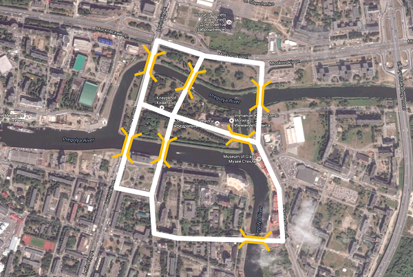

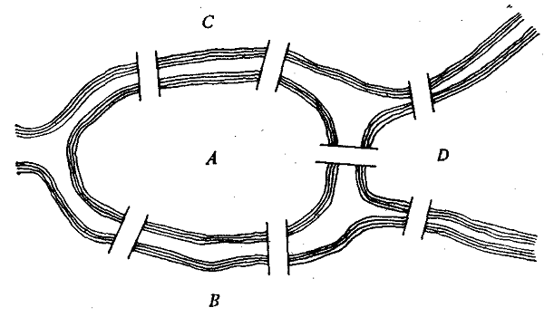

>I was asked whether someone could traverse the separate bridges in a connected walk in such a way that each bridge is crossed only once. I was informed that hitherto no-one had demonstrated the possibility of doing this, or shown that it is impossible. This question is so banal, but seemed to me worthy of attention in that neither geometry, nor algebra, nor even the art of counting was sufficient to solve it. And so, after some deliberation, I obtained a simple, yet completely established, rule with whose help one can immediately decide for all examples of this kind, with any number of bridges in any arrangement, whether such a round trip is possible, or not. 

You can see how Königsberg bridges are situated in the following picture, where the vertices of the graph correspond to a certain part of the city, and the edges correspond to bridges over the river, where A is an island, and B, C and D are parts of the continent, separated from each other by arms of the river.

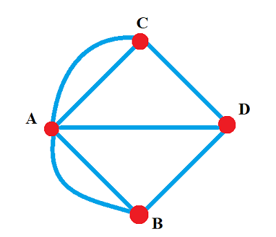

So is it possible to traverse the Königsberg bridges by crossing each of these bridges only once? To find the answer, let's continue with Euler's letter to Marinoni:

>The question is to determine whether it is possible to get around all these seven bridges, passing through each only once, or not. My rule leads to the following solution to this question. First of all, you need to look at how many sections are separated by water, - such that there is no other way from one to another, except through the bridge. In this example, there are four such sections - A, B, C, D. Next, you need to distinguish whether the number of bridges leading to these individual sections is even or odd. So, in our case, five bridges lead to section A, and three bridges to the rest, i.e. the number of bridges leading to individual sections is odd, and this one is already enough to solve the problem. When this is determined, we apply the following rule: if the number of bridges leading to each individual section were even, then the bypass, about which in question, would be possible, and at the same time it would be possible to start this detour from any section. If, however, two of these numbers were odd, for only one cannot be odd, even then the transition could take place, as prescribed, but only the beginning of the detour must necessarily be taken from one of those two sections to which an odd number of bridges leads. If, finally, there were more than two sections to which an odd number of bridges leads, then such a movement is generally impossible ... if other, more serious problems could be cited here, this method could be even more useful and should not be neglected

We can paraphrase the author's words and formulate the following rules:
1) The number of odd vertices (vertices to which an odd number of edges lead) of a graph must be even.
There cannot be a graph that has an odd number of odd vertices.
2) If all vertices of a graph are even (vertices that are led to by an odd number of edges), you can draw the graph without taking your pencil off the paper, and you can start from any vertex of the graph and end it at the same vertex.
3) A graph with more than two odd vertices cannot be drawn with a single stroke.

The Königsberg bridge graph had four odd vertices, hence, it is impossible to traverse all the bridges without passing over any of them twice.

Until the beginning of the 20th century, graph theory was developing mainly in the formulation of new theorems based on the results of solving various 'puzzle problems'. Graph theory was seriously developed due to the emergence of large-scale mass production and general breakthroughs in science and technology in the first half of the 20th century.  

### Main terms

A **Graph** has a finite set of vertices, and a set of edges. Each edge has two points from the set of graph vertices that form the edge points.

**Types of graphs based on the type of edges:**
* *undirected* - a graph in which movement between vertices connected by an edge is possible in any direction

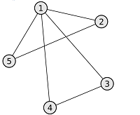

* *directed* - a graph, the edges of which have a direction. Directed edges are also called arcs. Moving from one vertex to another is possible only by arcs of corresponding direction

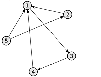

If besides the edge between two vertices, the weight of the edge is also given, then such a graph is called ***weighted***.

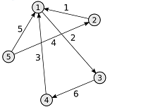


**Types of graphs based on the number of edges:**
* a *null graph* is a graph in which there are no edges

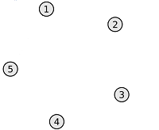

* *incomplete* - the graph has edges, but not from every vertex, there is an edge to every other vertex


* *complete* - the graph has an edge from each vertex to any other vertex

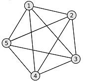


**Types of graphs based on node reachability:**

* *connected* - for any vertex in the graph there is at least one path to any other vertex in the same graph

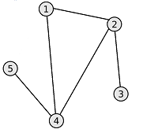

* *disconnected* - the graph has no path between at least two vertices

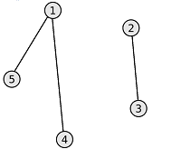

For directed graphs there are two more types of connectivity: *strongly connected* and *weakly connected*.
* *strongly connected* - there is a path for any vertex in a directed graph to any other vertex and back. 
* *weakly connected* - there is a path between any two vertices in the graph, but this path can be one-sided.
It means that from vertex A to vertex B the path can exist, but not the opposite way.


**Trees**

An important subtype of graphs are *trees*. 
    
***A tree*** is a connected acyclic graph in which any two vertices are connected by only one path. The following formula is the same for any tree: *q = n - 1*, where q is the number of edges, n is the number of vertices of the graph (tree). Trees can be built on the basis of both undirected and directed graphs, depending on the problem to be solved.

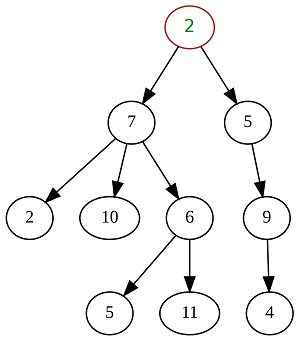

***A spanning tree*** is a subgraph of a given graph that includes all its vertices and is a tree. The graph edges that are not part of the spanning tree are called chords of the graph relative to the spanning tree.

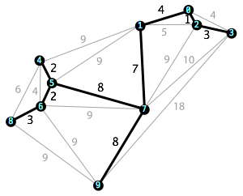


### Ways of representing a graph

The main ways of representing graphs are:
* *an adjacency matrix* is a square matrix whose dimension is equal to the number of vertices in the graph, and in which $`A_{ij}`$ element of the matrix contains information about an edge from vertex $`i`$ to vertex $`j`$. Possible values that $`A_{ij}`$ can have:
    + for an unweighted undirected graph:
        - 0 - there is no edge between the vertices
        - 1 - there is an edge between the vertices
    + for a weighted undirected graph:
        - 0 - there is no edge between the vertices
        - N - there is an edge between vertices, and its weight is N
    + for an unweighted directed graph:
        - 0 - there is no arc between the vertices
        - 1 - there is an arc (directed edge), which is directed from vertex $`i`$ to vertex $`j`$.
    + for a weighted directed graph:
        - 0 - there is no arc between the vertices
        - N - there is an arc (directed edge), which is directed from vertex $`i`$ to vertex $`j`$, and its weight is N
* *an incidence matrix* is a matrix with the number of rows equal to the number of vertices, and the number of columns equal to the number of edges. It specifies the connections between the incident elements of the graph (edge (arc) and vertex). In an undirected graph if a vertex is incident to an edge then the corresponding element is 1, otherwise the element is 0. In a directed graph if an edge comes from a vertex then the corresponding element is 1, if the edge enters a vertex then the corresponding element is -1, if there is no edge then the element is 0.

You can find an example of representing a graph with an adjacency matrix in the materials.

If the number of graph edges is small compared to the number of vertices, the values of most elements of the adjacency matrix will be 0. In this case it is not reasonable to use this method. For such graphs there are more appropriate ways to represent them:

* *an adjacency list* is one of the ways to represent a graph as a collection of lists of vertices. Each vertex of the graph corresponds to a list consisting of \"neighbors\" (i.e. vertices that are directly reachable from the current vertex) of this vertex with edge weights.
* *list of edges* is a table (matrix of dimension Nx3), each row of which contains two adjacent vertices, and the weight of the edge that connects them.


## Chapter III

Within this task, all graphs must meet the following requirements:
- Edge weights are only natural numbers
- There may be loops
- Weights may differ on all edges
- Only a nonzero connected graph

## Part 1. Depth- and Breadth-first search 

Implementation of the _s21_graph.h_  library:  
* The library must be developed in C++ language of C++17 standard
* The library code must be located in the src folder in the develop branch  
* When writing code it is necessary to follow the Google style
* Make it as a static library (with the _s21_graph.h_ header file)
* The library must be represented as a `Graph` class that stores information about the graph using an **adjacency matrix**. The dimensionality of the adjacency matrix should be set dynamically when initializing the graph (when loading it from a file)
* The program must be built with Makefile which contains standard set of targets for GNU-programs: _all, clean, test, s21_graph.a_
*Prepare full coverage of the `Graph` class methods with unit-tests
* The class `Graph` must contain at least the following public methods:
    + `loadGraphFromFile(string filename)` - loading a graph from a file in the adjacency matrix format
    + `exportGraphToDot(string filename)`- exporting a graph to a dot file (see materials)

Implementation of the _s21_graph_algorithms.h_ library:  
* The library must be developed in C++ language of C++17 standard
* The library code must be located in the src folder in the develop branch  
* Make it as a static library (with the _s21_graph_algorithms.h_ header file)
* The library must be represented as a ` GraphAlgorithms ` class that stores the implementation of algorithms on graphs. The class `GraphAlgorithms` itself must not know anything about the internal representation of the graph from the class `Graph`. To interact with graph data, the class `GraphAlgorithms` can only use the public methods and properties provided by the `Graph` class. 
* Add to the Makefile _s21_graph_algorithms.a_ target 
*Prepare full coverage of the `GraphAlgorithms` class methods with unit-tests
* The class ` GraphAlgorithms ` must contain at least the following public methods:
    + `depthFirstSearch(Graph &graph, int startVertex)` - a *non-recursive* depth-first search in the graph from a given vertex. The function should return an array that contains the traversed vertices in the order they were traversed. When implementing this function, you must use the *self-written* data structure **stack**, which should be previously made as a separate static library
    + `breadthFirstSearch(Graph &graph, int startVertex)` - breadth-first search in the graph from a given vertex. The function should return an array that contains the traversed vertices in the order they were traversed. When implementing this function, you must use the *self-written* data structure **queue**, which should be previously made as a separate static library
* It is necessary to use *self-written* helper classes `Stack` and `Queue` (you can reuse your solution from the *CPP2* project for this). These classes must contain the following methods:
    + `init()` - creating an empty stack/queue
    + `push(value)` - adding an element to the stack/queue
    + `pop()` - getting an element from the stack/queue followed by its removal from the stack/queue
    + `peek()` - getting an element from the stack/queue without its removal from the stack/queue

*In this and the following tasks, consider that the vertex numbers start from 1*

## Part 2. Finding the shortest paths in a graph

* Add two new methods to the `GraphAlgorithms` class:
    + `getShortestPathBetweenVertices(Graph &graph, int vertex1, int vertex2)` - searching for the shortest path between two vertices in a graph using *Dijkstra's algorithm*. The function accepts as input the numbers of two vertices and returns a numerical result equal to the smallest distance between them
    + `getShortestPathsBetweenAllVertices(Graph &graph)` - searching for the shortest paths between all pairs of vertices in a graph using the *Floyd-Warshall algorithm*. As a result, the function returns the matrix of the shortest paths between all vertices of the graph

## Part 3. Finding the minimum spanning tree

* Add a new method to the `GraphAlgorithms` class:
    + `getLeastSpanningTree(Graph &graph)` - searching for the minimal spanning tree in a graph using *Prim's algorithm*. As a result, the function should return the adjacency matrix for the minimal spanning tree

## Part 4. Travelling salesman problem

* Add a new method to the `GraphAlgorithms` class:
    + `solveTravelingSalesmanProblem(Graph &graph)` - solving the traveling salesman's problem using the *ant colony algorithm*.
You need to find the shortest path that goes through all vertices of the graph at least once, followed by a return to the original vertex. As a result, the function should return the `TsmResult` structure described below:
    ```cpp
    struct TsmResult {
        int* vertices;    // an array with the route you are looking for (with the vertex traverse order). Instead of int* you can use std::vector<int>
        double distance;  // the length of this route
    }
    ``` 

*If it is impossible to solve the problem with a given graph, output an error.*

## Part 5. Console interface

* You need to write the main program, which is a console application for testing the functionality of the implemented s21_graph.h and s21_graph_algorithms.h libraries 
* The console interface must provide the following functionality:
    1. loading the original graph from a file
    2. graph traversal in breadth with output of the result to the console   
    3. graph traversal in depth with output of the result to the console
    4. searching for the shortest path between any two vertices and displaying the result to the console
    5. searching for the shortest paths between all pairs of vertices in the graph with the output of the resulting matrix to the console
    6. searching for the minimal spanning tree in the graph with the output of the resulting adjacency matrix to the console
    7. solving the salesman problem with the output of the resulting route and its length to the console

## Part 6. Bonus. Comparison of methods for solving the traveling salesman problem

* It is necessary to choose two additional algorithms to solve the traveling salesman problem and implement them as methods of the `GraphAlgorithms` class
* Add to the console interface the ability to perform a comparison of  speed of the three algorithms (the ant colony algorithm and two randomly selected algorithms)
    + The study starts for a graph that was previously loaded from a file.
    + As part of the study you need to keep track of the time it took to solve the salesman's problem `N` times in a row, by each of the algorithms. Where `N` is set from the keyboard.
    + The results of the time measurement must be displayed in the console.

*Example:* For `N = 1000` it will measure how long it will take to solve the traveling salesman problem 1000 times for the current given graph by an ant colony algorithm and two randomly chosen algorithms.


## Chapter IV

`-` \"Bob asked if we could take the task, and so we did. I'd love to take you along with it, but Bob has his own ideas,\" Alice answered Eve's question.

`-` \"Still, I don't see how your job has anything to do with a robot vacuum cleaner,\" Eve complained. \"Where's Charlie? He used to drop by at least a couple of times a week.\"

`-` \"Charlie... is working. We've got a little problem, and your pathfinding work is exactly what will help us. Don't worry, when it's all over, our evening gatherings will be back. Then we'll discuss everything,\" calming, but sadly assured Alice. \"Thanks for your time, I have to go. See you later!\"

💡 [Tap here](https://forms.yandex.ru/u/635aa038eb61461d3b7defae/) **to leave your feedback on the project**. Pedago Team really tries to make your educational experience better.
