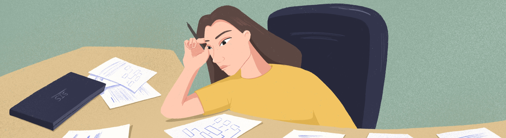
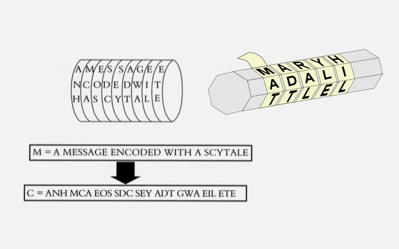
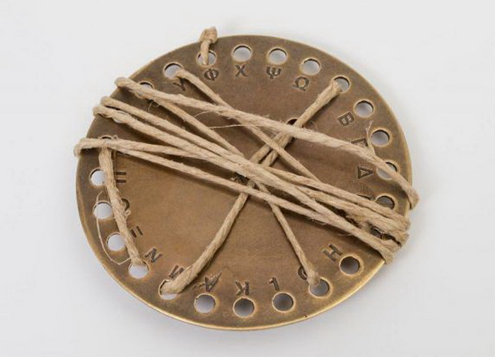
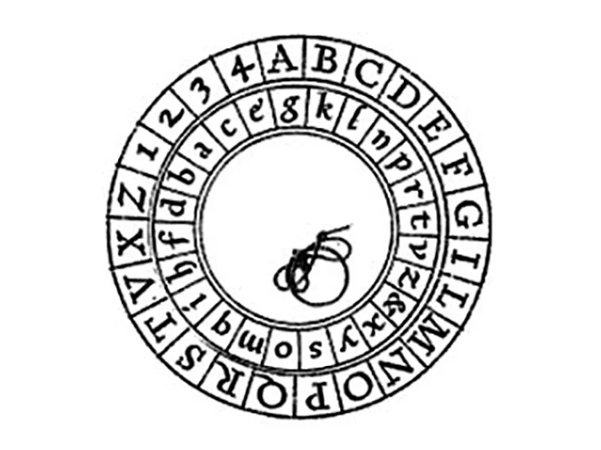
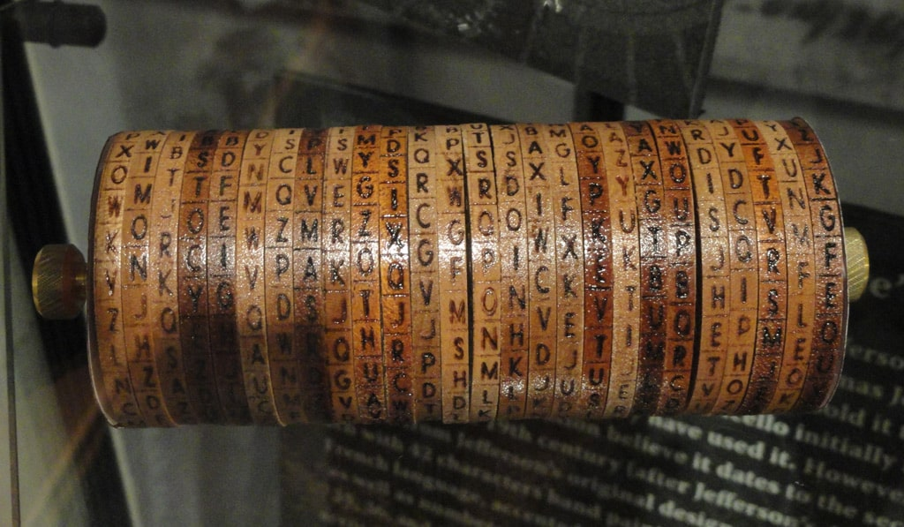
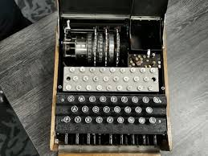
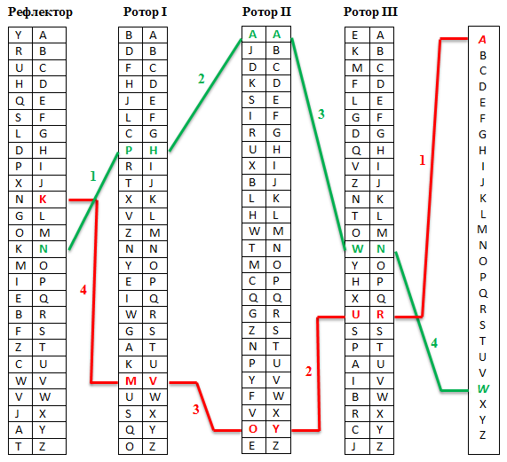
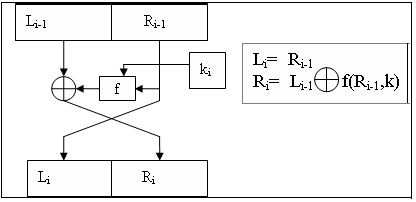
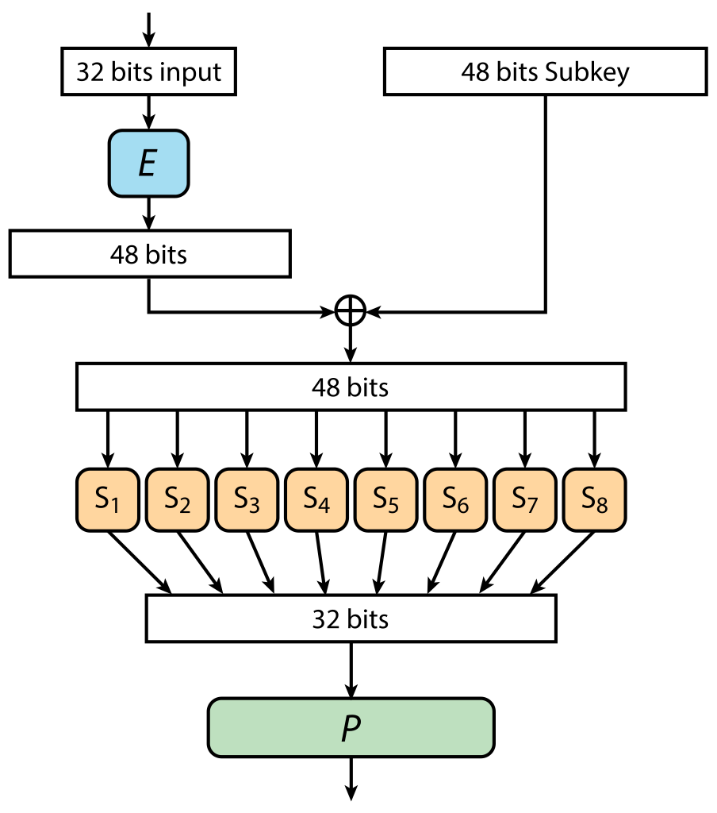

Crypto

Implementation of the Crypto project.

## Contents

1. [Chapter I](#chapter-i) 
    
   1.1. [Introduction](#introduction)
2. [Chapter II](#chapter-ii) 
    
   2.1. [Main terms](#main-terms)  
   2.2. [The birth of cryptography](#the-birth-of-cryptography)  
   2.3. [Era of encryption machines](#era-of-encryption-machines)  
   2.4. [Modern Cryptography. Symmetric encryption](#modern-cryptography-symmetric-encryption )  
   2.5. [Modern Cryptography. Asymmetric encryption](#modern-cryptography-asymmetric-encryption)  
   2.6. [Data compression algorithms](#data-compression-algorithms)
3. [Chapter III](#chapter-iii) 
    
   3.1. [Part 1](#part-1-enigma-encryption-machine)  
   3.2. [Part 2](#part-2-huffman-compression-algorithm
   )  
   3.3. [Part 3](#part-3-rsa-asymmetric-encryption-algorithm)      
   3.4. [Part 4](#part-4-bonus-des-symmetric-encryption-algorithm)

## Chapter I

The letter came on the corporate email exactly when Eve was reading the DES algorithm. The Data Encryption Standard wasn't some super innovation, but it included bases that have been used in encryption everywhere to this day. And the algorithm itself has not become much easier to understand because of its age. So, that’s why Eve was sitting with a pen, a piece of paper and a bunch of tables, trying her best to get to the bottom of it.

However, the letter still distracted her. The text was not particularly detailed, but Eve got interested:

>Dear colleagues!
>
>You have been chosen to pilot our new project, code-named: \"Invisible College XXI\". The essence of the task is fairly simple: you will be offered small C projects (for example, write a library or implement your own grep), which must be done in any form in the shortest period of time. Besides solutions, you will also need to provide feedback on the completed task. The established feedback form will be issued later. 
    
>Your solutions will help us to adjust the tasks themselves, and will also be used in other company projects on ML and AI. The solutions will be analyzed in a strictly anonymous format. 
    
> For further details and tasks, please contact your supervisors, Alice S. or Charlie K.
>
> We hope for your cooperation and understanding!

\"I'll have to see Alice on Monday,\" decided Eve to herself. \"Another chance to try to get some answers. In the meantime, back to DES.\"

## Introduction

In this project you will be introduced to the basics of cryptography, the concepts of synchronous and asynchronous encryption, as well as data compression. You will write your implementations of the Enigma machine, the RSA asymmetric encryption and DES symmetric encryption algorithms, and the Huffman data compression algorithm.

## Chapter II

### Main terms

**Cryptography** is the science of techniques for secure communication (preventing third parties from reading information), data integrity (no possibility to change information unnoticed), authentication (checking authenticity of authorship or other properties of an object), encryption (data encoding).

**Monoalphabetic ciphers** are ciphers that replace the alphabet of the plaintext with another alphabet. As a result, each letter of the plaintext is assigned a unique encrypted letter.

**Polyalphabetic ciphers** are a set of simple substitution ciphers, which are used to encrypt the letter of the plaintext according to some rule. The essence of the polyalphabetic cipher is the cyclic application of several monoalphabetic ciphers to a certain number of letters of the ciphertext. Suppose that there is some message *x1, x2, x3, ..., xn, ..., x2n* that needs to be encrypted, and *n* monoalphabetic ciphers were picked to use the polyalphabetic cipher. In this case, the first monoalphabetic cipher is applied to the first letter, the second to the second letter, the third to the third letter, ..., the *n*th cipher to the *n*th letter, and to the *(n+1)* the first again, and so on, until the whole message is encrypted.

**Symmetric encryption** is a type of encryption where only one secret key is used to both encrypt and decrypt the original message. There are two types of symmetric encryption algorithms: **block** and **stream** algorithms.

**Stream cipher** is a symmetric cipher where each plaintext character is converted to a ciphertext character depending not only on the key used, but also on its location in the stream of plaintext.

**Block cipher** is a kind of symmetric cipher that operates with groups of bits of fixed length - blocks, the typical size of which varies from 64 to 256 bits.
If the plaintext (or its remainder) is smaller than the block size, it is padded before encryption.

**Asymmetric encryption** is a data encryption method that uses two keys - public and private. The public key is used to encrypt information and can be transmitted through unsecured channels. The private key is used to decrypt data encrypted with the public key. The public and private keys are very large numbers connected to each other by a certain function, but in a way that, knowing one, it is extremely difficult to calculate the other.

### The birth of cryptography

Behind the scientific word “cryptography” lies the ancient human desire to hide important information from prying eyes. Writing itself was already a cryptographic system at the very beginning, as it belonged to a small circle of people, and they could use it to exchange knowledge that was inaccessible to illiterates. With the spread of writing came the need for more sophisticated encryption systems. Since the time of ancient civilizations, cryptography has served the military, civil servants, merchants and custodians of religious knowledge faithfully.

One of the first proofs of using ciphers is the \"Scytale Algorithm\". *Scytale* is a tool used to implement a transposition cipher, also known in cryptography as the Ancient Spartan cipher. A strip of parchment and a cylindrical stick with a fixed length and diameter were used to encrypt the message. The strip of parchment was wound around the stick so that there were no gaps or overlaps. The message was written on the wound parchment strip on the long side of the cylinder. After reaching the end of the wound strip, the stick was rotated a fraction of a turn, and the writing continued. After unwinding the parchment strip, the encrypted message appeared on it. Decryption was performed using a stick of the same size.

In the fourth century B.C., Aeneas Tacticus, author of military treatises, invented the cipher disk later named after him. To write the message, a thread was passed sequentially through the holes of the disk with the letters signed next to them. To read the text, all you had to do was to pull out the thread in the reverse order. This was the main disadvantage of this device - if there was time, the cipher could have been solved by any literate person. At the same time, to quickly \"erase\" the information from the Aeneas disk, one had only to pull out the thread or break the device.

One of the first documented ciphers is the Caesar cipher (around 100 BC). Its use was very simple: each letter of the plaintext was replaced by a letter some fixed number of positions down the alphabet. Knowing this number, it was possible to break the cipher and find out what secrets Caesar passed on to his generals.

The high level of mathematics and linguistics development made it possible not only to create ciphers, but also to deal with the deciphering of other people's ciphers. This led to the appearance of the first scientific works on cryptanalysis - decryption of messages without knowing the key. The era of so-called naive cryptography, when ciphers were more like puzzles, came to an end.

During the Renaissance, cryptography was thriving. The period of formal cryptography begins, associated with the emergence of formalized, more secure ciphers. Around 1466, the Italian scientist Leon Alberti invented a cipher disk consisting of two parts: an outer and an inner one. The stationary outer disk had the alphabet and numbers written on it. The inner movable disk also contained letters and numbers in a different order and was the key to the cipher. To encrypt the text, it was necessary to find the right letter on the outer disk and replace it with the letter on the inner disk below it. After that, the inner disk was shifted, and the new letter was encrypted from the new position. Thus, the Alberti cipher became one of the first polyalphabetic ciphers based on the principle of combinatorics. Besides that, Leon Alberti wrote one of the first scientific works on cryptography, the «Treatise on Ciphers».

### Era of encryption machines

The Industrial Revolution did not pass over cryptography. Around 1790, one of the founding fathers of the United States, Thomas Jefferson, created the disk cipher, later named Jefferson disk. This device, based on the rotary system, allowed the automation of the encryption process and became the first crypto-device of the New Age.

The invention of the telegraph had a great impact on ciphers. Previous ciphers stopped being effective in a moment, and the need for high-quality encryption was only increasing due to the series of major military conflicts. In the XIX-XX centuries, the main impetus for the development of cryptography was provided by the military sphere. Since 1854, the British military had been using the Playfair cipher, which is based on the encryption of bigrams, or pairs of characters. This cipher was used until the beginning of World War II.

In World War II, enemies were already using mobile electromechanical ciphers, which were considered unbreakable. The devices were either rotary or pinwheel ones. The first included the famous Enigma machine used by the Nazis, and the second - the American M-209 machine.

The Enigma machine consisted of three rotors and a reflector. Each rotor had 26 sections, which corresponded to a separate letter of the alphabet, as well as 26 contacts for interaction with neighboring rotors. As soon as the operator pressed the necessary letter - the electric circuit was closed, as a result of which the cipher letter appeared. The circuit was closed by the reflector. The Enigma cipher was considered the most resistant to breaking, as the number of its combinations reached 15 quadrillion. However, the Enigma code was deciphered, first by Polish cryptographers in 1932, and then by the English scientist Alan Turing, who created the Enigma decryption machine called \"Bombe\". A set of 210 such machines allowed the British to decipher up to 3,000 military messages a day and contributed greatly to the allied victory.

### Modern Cryptography. Symmetric encryption

By the end of the 1960s, rotary encryption systems were replaced by more advanced block encryption systems, which involved the mandatory use of digital electronic devices. With the spread of computers, cryptography reached a new level.  
The abilities of the new devices allow creating much more complex ciphers. Cipher or code becomes the language of communication between computers, and cryptography becomes a full-fledged civilian industry. In 1978, the DES encryption standard was developed, which became the basis for many modern cryptographic algorithms.

The DES algorithm is based on a Feistel network. This network operates with blocks, and each block entering the input is divided into two parts: left and right. The left part becomes the right part without any change. The right part is xored with the result of calculation of some function, to the input of which the left part and the key are fed. After this transformation the right part becomes the left part.

This network has several interesting advantages. The first important one is that the function F can be arbitrary, it does not have to have properties of reversibility, it may not be linear or nonlinear. It still remains a symmetric cipher. The second very convenient property: decryption is arranged in the same way as encryption. If it is necessary to decrypt this network, then the former mechanism simply receives ciphertext instead of plaintext.

In a practical situation, such a construction (one Feistel network) represents one round of the block cipher, i.e. in the real cipher it is executed 16 times with different keys. For each of the 16 rounds, a separate 48-bit key is generated based on the original 56-bit key. Then, the function F uses the generated 48-bit key for each round.

Each of 16 rounds consists of just a few operations:
1) The size of the given half-block becomes equal to 32 bits, the half-block passes the expansion function, 32 bits get to the input. Next, by a special unclassified table, the initial 32 bits are saturated to 48 (by duplicating and permuting the original bits in the block).
2) Then the xor operation is performed with the round key, which is also 48 bits in size, and the output is a 48-bit value, which goes into a set of S-boxes functions. These S-boxes convert every 6 bits of the input into 4 bits of the output. Therefore, the output of the S-boxes of 48 bits is again 32 bits.
3) At the end a final permutation of P is performed. It again shuffles the 32 bits together.

The key part of the algorithm lies in the specified S-boxes, selected in a special way: a very complex transformation of 6 bits into 4 is conceived.  If you look at the whole structure, you can see that it consists of XOR and a couple of permutations. If the S-boxes were simple, the whole DES would actually be some set of linear transformations. It could be thought of as a matrix to which our plaintext is multiplied, getting the encrypted message. And then an attack on DES would be trivial: one would just have to match the matrix.

The key problem with the DES algorithm is the use of a 56-bit key for encryption. Due to the improvement of computational capabilities of computers, it has become possible to break a cipher with a simple brute force attack. Back in 1998, the Electronic Frontier Foundation (EFF) built a supercomputer, code-named the EFF DES Cracker, specifically for DES hacking, which was able to find the key to the encrypted sample by simple brute force in just 56 hours, that is, in less than three days. For this DES Cracker had to check about a quarter of all possible combinations, which means that even in the worst-case scenario it would take about 224 hours, that is no more than 10 days. The cost of the supercomputer, taking into account the funds spent on its design, was only $250,000. It is not hard to guess that today it is even easier and cheaper to break such a cipher.

Today, the DES algorithm has been replaced by the AES algorithm, which was accepted into the list of U.S. Federal Information Processing Standards on November 6, 2001. This algorithm is also a symmetric block encryption algorithm, but has a block size of 128 bits and several variations with keys of 128/192/256 bits, which makes AES a resistant algorithm to brute force hacking.

### Modern cryptography. Asymmetric encryption

While the scope of cryptography is expanding, the authorities of various countries are trying to keep control over the use of ciphers. Developments of cryptographers are classified, manufacturers of encryption machines are required to leave \"backdoors\" in products for access by intelligence agencies. At the same time, independent cryptanalysts are developing encryption methods that could be used by anyone - the so-called public cryptography. This became especially relevant with the development of the Internet, where the issue of privacy has become very acute.

The scheme of data transmission between two subjects (A and B) using public-key cryptography looks as follows:
- Subject A generates a key pair: public and private
- Subject A sends the public key to subject B. The transmission can take place through unsecured channels.
- Subject B encrypts the data package using the received public key and transmits it to A. The transmission can take place through unsecured channels.
- Subject A decrypts information received from B with a secret, private key.

In this scheme, interception of any data transmitted through unsecured channels makes no sense, since the recovery of the original information is only possible with a private key, known only to the recipient and does not require transmission.

Asymmetric encryption solves the main problem of the symmetric method, which uses the same key to encrypt and recover data. If this key is transmitted through unsecured channels, it can be intercepted and gain access to the encrypted data. On the other hand, asymmetric algorithms are much slower than symmetric ones, so many cryptosystems use both. For example, SSL and TLS standards use asymmetric algorithm at the stage of connection establishment (handshake): with its help they encode and transfer the key from the symmetric cipher, which is used during further data transfer. Also asymmetric algorithms are used for generation of electronic signatures for confirmation of authorship and/or integrity of data. In this case the signature is generated with a private key and verified with a public key.

The first public-key cryptosystem is considered to be the RSA algorithm created in 1977, the name of which is an acronym of the names of its creators - Rivest, Shamir and Adleman. The algorithm is based on the computational complexity of the factorization (decomposition into multipliers) of large numbers. It is used in secure SSL and TLS protocols, encryption standards such as PGP and S/MIME, and so on. It is used for both data encryption and creation of digital signatures.

### Data compression algorithms

Data compression is a special case of information encoding, during which the final message size (of the information to be encoded) is reduced. Existing data compression algorithms can be divided into two large classes - with and without losses.

Lossy algorithms are commonly used to compress images and audio. These algorithms allow large compression rates through selective loss of quality. However, by definition, it is impossible to recover the original data from the compressed result. Famous examples of these algorithms are JPEG, H.264, MPEG and MP3.

Lossless compression algorithms are used to reduce the size of data, and work in a way that makes it possible to recover data exactly as it was before compression. They are used in communications, archivers, and some audio and image compression algorithms.

Thus, one of the first algorithms of data compression, can be considered Morse code. Morse, when inventing his code in 1838, wisely assigned the most frequently used letters in the English language, \"e\" and \"t\", the shortest sequences (dot and dash, respectively). Shortly after mainframes appeared in 1949, the Shannon-Fano algorithm was invented, which assigned codes to characters in a data block based on their probability of appearing in the block. The probability of a character appearing in a block was inversely proportional to the length of the code, which allowed the data representation to be compressed. David Huffman was a student in Robert Fano's class and chose as his academic work to find an improved method of binary data coding. As a result, he was able to improve the Shannon-Fano algorithm. Early versions of the Shannon-Fano and Huffman algorithms used predefined codes. Later, they began to use codes created dynamically from the data meant to be compressed. In 1977, Lempel and Ziv published their LZ77 algorithm, based on the use of a dynamically generated dictionary (also called \"sliding window\"). In 1978, they published the LZ78 algorithm, which first parses the data and creates a dictionary, instead of creating it dynamically.

## Chapter III

## Part 1. Enigma Encryption Machine

You need to write a program implementation of the Enigma encryption machine:
- The program must be developed in C++ language of C++17 standard
- The program code must be located in the src/enigma folder
- When writing code it is necessary to follow the Google style
- Do not use outdated language constructs and libraries
- Provide a Makefile for building the program and tests (with targets all, clean, test, enigma)
- The program must have a console interface
- Requirements for the Enigma machine that you have to implement:
    + The entities \"Reflector\", \"Rotor\" and \"Enigma Machine\" must be represented in the code as separate classes
    + The program should provide the ability to set an absolute path to the file you want to encrypt
    + Unlike the original Enigma machine, which was only capable of encrypting text messages, the Enigma machine in this task must be able to encrypt arbitrary files (binary and text files). The result of the program is an encrypted file in the format `<source_file_name>_encoded`.
    + The program must provide the ability to read the configuration of the Enigma machine from an arbitrary file.
      The machine configuration consists of the reflector configuration, the rotor configuration, and the initial state of the machine. The reflector configuration or rotor configuration is an array that specifies the rule for mapping some bytes to others. Initial state of the machine is the initial position of the rotors
    + The program must allow creating an Enigma machine with a given number of Rotors (the number of Rotors in the implemented Enigma machine can be from 1 to 255). In this case the configuration of all rotors is set randomly during their initialization
    + The program must provide the ability to save the current state of the Enigma machine to a configuration file. The file name and location are set by the user while the program is running

## Part 2. Huffman compression algorithm

You need to implement the Huffman data compression algorithm :
- The program must be developed in C++ language of C++17 standard
- The program code must be located in the src/huffman folder
- When writing code it is necessary to follow the Google style  
- Do not use outdated language constructs and libraries
- Provide a Makefile for building the program and tests (with targets all, clean, test, huffman)
- The program must have a console interface
  -The program must allow encoding (compressing) and decoding any arbitrary files (both text and binary)
- In encoding (compression) mode, the program takes the absolute path to the source file as input and generates two new files as output: a compressed file in the format `<source_file_name>_encoded` and a configuration file `huffman.cfg`, which contains the Huffman tree needed to decode the compressed file. The locations of these two files are set while the program is running
- In decoding mode, the program takes the absolute path to the compressed file and to the `huffman.cfg` configuration file as input. The program outputs a new decoded file in the format `<source_file_name>_decoded`. The location of this file is set while the program is running

## Part 3. RSA asymmetric encryption algorithm

You need to implement the RSA data encryption algorithm:
- The program must be developed in C++ language of C++17 standard
- The program code must be located in the src/rsa folder
- When writing code it is necessary to follow the Google style  
- Do not use outdated language constructs and libraries
- Provide a Makefile for building the program and tests (with targets all, clean, test, rsa)
- The program must have a console interface
- The program must allow encryption and decryption of any arbitrary files (both text and binary)
- The program works in three modes: public and private key generation mode, encryption mode and decryption mode
- In key generation mode, the program takes as input the absolute path to the directory in which the keys will be generated. The program outputs two files in the given directory: `private_key` and `public_key`.
- In encryption mode, the program takes the absolute path to the source file and the file with the public key as input. The program outputs a new encrypted file in the format `<source_file_name>_encoded`. The location of this file is set while the program is running
- In decryption mode, the program takes as input the absolute path to the source file and the files with public and private keys. The program outputs a new decrypted file in the format `<source_file_name>_decoded`. The location of this file is set while the program is running

##Part 4. Bonus. DES symmetric encryption algorithm

You need to implement the DES data encryption algorithm:
- The program must be developed in C++ language of C++17 standard
- The program code must be located in the src/des folder
- When writing code it is necessary to follow the Google style  
- Do not use outdated language constructs and libraries
- Provide a Makefile for building the program and tests (with targets all, clean, test, des)
- The program must have a console interface
- The program must allow encryption and decryption of any arbitrary files (both text and binary)
- In encryption mode, the program takes as input the absolute path to the source file and the configuration file containing the 56-bit encryption key.
  The program outputs a new encrypted file in the format `<source_file_name>_encoded`. The location of this file is set while the program is running
- In decryption mode, the program takes as input the absolute path to the source file and the configuration file containing the 56-bit encryption key.
  The program outputs a new decrypted file in the format `<source_file_name>_decoded`. The location of this file is set while the program is running

💡 [Tap here](https://forms.yandex.ru/u/635aabf45d2a0620c619cb9b/) **to leave your feedback on the project**. Pedago Team really tries to make your educational experience better.
