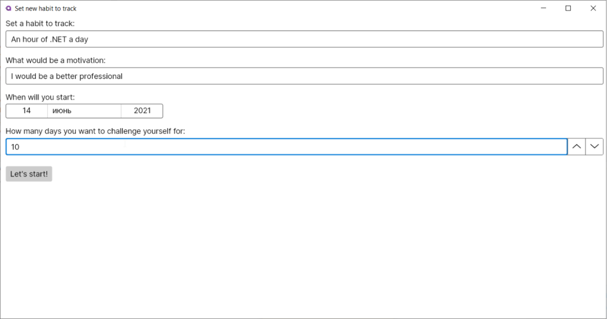
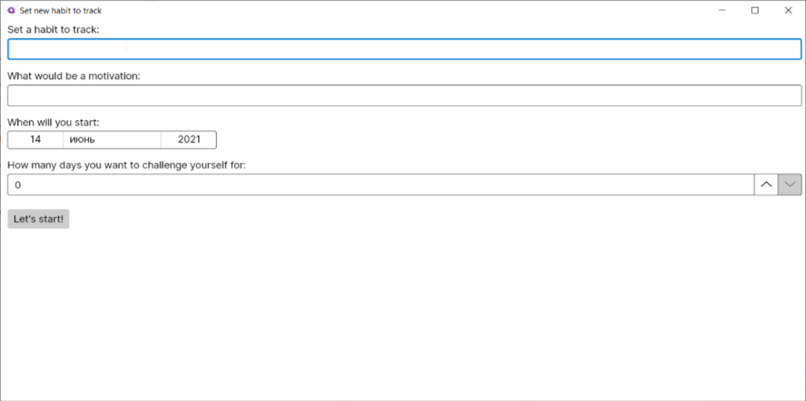
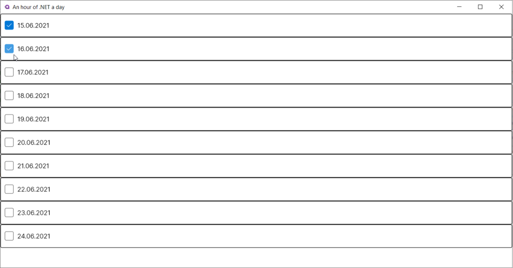
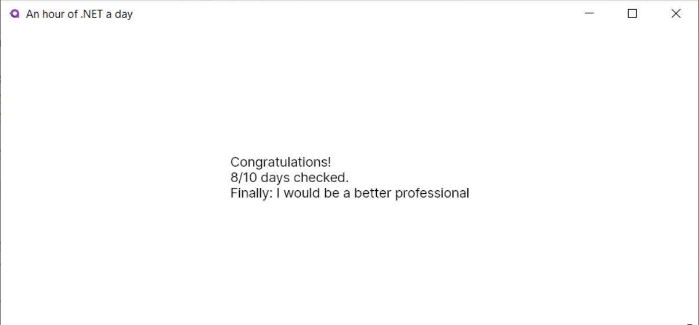

----- Day 01 – .NET Boot camp -----
### Make it classy

# Contents
1. [Chapter I](#chapter-i) 
    
	[General Rules](#general-rules)
2. [Chapter II](#chapter-ii) 
    
	[Rules of the Day](#rules-of-the-day)
3. [Chapter III](#chapter-iii) 
    
	[Intro](#intro)
4. [Chapter IV](#chapter-iv) 
    
	[Exercise 00 – Storage](#exercise-00-storage)
5. [Chapter V](#chapter-v) 
    
  [Exercise 01 – Customers](#exercise-01-customers)
6. [Chapter VI](#chapter-vi) 
    
  [Exercise 02 – Shopping cart](#exercise-02-shopping-cart) 
7. [Chapter VII](#chapter-vii) 
    
  [Exercise 03 – Cash register](#exercise-03-cash-register)
8. [Chapter VIII](#chapter-viii) 
    
  [Exercise 04 – Store](#exercise-04-store)
9. [Chapter IX](#chapter-ix) 
    
  [Exercise 05 – Queues](#exercise-05-queues)
10. [Chapter X](#chapter-x) 
    
  [Exercise 06 – So how does it work?](#exercise-06-so-how-does-it-work)

# Chapter I 

## General Rules
- Make sure you have [the .NET 5 SDK](<https://dotnet.microsoft.com/download>) installed on your computer and use it.
- Remember, your code will be read! Pay special attention to the design of your code and the naming of variables. Adhere to commonly accepted [C# Coding Conventions](<https://docs.microsoft.com/en-us/dotnet/csharp/fundamentals/coding-style/coding-conventions>).
- Choose your own IDE that is convenient for you.
- The program must be able to run from the dotnet command line.
- Each of the exercise contains examples of input and output. The solution should use them as the correct format.
- At the beginning of each task, there is a list of allowed language constructs.
- If you find the problem difficult to solve, ask questions to other piscine participants, the Internet, Google or go to StackOverflow.
- You may see the main features of C# language in [official specification](<https://docs.microsoft.com/en-us/dotnet/csharp/language-reference/language-specification/introduction>).
- Avoid **hard coding** and **\"magic numbers\"**.
- You demonstrate the complete solution, the correct result of the program is just one of the ways to check its correct operation. Therefore, when it is necessary to obtain a certain output as a result of the work of your programs, it is forbidden to show a pre-calculated result.
- Pay special attention to the terms highlighted in **bold** font: their study will be useful to you both in performing the current task, and in your future career of a .NET developer.
- Have fun :)


# Chapter II
##  Rules of the Day

- Do not use any nuget packages.
- The name of the solution and the project (and its separate catalog) is d_{xx}, where xx are the digits of the current day.
- Use console application created based on a standard .NET SDK template.
- Each class should be in a separate file.
- Use **top-level-statements**  and **var**.
- To format the output data, use the en-GB **culture**: N2 for the output of monetary amounts, d for dates.

## What's new

- Classes, properties, methods
- Class constructors
- Lambda operators
- Overriding methods
- Encapsulation
- Static classes
- Extension methods

# Chapter III
## Intro

Returning from the food store, where you spent ages standing in a queue, you find yourself being fascinated by the nature of these places. Stores, actually. And their queues. Why do they appear? Whether from a small number of working cash registers, because of slow cashiers or people with a large number of goods in the cart. Why does it always seem that the other queue moves faster?

This mystery of nature does not give you any peace. So, you decide, if not to understand it, then at least to model it with the help of the force that has always come to your aid in difficulties.

With the help of programming.


[xkcd](<https://xkcd.com/208/>)

# Chapter IV
## Exercise 00 – Storage

Let's start with the heart of the store. Create a _Storage_ class and describe its **properties**. The main thing for us is that the storage is determined by the integer number of goods (let's agree, the same) that are stored in it.

The number of goods may vary, but at the time of the creation of the storage, it is determined by its capacity - the initial value. Let the number of goods be specified in the **class constructor**. The storage cannot be created without capacity, so it should not have a **parameterless constructor**.

Add the _IsEmpty_ method to the class, which will return information about the goods that are out of stock. Use a [lambda operator](<https://docs.microsoft.com/en-us/dotnet/csharp/language-reference/operators/lambda-operator>).

# Chapter V
## Exercise 01 – Customers

What about the customers? Create the _Customer_ class and describe its **properties**. Make it so that one customer can be distinguished from another: let them have a name and a serial number under which they entered the store. Since classes inherit from **the Object type** and get access to its methods, [override the ToString()](<https://docs.microsoft.com/en-us/dotnet/api/system.object.tostring?view=net-5.0>) method so that it returns string information with the customer’s number and name.
```
Andrew, customer #1
```

The number and name are not changing. Make these **auto-properties** locked for editing from the outside and set only from the class constructor. The customer cannot be created without them, so it should not have a **parameterless constructor**.

Try creating two customers with the same names and numbers:
```
var customer1 = new Customer(\"Andrew\", 1);
var customer2 = new Customer(\"Andrew\", 1);
```

Output the value of the expression _customer1 == customer2_ to the console. Why is the answer like this? 

Change the _Customer_ class so that output to the console is true.

# Chapter VI
## Exercise 02 – Shopping cart

Take the _Customer_ class from the previous exercise, let's add it a property that reflects the number of goods in its cart. When a customer is created (in the real world when they appear in the store), they have zero goods.

To prevent users of your classes from changing the value as they like, make the field with the number of goods not changeable from the outside. 

Instead, add the _FillCart_ cart filling method to the customer: let the method take the maximum cart capacity (input argument) and fill the customer's number of goods with a random number (minimum 1, maximum cart capacity).

This is how we implemented the logic of filling the cart in one place and closed it with a convenient method with a readable and understandable name. Welcome to **encapsulation**.

Create 3 users, fill their carts with a capacity of 15 items. Output information about the user and the number of goods in their cart to the console.

Example:
```
Andrew, customer #1 (5 items in cart)
```

# Chapter VII
## Exercise 03 – Cash register

Create the _CashRegister_ class and describe its properties. Let the cash register have a \"name” - some kind of a title that will allow customers to clearly understand which cash register they are talking about. **Override the methods** of the class so that ToString() returns the title and two cash registers with the same heading are equal.
```
Register #1
```

The cash register should not have a parameterless constructor. 
There should also be no queues at the checkout. But we live in the real world and we want to build a model for the real world, so let's implement queues. 

Add the _Customers_ collection to the _CashRegister_ class so that it is a [«first - come, first - served»](<https://docs.microsoft.com/en-us/dotnet/api/system.collections.generic.queue-1?view=net-5.0>) type of a queue. 

Think about whether it is necessary to encapsulate this property?

# Chapter VIII
## Exercise 04 – Store

Create the _Store_ class and describe its properties. The store should have a storage and a set of cash registers. 

Implement the class constructor so that it accepts an integer storage capacity and an integer number of cash registers at the input. Fill in the class properties in the constructor using these inputs. Let each cash register be created with a title corresponding to its serial number.

Think about whether it makes sense to lock the **setter** of a cash registers collection from editing?

Add the _IsOpen_ method, that returns true, if there are still goods in the storage.

# Chapter IX
## Exercise 05 – Queues 

How do you stand in a queue? To the checkout with the least number of customers or to the checkout with the least number of purchases? Let’s implement both situations.

Create a **static** _CustomerExtensions_ class with two **extension methods** for the _Customer_ object: both methods will accept a collection of cash registers (_CashRegister_ objects) and return the register that the customer chooses. The first method is the cash register with the least number of customers, the second one with the least number of goods among all customers in the queue of this cash register.

Don't forget to name the methods so that it is clear what exactly they do. Now you have a separate class responsible for queue picking (we separated the responsibility) and a nice clean way to call these methods in code. Try them.

# Chapter X
## Exercise 06 – So how does it work?

Create a store with 3 cash registers and a storage with 40 goods in it. Create 10 different customers. Implement a cycle: let each of the customers fill the cart and stand in queue. The cycle should work while the store is open (you have a method to check it) and there are customers in it. 

Keep in mind that filling the customer's cart with goods should remove them from the storage. Implement it yourself. Customers leave a queue after they get their items from storage.  Customers can’t have more than items left in the storage (storage cannot have less than 0 items). If storage is empty and customer’s cart still has some items to buy output to the console:
```
Andrew, Customer #4 (2 items left in cart)
```

Do this for two different cases of queue selection (exercise 05) and in each case, output the user's name and number, the number of goods, the chosen checkout and the number of people at the checkout, the number of goods in the queue carts to the console in a loop.
```
Andrew, Customer #4 (6 items in cart) - Register #1 (4 people with 20 items behind)
```

The capacity of the cart is 7 items.


[xkcd](<https://xkcd.com/1445/>)


----- Day 06 – Bootcamp .NET -----
### Multithreading

# Contents
1. [Chapter I](#chapter-i) 
    
	[General Rules](#general-rules)
2. [Chapter II](#chapter-ii) 
    
	[Rules of the Day](#rules-of-the-day)
3. [Chapter III](#chapter-iii) 
    
	[Intro](#intro)
4. [Chapter IV](#chapter-iv) 
    
	[In addition](#in-addition)
5. [Chapter V](#chapter-v) 
    
  [Exercise 00 – The laws of the world](#exercise-00-the-laws-of-the-world) 
6. [Chapter VI](#chapter-vi) 
    
  [Exercise 01 – A race for resources](#exercise-01-a-race-for-resources)
7. [Chapter VII](#chapter-vii) 
    
  [Exercise 02 – Parallels](#exercise-02-parallels)
8. [Chapter VIII](#chapter-viii) 
    
  [Exercise 03 – Ready](#exercise-03-ready)
9. [Chapter IX](#chapter-ix) 
    
  [Exercise 04 – Set, Go!](#exercise-04-set-go)
10. [Chapter X](#chapter-x) 
    
  [Bonus A little bit random](#bonus-a-little-bit-random)

# Chapter I

## General Rules
- Make sure you have [the .NET 5 SDK](<https://dotnet.microsoft.com/download>) installed on your computer and use it.
- Remember, your code will be read! Pay special attention to the design of your code and the naming of variables. Adhere to commonly accepted [C# Coding Conventions](<https://docs.microsoft.com/en-us/dotnet/csharp/fundamentals/coding-style/coding-conventions>).
- Choose your own IDE that is convenient for you.
- The program must be able to run from the dotnet command line.
- Each of the exercise contains examples of input and output. The solution should use them as the correct format.
- At the beginning of each task, there is a list of allowed language constructs.
- If you find the problem difficult to solve, ask questions to other piscine participants, the Internet, Google or go to StackOverflow.
- You may see the main features of C# language in [official specification](<https://docs.microsoft.com/en-us/dotnet/csharp/language-reference/language-specification/introduction>).
- Avoid **hard coding** and **\"magic numbers\"**.
- You demonstrate the complete solution, the correct result of the program is just one of the ways to check its correct operation. Therefore, when it is necessary to obtain a certain output as a result of the work of your programs, it is forbidden to show a pre-calculated result.
- Pay special attention to the terms highlighted in **bold** font: their study will be useful to you both in performing the current task, and in your future career of a .NET developer.
- Have fun :)


# Chapter II
##  Rules of the Day

- All projects must be in the same solution.
- Use a console application created based on a standard .NET SDK template.
- Use **var**.
- The name of the solution (and its separate catalog) is d_{xx}, where xx are the digits of the current day.
- To format the output data, use the en-GB **culture**: N2 for the output of monetary amounts, d for dates.

## What's new

- TimeSpan
- Parallel computing, multithreading
- Deadlocks, race conditions
- PLINQ


# Chapter III
## Intro

Times, people and tasks change, but there are things in the world that remain eternal. Love, the theory of relativity, the sunshine of the spotless mind. Queues. Why don't we go back to the question that we already considered at the start of our course?

During Day 01, we implemented a subject model based on the work of the store, its customers and cash registers. Let's reuse this model, but finish the queue emulation.

Use your own result of Day 01 or download the source code of the [domain model](<https://github.com/smarthead/dotnet_exercise06>). This will be the basis of our project, study it and figure it out if you have not encountered the exercises of Day 01 yet. 

Now let’s add some complexity and parallel work. Our today’s objective is to create a full-fledged simulation of the parallel operation of several cash registers with queues in the store.


# Chapter IV
## In addition

Multithreaded programming in .NET is a very deep topic, which is simply impossible to study fully in one day. Today you will only get a superficial understanding of some of its possibilities. 

However, if you wish, you can get acquainted with this area of knowledge with the help of this free online book: [Threading in C#](<http://www.albahari.com/threading/>).


# Chapter V
## Exercise 00 – The laws of the world

“The story so far:
In the beginning the Universe was created.
This has made a lot of people very angry and been widely regarded as a bad move.”

**― Douglas Adams, The Restaurant at the End of the Universe**

Cash registers do not cope with customers and their purchases instantly. Add two new properties to the *CashRegister* class: the time that the cashier spends on each item in the basket, and the time that the cashier spends switching between customers. For simplicity, let it be the number of seconds. Decide for yourself whether you want to use the **TimeSpan type**.

Let these parameters be defined globally for the store: implement this in the constructors of the *CashRegister* and *Store* classes. Modify the application so that the values of these parameters (in seconds) are taken at startup from the application configuration in the **appsettings.json** file. It is assumed that all the cash registers of the store work and charge in [parallel](<https://docs.microsoft.com/en-us/dotnet/standard/threading/threads-and-threading>), don’t they? Each in its own flow. 

Let's implement the emulation of one cash register’s busyness: add the *Process* method to the *CashRegister*, within which one customer will be processed. In the method, [pause the current processing flow](<https://docs.microsoft.com/en-us/dotnet/standard/threading/pausing-and-resuming-threads>) for the time corresponding to the processing time of one customer and all his goods. Don't forget to count this time!

Add a property to the *CashRegister* class that will let you get the entire time of loading the cash register. Make this time initially zero, but increase every time a new user is processed - increasing by the time the total processing took. 
We have emulated the cash register load. Try debugging it and see if the delays are performed correctly.


# Chapter VI
## Exercise 01 – A race for resources

“Profitable bookstores sell books. Unprofitable book sellers store books.”

**― Mokokoma Mokhonoana**

In our model, each customer takes goods from the same storage - the _Storage_ class is responsible for its work. And if there can be many cash registers, the store's storage is still one. Which means parallel cash registers claim a limited number of goods in one storage - thus creating competition. 

When using multiple threads, it is important to understand that they can block shared resources. Moreover, this block is important for keeping the data **consistent**. For a deeper understanding, refer to the [best practices](<https://docs.microsoft.com/en-us/dotnet/standard/threading/managed-threading-best-practices>).

Let's add a method to the *Storage* class that allows you to take the required number of goods from the storage. Use the tools of the [Interlocked](<https://docs.microsoft.com/en-us/dotnet/api/system.threading.interlocked?view=net-5.0>) class to provide **a thread-safe mechanism for locking** resources.

# Chapter VII
## Exercise 02 – Parallels

“I am free of all prejudice. I hate everyone equally. ”

**― W.C. Fields**

Now that we have implemented the operation of each individual cash register and the mechanism for \"buying\" goods from the storage, let's make sure that the store runs all the cash registers in parallel.

Add the *OpenRegisters* method to the *Store* class, which [will run a separate thread](<https://docs.microsoft.com/en-us/dotnet/standard/threading/creating-threads-and-passing-data-at-start-time>) for all the store's cash registers: as long as there are goods in the storage, each cash register must consistently process each customer in its queue. In this case, the \"purchase\" should be made with a decrease in the corresponding number of goods in the storage. 

Create a store with several cash registers and manually add several customers with goods to their queues. Check yourself by debugging, is everything working correctly? Output information about each customer at the checkout to the console.


# Chapter VIII
## Exercise 03 – Ready

“It ain't no fun if the homies can't have none. ”

**― Snoop Dogg**

Now let's turn to the final part of our equation: customers. They also make the choice of the cash register in parallel, let's implement this. When the store starts its work, let it already have some initial number of customers.

Let's say we have 20 customers at the start. Create them and make it so that before the store opens its cash registers, each of these customers will fill their cart and stand in line at the checkout, but do it in parallel.

[PLINQ](<https://docs.microsoft.com/en-us/dotnet/standard/parallel-programming/introduction-to-plinq>) tools will help you here, look towards the **Parallel.Foreach** method. Keep in mind that you would have to change the type of a *Customer* queue in the *CashRegister* class to **ConcurrentQueue**. Why is that?

We have provided our store with starting customers and their parallel queue selection. Try debugging your code and see if everything is running correctly.


# Chapter IX
## Exercise 04 – Set, Go!

“Any fool can know. The point is to understand.”

**― Albert Einstein**

It seems that all the pieces of the puzzle are implemented separately, so it's time to put them together. Add the application code to emulate the following situation. 

There is a store where 4 cash registers work at the same time and its storage holds up to 50 goods. Each customer may have from 1 to 7 items in the shopping cart. It takes 2 seconds to charge one item. It takes 4 seconds to change the customer. While the store is open, a new customer appears every 7 seconds.

When cash registers start working, there are 10 customers already in the store. You need to simulate two modes of the store operation.

Customers always choose the shortest queue. New customers always select the queue with the fewest customers, assuming that the queue is moving faster.

Customers choose the queue with the least number of goods.  New customers always select the queue with the least number of goods in their baskets, making the assumption that the queue where customers have fewer baskets moves faster.

For each customer who has completed the purchase, output to the console: the cash register, the customer, the number of goods in the cart, the number of customers in the queue behind them. After the store closes, output for each cash register: the cash register, the average time of the customer in the queue at this checkout (for this you have the total processing time of all and the number of past customers).


# Chapter X
## Bonus A little bit random

“Ph'nglui mglw'nafh Cthulhu R'lyeh wgah'nagl fhtagn.

**― H.P. Lovecraft, The Call of Cthulhu**

We will bring even more chaos to the work of our emulation, making it close to reality. 

Change the application code so that the processing time of one customer and one item at each cash register is not a constant value, global for the entire store, but is calculated as a random number of seconds from 1 to the specified maximum (previously used and defined in appsettings.json parameters timePerItem and timePerCustomer). For each cash register. 

For each customer who has completed the purchase, output to the console: the cash register, the customer, the number of goods in the shopping cart, the number of customers in the queue behind them. After the store closes, output for each cash register: the cash register, the average time of the customer in the queue at this checkout (for this you have the total processing time of all and the number of past customers).


----- Day 08 – .NET Boot camp -----
### Testing

# Contents
1. [Chapter I](#chapter-i) 
    
	[General Rules](#general-rules)
2. [Chapter II](#chapter-ii) 
    
	[Rules of the Day](#rules-of-the-day)
3. [Chapter III](#chapter-iii) 
    
	[Intro](#intro)
4. [Chapter IV](#chapter-iv) 
    
	[Exercise 00 – ElementsTests](#exercise-00-elementstests)
5. [Chapter V](#chapter-v) 
    
  [Exercise 01 – MarkdownBuilderTests](#exercise-01-markdownbuildertests) 
6. [Chapter VI](#chapter-vi) 
    
  [Exercise 02 – MarkdownableTypeTests](#exercise-02-markdownabletypetests) 
7. [Chapter VII](#chapter-vii) 
    
  [Exercise 03 – GithubWikiDocumentBuilderTests](#exercise-03-githubwikidocumentbuildertests)

# Chapter I 

## General Rules
- Make sure you have [the .NET 5 SDK](<https://dotnet.microsoft.com/download>) installed on your computer and use it.
- Remember, your code will be read! Pay special attention to the design of your code and the naming of variables. Adhere to commonly accepted [C# Coding Conventions](<https://docs.microsoft.com/en-us/dotnet/csharp/fundamentals/coding-style/coding-conventions>).
- Choose your own IDE that is convenient for you.
- The program must be able to run from the dotnet command line.
- Each of the exercise contains examples of input and output. The solution should use them as the correct format.
- At the beginning of each task, there is a list of allowed language constructs.
- If you find the problem difficult to solve, ask questions to other piscine participants, the Internet, Google or go to StackOverflow.
- You may see the main features of C# language in [official specification](<https://docs.microsoft.com/en-us/dotnet/csharp/language-reference/language-specification/introduction>).
- Avoid **hard coding** and **\"magic numbers\"**.
- You demonstrate the complete solution, the correct result of the program is just one of the ways to check its correct operation. Therefore, when it is necessary to obtain a certain output as a result of the work of your programs, it is forbidden to show a pre-calculated result.
- Pay special attention to the terms highlighted in **bold** font: their study will be useful to you both in performing the current task, and in your future career of a .NET developer.
- Have fun :)


# Chapter II
##  Rules of the Day

- Each of the task must correspond to a separate console application created based on a standard template .NET SDK.
- Use **var**.
- The name of the solution (and its separate catalog) is d {xx}, where xx are the digits of the current day. The names of the projects are specified in the exercise.
- To format the output data, use the en-US culture: N2 for the output of monetary amounts, d for dates.


# Chapter III
## Intro

Programming is a profession where you always need to learn. New tools, technologies, methodologies, you have to quickly understand all these. You have already noticed that with the growth of experience, the solution of some tasks comes easier, faster and better.

The only thing that takes a lot of time is debugging. It is not convenient and very wasteful to check the software operation scenario one by one every time. And here you are, inspired by Kent Beck and his book [Test Driven Development: By Example](<https://www.amazon.com/Test-Driven-Development-Kent-Beck/dp/0321146530>), you decide to help the OpenSource community and write tests for the [markdown-generator](<https://github.com/smarthead/markdown-generator>) library, which you plan to use on the next project.

This library lets you generate documentation for the code in **Markdown** format, which can later be posted on the GitHub Wiki. You can see an example [here](<https://github.com/smarthead/markdown-generator/wiki>).

You need to clone the repository to your computer, and change the origin to the repository that you created for this exercise.

```
$ git remote rm origin
$ git remote add origin your/repository/project.git
$ git config master.remote origin
$ git config master.merge refs/heads/master
```
### Types of tests

Different types of tests are used at different levels of the software. For example, **unit-tests** are used to test methods and functions that are a small part of the whole. While **integration tests** check the interaction of the system modules. You can learn a little more about the types of tests [here](<https://en.wikipedia.org/wiki/Software_testing#Testing_levels>).

### Methodologies

In addition to the types of testing, there are various approaches to it.

In this lesson, we will write **BDD** tests-tests based on the current behavior of the system. Besides, there is an approach called **TDD** - Test Driven Development. You can read about the pros and cons of the approaches [here](<https://www.browserstack.com/guide/tdd-vs-bdd-vs-atdd>).

### What to test?

It should be understood that tests are also part of the code base that needs to be maintained. Your efforts, hours and employer's money are also spent on support, updating this code base. Therefore, you should ask the question, what is the purpose of testing?

There is an interesting [article](<https://blog.ploeh.dk/2018/11/12/what-to-test-and-not-to-test/>) on this topic. As in the article, in our case we will protect ourselves from the **regression** of the project.

### Best practices

The [Microsoft](<https://docs.microsoft.com/en-us/dotnet/core/testing/unit-testing-best-practices>) website contains brief information on all of the above points, and there is also a section on the correct naming of tests. It is a must-study.

### Frameworks

Of course, tests are not written from scratch. There are several basic frameworks for their development. For unit-tests, these are **XUnit**, **NUnit** and **MsTest**. You can read more about each of them [here](<https://www.lambdatest.com/blog/nunit-vs-xunit-vs-mstest/#:~:text=as%20NUnit%20vs.-,XUnit%20vs.,of%20the%20%5BTest%5D%20attribute.>).

For this project, we will choose XUnit, since it is actively supported by the community and incorporates the best that is in other frameworks. See how to run unit-tests in the IDE where you are developing projects.

### Project structure

Create a *Tests* folder in the solution with the library, create a *Markdown.Generator.Core.Tests* project in the *Tests *folder using **the Unit Test Project template** (the name depends on the IDE used). Specify XUnit as the framework to use. All tests of these exercises must be placed in this project. The name of each exercise is the name of the test file.

```
Markdown.Generator/
      Tests/
            Markdown.Generator.Core.Tests/
                  ElementsTests.cs
                  MarkdownBuilderTests.cs
                  MarkdownableTypeTests.cs
                  GithubWikiDocumentBuilderTests
      Markdown.Generator.Core/
      Markdown.Generator.Application/
```

### Instruction

The [markdown-generator](<https://github.com/smarthead/markdown-generator>) library does contain a number of bugs. As part of writing tests, you will meet with them, and they will need to be corrected.

There are different conventions for naming tests, but we will use the BDD-specific one:
Given_Preconditions_When_StateUnderTest_Then_ExpectedBehavior.


# Chapter IV
## Exercise 00 – ElementsTests

In the [markdown-generator](<https://github.com/smarthead/markdown-generator>) library, the final document in the Markdown format is formed using small building blocks, such as *Header*, *Link*, *Table*, and others. These elements encapsulate the logic of formatting the passed parameters in the Markdown markup element.

There are a lot of elements - it is easy to make mistakes in the syntax during implementation, and the finished document will contain an error. But you won't notice it right away, because the documentation can be quite voluminous. 

So first we will write tests for all the elements from the *Markdown.Generator.Core.Elements* namespace that will check that the markup matches the Markdown markup.

Let's look at the example of the *Code* element. This element is for displaying source code, including formatting and syntax highlighting. In Markdown, this element looks like this:

````
```csharp
some code
```
````
As we can see, this element consists of a sequence of characters ```` ``` ````, the name of the programming language, directly the code to display and ends with the same sequence of characters ```` ``` ````.

In C#, this line, considering line breaking, will look like:

````
```csharp\
some code\
```\

````

Create a test in the *ElementsTests* file.

Following the test naming convention, the test name will be as follows:
Given_Code_When_LanguageAndCodeAsParameter_Then_ReturnMarkdownCodeMarkup.

Next, take the line 
```` 
```csharp
some code
```
```` 
as a reference and put its value in the *expected* variable. Then create an object of the *Code* type with the ```csharp``` and ```some code``` parameters and call the *Create* method. Save the result to the *actual* variable. Now, to check the value, use the static **Assert** class and compare the two values. If the values are not equal, the test will fail. 

The actions described above are a pattern of building unit-tests, which is called **AAA-Arrange**, **Act**, **Assert**. The **Arrange** block configures the unit-test environment (creating a *Code* object, *expected* declaration). The test script is executed in the **Act** block. And in the **Assert** block, the results are checked. Follow this pattern, and your tests will be clean, they will be easy to read.

Write tests of the *CodeQuote*, *Header*, *List*, *Link*, *Image* elements. You can take examples of return values from the [library documentation](<https://github.com/smarthead/markdown-generator/wiki/Markdown.Generator.Core.Elements#code>) and use them as expected values when writing tests. 

You can find more information about markup in [Markdown-Cheatsheet](https://github.com/adam-p/markdown-here/wiki/Markdown-Cheatsheet#headers).


# Chapter V
## Exercise 01 – MarkdownBuilderTests

Let's take a look at the *MarkdownBuilder* class. This class implements the [builder](<https://en.wikipedia.org/wiki/Builder_pattern>) pattern for building the markdown-markup of a document from markup elements.

The [corresponding methods](<https://github.com/smarthead/markdown-generator/wiki/Markdown.Generator.Core#markdownbuilder>) are implemented to add elements to the document. Since there are many elements, it is easy to make a mistake in the implementation, for example, in the *CodeQuote* method to create a *Code* element.

*MarkdownBuilder* allows you to view the list of added elements through the *Elements* property. 

It is necessary to implement unit-tests which check that after calling the *CodeQuote*, *Code*, *Link*, *Header* methods of the *MarkdownBuilder* class, elements of the same types fall into the *Elements* collection. To pass the tests successfully, you need to check that only one element is added to the Elements collection, which has the *CodeQuote*, *Code*, *Link*, *Header* type (depending on which element the test is written for). The static **Assert** class and its *Equals* and *Contains* methods will help with this.


# Chapter VI
## Exercise 02 – MarkdownableTypeTests

The *MarkdownableType* class is a wrapper over **System.Type**, which implements methods for convenient access to information about class members, such as **FieldInfo**, **MethodInfo**, **PropertyInfo**, and others. More information can be found [here](<https://github.com/smarthead/markdown-generator/wiki/Markdown.Generator.Core#markdownabletype>).


In addition, the class overrides the **ToString** method - when it is called, type information is returned in the form of a markdown string.

The class contains the *GetMethods* method, which returns an array of MethodInfo - information about methods for documentation. But there is a problem, the documentation should not specify private methods, since they are part of the internal api of the software and change frequently. These changes should not affect the Software users. But this method returns them.

Before looking for an error, you need to write a test. To do this, we need an object that has a list of public and private methods that we know in advance. This object will be called **stub**, it will simulate the specified state.

For this test, create a *Sut* class in the same file with *MarkdownableTypeTests*

``` 
public class Sut
{
   public void PublicMethod(){ }
   private void PrivateMethod(){ }
}
```

Write a test that creates a *MarkdownableType* object for the Sut type, and call the *GetMethods* method. Make sure that the result contains only the *PublicMethod* method, for example by name, or using **MethodInfo.isPrivate**.

The test will fail with an error. Now edit the code of the *GetMethods* method so that the test runs successfully. 

Additionally, write similar tests for the *GetFields* and *GetProperties* methods.


# Chapter VII
## Exercise 03 – GithubWikiDocumentBuilderTests

The project has a *GithubWikiDocumentBuilder* class, which is responsible for generating documentation files for later posting on the Github Wiki. The class is **generic**, and takes into the constructor an object that implements the *IMarkdownGenerator* interface.


When writing unit-tests for the *GithubWikiDocumentBuilder* class, we face a problem - in order to isolate the tests for *GithubWikiDocumentBuilder* from the implementation of *IMarkdownGenerator* and not depend on its implementation and side effects, we need to simulate the behavior of *IMarkdownGenerator*. To do this, as it was mentioned earlier, we can use a **stub**-object, for example, create an implementation of this interface that returns pre-prepared objects.

But if we need to test various work scenarios, such as exceptions, positive scenarios, or negative scenarios, it can be inconvenient to create **stub**-objects for each of the tests.

**Stub** simulates the state of the object. But to simulate different behavior, we will need objects of a different category - **Mock**-objects.

**Mock**-s simulate the behavior of an object, return the result of functions in the form of constants or a set of random values. In addition to providing the results, mock allows you to check whether the function was called, with what parameters and how many times.

.NET has a great library for creating mock objects - [Moq](https://github.com/moq/moq). As the documentation for the library says, it is enough for us to create an object of the **Mock** class and specify the interface that we want to mock as a generic type. Then, using the **Setup** and **Returns** methods, configure which methods we want to replace, and what results they should return.

Use the *Moq* library to implement the following tests.

Reflection can significantly affect the speed of the application. Why are we thinking about this? Because the *Load* methods in the class implementing the *IMarkdownGenerator* interface actively use reflection to find the collection of information about types.

It is necessary to check with the help of the Moq package that overloads of Load methods are called only once to generate one set of documentation (i.e. for one call of the *Generate* method). May **Verify** and **Times** help you.

Since we have several overloads of the *Load* method available, and all overloads are used in the *GithubWikiDocumentBuilder* class, we need to check that the correct overloads are called with the correct parameters.


----- Day 07 – Bootcamp .NET -----
### Reflection

# Contents
1. [Chapter I](#chapter-i) 
    
	[General Rules](#general-rules)
2. [Chapter II](#chapter-ii) 
    
	[Rules of the Day](#rules-of-the-day)
3. [Chapter III](#chapter-iii) 
    
	[Intro](#intro)
4. [Chapter IV](#chapter-iv) 
    
	[Exercise 00 – Code Documentation](#exercise-00-code-documentation)
5. [Chapter V](#chapter-v) 
    
  [Exercise 01 – Breaking the rules](#exercise-01-breaking-the-rules) 
6. [Chapter VI](#chapter-vi) 
    
  [Exercise 02 – Autofill](#exercise-02-autofill) 
7. [Chapter VII](#chapter-vii) 
    
  [Exercise 03 – Creating objects](#exercise-03-creating-objects)
8. [Bonus task](#bonus-task)

# Chapter I 

## General Rules
- Make sure you have [the .NET 5 SDK](<https://dotnet.microsoft.com/download>) installed on your computer and use it.
- Remember, your code will be read! Pay special attention to the design of your code and the naming of variables. Adhere to commonly accepted [C# Coding Conventions](<https://docs.microsoft.com/en-us/dotnet/csharp/fundamentals/coding-style/coding-conventions>).
- Choose your own IDE that is convenient for you.
- The program must be able to run from the dotnet command line.
- Each of the exercise contains examples of input and output. The solution should use them as the correct format.
- At the beginning of each task, there is a list of allowed language constructs.
- If you find the problem difficult to solve, ask questions to other piscine participants, the Internet, Google or go to StackOverflow.
- You may see the main features of C# language in [official specification](<https://docs.microsoft.com/en-us/dotnet/csharp/language-reference/language-specification/introduction>).
- Avoid **hard coding** and **\"magic numbers\"**.
- You demonstrate the complete solution, the correct result of the program is just one of the ways to check its correct operation. Therefore, when it is necessary to obtain a certain output as a result of the work of your programs, it is forbidden to show a pre-calculated result.
- Pay special attention to the terms highlighted in **bold** font: their study will be useful to you both in performing the current task, and in your future career of a .NET developer.
- Have fun :)


# Chapter II
##  Rules of the Day

- Each of the task must correspond to a separate console application created based on a standard template .NET SDK.
- Use **var**.
- The name of the solution (and its separate catalog) is d {xx}, where xx are the digits of the current day. The names of the projects are specified in the exercise.
- To format the output data, use the en-US culture: N2 for the output of monetary amounts, d for dates.

## What's new

- Reflection
- Metaprogramming
- Attributes
- Runtime
- Open-source software
- Factory

## Allowed language constructs

- Activator
- params, typeof
- Type
- Attribute

# Chapter III
## Intro

“Since everything is a reflection of our minds, everything can be changed by our minds.”

**― Gautama Buddha**

You have already mastered C# so much that you decided to reflect a little. But no, it's not about reflecting on your mental state or experiences. You have decided to discover the dark side of .NET - Reflection. Reflection is a type of metaprogramming that allows you to explore a program in **runtime**. For example, get information about the types, composition and properties of fields. And even slightly modify their behavior.

We live in an amazing era when there is a lot of information in the public domain around us. It also applies to software. There is a wonderful film about the history of the development of the **open-source software movement** - [Revolution OS](https://en.wikipedia.org/wiki/Revolution_OS). Watch it at your leisure.

In the meantime, we’re glad that Microsoft has also joined this movement and the entire source code of the platform .NET is available on [github](https://github.com/dotnet). And also, for any library, which we use in everyday development, we can not only study the source code on the github, but also get information about it right in the code while our application is running.

Let's take a look at some of them.

Note. For a better understanding of the exercises, it is better to do them in the specified order.


# Chapter IV
## Exercise 00 – Code Documentation

### Project structure:
```
d07_ex00
    
      Program.cs
```

### The objective

Well-documented code is the code which is much easier to maintain. Everyone knows it. And they also know, it is sometimes forgotten or there is not enough time for good documentation.

What if you can try to do this automatically?

There are already a lot of ideas and implementations for this, but here and now let's look at the basics. Let's take a real-life [DefaultHttpContext](<https://github.com/dotnet/aspnetcore/blob/c660e9b1e3d6918e327499d340cbc38065e34436/src/Http/Http/src/DefaultHttpContext.cs>) class. It is contained in the Microsoft.AspNetCore.Http nuget package and is actively used in ASP.NET Core to store and manage information about http requests and responses.

Reflection will help us get information about the types, properties, methods of this class. Why not use it and display a description of all of them on the screen? The **Type class**, which is essentially the root of **System.Reflection** and the main way to access **metadata**, and its **methods** will help us. An object of the Type class for the DefaultHttpContext can be obtained using **typeof**.

Let's start with general information: let's output the full name of the type, the description of its **Assembly** and the name of its base type.

Next, we will get a description of its [fields](<https://docs.microsoft.com/ru-ru/dotnet/api/system.type.getfields?view=net-5.0>) for the DefaultHttpContext class - let's output the name and type name for each field in the FieldInfo list. We will do the same for the [properties](<https://docs.microsoft.com/ru-ru/dotnet/api/system.type.getproperties?view=net-5.0>) and the PropertyInfo list.
Think about [how they differ](<https://docs.microsoft.com/en-us/dotnet/csharp/programming-guide/classes-and-structs/using-properties>).

DefaultHttpContext probably also has [methods](<https://docs.microsoft.com/en-us/dotnet/api/system.type.getmethods?view=net-5.0>). Their list - the list of MethodInfo objects - also needs to be output, but for each of them, specify the name, the type returned by the method, and the method parameters.

When getting these lists, pay attention to **BindingFlags**. In the output, we are interested in public and non-public fields and only public methods and properties.

You need to take into account both **static** and non-static ones.
None of the lists above requires sorting at the  output. You don't write code in alphabetical order, do you?

### Output format

```
Type: {FullName}
Assembly: {AssemblyFullName}
Based on: {BaseType}

Fields: 
{field.TypeName} {field.Name}
...

Properties:
{property.TypeName} {property.Name}
...

Methods:
{method.ReturnTypeName} {method.Name} ({method.Parameters[]})
...
```

### Example of launching an application from the project folder

```
$ dotnet run
Type: Microsoft.AspNetCore.Http.DefaultHttpContext
Assembly: Microsoft.AspNetCore.Http, Version=2.2.2.0, Culture=neutral, PublicKeyToken=adb9793829ddae60
Based on: Microsoft.AspNetCore.Http.HttpContext

Fields:
Microsoft.AspNetCore.Http.Features.FeatureReferences`1[Microsoft.AspNetCore.Http.DefaultHttpContext+FeatureInterfaces] _features
Microsoft.AspNetCore.Http.HttpRequest _request
Microsoft.AspNetCore.Http.HttpResponse _response
Microsoft.AspNetCore.Http.Authentication.AuthenticationManager _authenticationManager
Microsoft.AspNetCore.Http.ConnectionInfo _connection
Microsoft.AspNetCore.Http.WebSocketManager _websockets
System.Func`2[Microsoft.AspNetCore.Http.Features.IFeatureCollection,Microsoft.AspNetCore.Http.Features.IItemsFeature] _newItemsFeature
System.Func`2[Microsoft.AspNetCore.Http.Features.IFeatureCollection,Microsoft.AspNetCore.Http.Features.IServiceProvidersFeature] _newServiceProvidersFeature
System.Func`2[Microsoft.AspNetCore.Http.Features.IFeatureCollection,Microsoft.AspNetCore.Http.Features.Authentication.IHttpAuthenticationFeature] _newHttpAuthenticationFeature
System.Func`2[Microsoft.AspNetCore.Http.Features.IFeatureCollection,Microsoft.AspNetCore.Http.Features.IHttpRequestLifetimeFeature] _newHttpRequestLifetimeFeature
System.Func`2[Microsoft.AspNetCore.Http.Features.IFeatureCollection,Microsoft.AspNetCore.Http.Features.ISessionFeature] _newSessionFeature
System.Func`2[Microsoft.AspNetCore.Http.Features.IFeatureCollection,Microsoft.AspNetCore.Http.Features.ISessionFeature] _nullSessionFeature
System.Func`2[Microsoft.AspNetCore.Http.Features.IFeatureCollection,Microsoft.AspNetCore.Http.Features.IHttpRequestIdentifierFeature] _newHttpRequestIdentifierFeature

Properties:
Microsoft.AspNetCore.Http.Features.IFeatureCollection Features
Microsoft.AspNetCore.Http.HttpRequest Request
Microsoft.AspNetCore.Http.HttpResponse Response
Microsoft.AspNetCore.Http.ConnectionInfo Connection
Microsoft.AspNetCore.Http.Authentication.AuthenticationManager Authentication
Microsoft.AspNetCore.Http.WebSocketManager WebSockets
System.Security.Claims.ClaimsPrincipal User
System.Collections.Generic.IDictionary`2[System.Object,System.Object] Items
System.IServiceProvider RequestServices
System.Threading.CancellationToken RequestAborted
System.String TraceIdentifier
Microsoft.AspNetCore.Http.ISession Session

Methods:
IFeatureCollection get_Features ()
HttpRequest get_Request ()
HttpResponse get_Response ()
ConnectionInfo get_Connection ()
AuthenticationManager get_Authentication ()
WebSocketManager get_WebSockets ()
ClaimsPrincipal get_User ()
Void set_User (ClaimsPrincipal value)
IDictionary`2 get_Items ()
Void set_Items (IDictionary`2 value)
IServiceProvider get_RequestServices ()
Void set_RequestServices (IServiceProvider value)
CancellationToken get_RequestAborted ()
Void set_RequestAborted (CancellationToken value)
String get_TraceIdentifier ()
Void set_TraceIdentifier (String value)
ISession get_Session ()
Void set_Session (ISession value)
Void Initialize (IFeatureCollection features)
Void Uninitialize ()
Void Abort ()
Type GetType ()
String ToString ()
Boolean Equals (Object obj)
Int32 GetHashCode ()
```

# Chapter V
## Exercise 01 – Breaking the rules

### Project structure:
```
d07_ex01
    
      Program.cs
```

### The objective

Private fields cannot be changed. The end. It is impossible by design, it is bad and in most countries it is punishable by law.

But any knowledge gives us strength. Including knowledge of how to break some rules. And so we learn that the value of a private field can be changed at runtime using reflection.

Let's take the actual [DefaultHttpContext](<https://github.com/dotnet/aspnetcore/blob/c660e9b1e3d6918e327499d340cbc38065e34436/src/Http/Http/src/DefaultHttpContext.cs>) class again. It is contained in the Microsoft.AspNetCore.Http nuget package and is actively used in ASP.NET Core to store and manage information about http requests and responses.

First of all, create an instance of the DefaultHttpContext class. Output the value of its Response property to the console. You will see the full name of the DefaultHttpResponse type, this is how the ToString() method worked [by default](<https://docs.microsoft.com/ru-ru/dotnet/api/system.object.tostring?view=net-5.0#the-default-objecttostring-method>).

The Response property does not store anything in itself, it **encapsulates** the private _response field, the value of which is not directly accessible (this is the meaning of privacy). When a DefaultHttpResponse instance is created, a DefaultHttpResponse object is created and stored in the _response field. We output it above.

Let's change its value.

Get an object of the FieldInfo type for the _response field. Don't forget about the flags and the fact that the field is private and not static. The knowledge gained in the exercise above will help you with this.

Now use the [SetValue method](<https://docs.microsoft.com/ru-ru/dotnet/api/system.reflection.fieldinfo.setvalue?view=net-5.0#System_Reflection_FieldInfo_SetValue_System_Object_System_Object_>) and specify the new value - null. Output the value of the Response property to the console again. An empty string will be output.

So, we have changed the value of the private field. Keep in mind, most likely this modification will break the behavior of the DefaultHttpContext class. That’s why, use this knowledge with caution.

### Output format

```
Old Response value: {value}
New Response value: {value}
```

### Examples of launching an application from the project folder

```
$ dotnet run
Old Response value: Microsoft.AspNetCore.Http.Internal.DefaultHttpResponse
New Response value:
```

# Chapter VI
## Exercise 02 – Autofill

### Project structure:
```
d07_ex02/
      Attributes/
              NoDisplayAttribute.cs
      ConsoleSetter/
              ConsoleSetter.cs
      Models/
              IdentityUser.cs
              IdentityRole.cs
      Program.cs
```

### The objective

What if we let the user fill in some object? What if we don't need to know what kind of object it is, but with the help of reflection, your code can run through the properties of the class itself and fill in the necessary ones?

Let's try it.

Let's take the IdentityUser class. Put it into the project:

```
public class IdentityUser
{
   public IdentityUser()
   {
   }

   public IdentityUser(string userName) : this()
   {
       UserName = userName;
   }

   public virtual string UserName { get; set; }
   public virtual string NormalizedUserName { get; set; }
   public virtual string Email { get; set; }
   public virtual string NormalizedEmail { get; set; }
   public virtual bool EmailConfirmed { get; set; }
   public virtual string PasswordHash { get; set; }
   public virtual string SecurityStamp { get; set; }
   public virtual string ConcurrencyStamp() => Guid.NewGuid().ToString();
   public virtual string PhoneNumber { get; set; }
   public virtual bool PhoneNumberConfirmed { get; set; }
   public virtual bool TwoFactorEnabled { get; set; }
   public virtual DateTimeOffset? LockoutEnd { get; set; }
   public virtual bool LockoutEnabled { get; set; }
   public override string ToString()
       => $\"User: {UserName}, {Email}, {PhoneNumber}\";
}
```

This class is based on the [IdentityUser](<https://github.com/aspnet/AspNetIdentity/blob/main/src/Microsoft.AspNet.Identity.EntityFramework/IdentityUser.cs>) type from ASP.NET Identity. This class is used for user authorization and authentication in Web-applications.

Let's implement an application that, when launching, it will request data from the user to fill in this class. Let's figure it out in detail.

In the first exercise we learned how to get a list of type properties, in the second-to set the values of these properties. Create a ConsoleSetter class, it will be responsible for filling data through the console in the SetValues <T> (T input) method. Note that the method shouldn't care what kind of object it is being asked to fill, so we make the type T **generic**. However, further it will be important for us that this type is a class, let's add a [constraint](<https://docs.microsoft.com/en-us/dotnet/csharp/language-reference/keywords/where-generic-type-constraint>).

Implement the *SetValues* method. First, let it output the greeting \"Let's set {typeName}!\" to the console, indicating which class we are going to fill in now. Now, for each public and non-static property, output the request \"Set {propertyName}:\" to the console and set the value entered by the user for this request to this property.

Now we can fill the \"form\" without the need to write each specific output. Let's set it up.

It is inconvenient and unnecessary to enter most of the values. Let's define that to fill in the class, we need to ask the user to fill in only the *UserName*, *Email* and *PhoneNumber* properties.
The **attributes** will help us mark the properties that are not required for filling in.

Attributes in C# let you add various **metadata** to a type. In .NET, attributes are used everywhere. For example, attributes from the **System.ComponentModel.DataAnnotations** namespace are used to validate models. **Xunit** actively uses attributes as markers, for example, to determine which method is a test and which test is with parameters.

In addition, attributes are often used for dynamic type identification at runtime and for formatted output. This is what we will need.

Let's declare [our attribute type](https://docs.microsoft.com/en-us/dotnet/csharp/programming-guide/concepts/attributes/creating-custom-attributes) *NoDisplayAttribute*, inheriting it from **System.Attribute**. We will also specify the [conditions for its use](https://docs.microsoft.com/en-us/dotnet/standard/attributes/writing-custom-attributes): it should be available for use only with properties, the same attribute can be specified for a property only once. Mark all the properties of the IdentityUser class with this attribute, except *UserName*, *Email*, and *PhoneNumber*.

Now add filtering to *SetValues*: we only need output and input for properties that are not marked with the *NoDisplayAttribute* attribute. You can do this by accessing the [attribute collection](<https://docs.microsoft.com/en-us/dotnet/csharp/programming-guide/concepts/attributes/accessing-attributes-by-using-reflection>) for each property. Check yourself: only three properties should be requested for *IdentityUser*.

Now let's make it beautiful. Use the existing attributes **DescriptionAttribute** and **DefaultValueAttribute**, specify them for the properties *User name (User name, \"Me\")*, *Email (Email address, \"test@test\")* and *Phone Number (Phone number, \"1234567890\")* of the *IdentityUser* class. Now modify *SetValues* so that when requesting data, a request with the contents of **DescriptionAttribute** is output, and if the user has not entered data, the property is filled with the default value specified in **DefaultValueAttribute**.

It only remains to add a message about successful completion to the console and output the data using the ToString () method.

Check yourself: pass an instance of another class to *SetValue* instead of an *IdentityUser* instance:

```
public class IdentityRole
{
   public IdentityRole()
   {
   }

   public string Name { get; set; }
   public string Description { get; set; }

   public override string ToString()
      => $\"{Name}, {Description}\";
}
```

### Output format

```
Let's set {typeName}
Set {propertyDescription}:

Set {propertyDescription}:

Set {propertyDescription}:
...

We've set our instance!
```

### Examples of launching an application from the project folder

```
$ dotnet run
Let's set IdentityUser!
Set User name:
Ann
Set Email address:
ann@test.ru
Set Phone number:
123000123

We've set our instance!
User: Ann, ann@test.ru, 123000123
```

```
$ dotnet run
Let's set IdentityUser!
Set User name:

Set Email address:

Set Phone number:


We've set our instance!
User: Me, test@test, 1234567890
```

```
$ dotnet run
Let's set IdentityRole!
Set Name:
Moderator
Set Description:
A role for moderation

We've set our instance!
Moderator, A role for moderation
```

# Chapter VII
## Exercise 03 – Creating objects

### Project structure:
```
d07_ex03/
      Models/
              IdentityUser.cs
              IdentityRole.cs
      Program.cs
      TypeFactory.cs
```

### The objective

Sometimes, when using reflection, it is necessary to create an instance of a certain class. For example, when implementing your own **DI container**, when you register your types in it that you want to use for dependency injection. There can be a lot of ways to use it. But since the action takes place in runtime, and the type to be created is also known only in runtime, you don't have the option to use the **new () keyword**.

How do we create an instance of an object in runtime?

Let's implement the *TypeFactory* **factory** class, which will provide a set of **static** and **generic** methods:

- CreateWithConstructor<T>
- CreateWithActivator<T>

In each of them, we will use a separate method for creating an instance of the T class. Moreover, it will be important for us that T is a class, let's add a [constraint](<https://docs.microsoft.com/en-us/dotnet/csharp/language-reference/keywords/where-generic-type-constraint>).

*CreateWithConstructor* will let you create an object of a type using the object's constructor. To implement it, it is necessary [to get an object of the ConstructorInfo type](<https://docs.microsoft.com/en-us/dotnet/api/system.type.getconstructor?view=net-5.0>) using reflection. For simplicity, we will use a parameterless constructor, this option is described in the given article. Next, use the **Invoke** method - this will let you call the class constructor and get the created object.

*CreateWithActivator* will let you create an object of the type using the [methods](<https://docs.microsoft.com/en-us/dotnet/api/system.activator?view=net-5.0>) of the static **Activator** class.

Copy the *IdentityUser* and *IdentityRole* classes from Exercise 02 to the project.
Use *TypeFactory* to create two objects of the *IdentityUser* type. We remind you that for simplicity when creating, we use a paramaterless constructor, but *ConstructorInfo* and *Activator* also let you create objects using a constructor with parameters. Output \"user1 == user2\" if the objects are equal and \" user1 != user2\" in the opposite case.

Do the same for the *IdentityRole* class.

Think about what output  should be correct here and [why](<https://docs.microsoft.com/ru-ru/dotnet/csharp/language-reference/operators/equality-operators#reference-types-equality>)?

# Chapter VIII
## Bonus task

Add the *CreateWithParameters<T>* method to the *TypeFactory* class so that it accepts an array of objects (*object*) and, using the *Activator* class method, which allows passing parameters to the constructor, creates an instance of the class using a parameterized constructor.
Create an object of the *IdentityUser* type with the specified UserName and output its name.

### Output format

```
$ dotnet run
d07_ex03.Models.IdentityUser
user1 != user2
d07_ex03.Models.IdentityRole
role1 != role2
```

### Output format (Bonus task)

```
$ dotnet run
d07_ex03.Models.IdentityUser
user1 != user2
d07_ex03.Models.IdentityRole
role1 != role2

d07_ex03.Models.IdentityUser
Set name:
Activated user
Username set: Activated user
```


----- Day 03 – .NET Boot camp -----
### Harder, Better, Faster, YAML

# Contents
1. [Chapter I](#chapter-i) 
    
	[General Rules](#general-rules)
2. [Chapter II](#chapter-ii) 
    
	[Rules of the Day](#rules-of-the-day)
3. [Chapter III](#chapter-iii) 
    
	[Intro](#intro)
4. [Chapter IV](#chapter-iv) 
    
	[Exercise 00 – Configuration](#exercise-00-configuration)
5. [Chapter V](#chapter-v) 
    
	[Exercise 01 – JSON](#exercise-01-json)
6. [Chapter VI](#chapter-vi) 
    
	[Exercise 02 – YAML](#exercise-02-yaml)
7. [Chapter VII](#chapter-vii) 
    
	[Exercise 03 – Exceptions](#exercise-03-exceptions)
8. [Chapter VIII](#chapter-viii) 
    
	[Exercise 04 – Priorities](#exercise-04-priorities)
9. [Chapter IX](#chapter-ix) 
    
	[In addition](#in-addition)

# Chapter I 

## General Rules
- Make sure you have [the .NET 5 SDK](<https://dotnet.microsoft.com/download>) installed on your computer and use it.
- Remember, your code will be read! Pay special attention to the design of your code and the naming of variables. Adhere to commonly accepted [C# Coding Conventions](<https://docs.microsoft.com/en-us/dotnet/csharp/fundamentals/coding-style/coding-conventions>).
- Choose your own IDE that is convenient for you.
- The program must be able to run from the dotnet command line.
- Each of the exercise contains examples of input and output. The solution should use them as the correct format.
- At the beginning of each task, there is a list of allowed language constructs.
- If you find the problem difficult to solve, ask questions to other piscine participants, the Internet, Google or go to StackOverflow.
- You may see the main features of C# language in [official specification](<https://docs.microsoft.com/en-us/dotnet/csharp/language-reference/language-specification/introduction>).
- Avoid hard coding and \"magic numbers\".
- You demonstrate the complete solution, the correct result of the program is just one of the ways to check its correct operation. Therefore, when it is necessary to obtain a certain output as a result of the work of your programs, it is forbidden to show a pre-calculated result.
- Pay special attention to the terms highlighted in **bold** font: their study will be useful to you both in performing the current task, and in your future career of a .NET developer.
- Have fun :)


# Chapter II
##  Rules of the Day

- You cannot use nuget packages.
- All projects must be in the same solution.
- Use **top-level-statements**  and **var**.
- The names of the solution and its project (and its separate catalog) should look like d{xx}, where xx is the digits of the current day
- To format the output data, use the en-GB **culture**: N2 for the output of monetary amounts, d for dates.
- Data files in exercises are considered correct and do not need validation.

## What's new

- YAML, JSON
- Hash tables
- Exceptions
- nuget

## Project structure:
```
d03/
	Program.cs
    Configuration/
        Configuration.cs
        Sources/
            IConfigurationSource.cs
            YamlSource.cs
            JsonSource.cs
```

# Chapter III
## Intro

Your apps are getting sleeker and bigger. You understand that the case comes to the distribution of your software, so it’s better to take sensitive data and settings depending on the environments - the database connection string, various flags, server address, constants out of the code and store them in a separate application configuration. Reading these parameters from **JSON** or **YAML** files is a great option.

So, you have two test files attached to the exercise: _config.json_ and _config.yml_. You need to make an application that will pull its settings out of these files. 

# Chapter IV
## Exercise 00 – Configuration

To process and store parameters implement the _Configuration_ class. It should contain the _Params_ collection - a set of parameters necessary for the application to work, a key-value dictionary. Keys must be unique, so **hash tables** are a good choice for this. 

Remember about **the single responsibility principle**: the _Configuration_ class should know nothing about the data source(s), whether it is JSON, YAML, or anything else. Therefore, let’s extract a common _IConfigurationSource_ interface to implement different sources. It will be responsible for loading data from the file and have a method that returns a collection of parameters.

Implement the constructor of the _Configuration_ class, so that it accepts the _IConfigurationSource_ collection of parameters and the _Params_ collection is filled with them.

This is how **the dependency inversion principle** will be kept: the _Configuration_ class will depend on the _IConfigurationSource_ abstraction, not on specific implementations of the given interface. Later, if you decide to add new sources, you won’t have to rewrite the configuration. 

# Chapter V
## Exercise 01 – JSON

Implement the _JsonSource_ class, the descendant of _IConfigurationSource_. The only constructor of  the class should be a constructor that accepts the path to the json file, where the configuration will be loaded from. To turn a JSON file into a **Hashtable**, use the built-in **System.Text.Json** tools. 

We assume the structure of the parameters in the files is flat, and there is no nested data here.

Create an instance of the _Configuration_ class using a _JsonSource_ filled in from the config.json file. Output the configuration to the console in the following format:
```
Configuration
{Key}: {Value}
{Key}: {Value}
...
{Key}: {Value}
```

### Input parameters

```
$ dotnet run “{filePath}”
```

|Argument|Type|Description|
|---|---|---|
| filePath |string | Path to a json file |

### Example of launching an application from the project folder

```
Configuration
Port: 1234
CheckForUpdates: True
Domain: http://localhost
Source: JSON
```

# Chapter VI
## Exercise 02 – YAML

Implement the _YamlSource_ class, the descendant of _IConfigurationSource_. The only constructor of the class should be a constructor that accepts the path to the yaml file, where the configuration will be loaded from. There are no built-in tools to get a Hashtable from a **YAML** file yet, but it’s not a big deal. The fact is that any development, one way or another, is a team work, and there is a **nuget** tool for sharing useful code. Connect and use the **YamlDotNet** package. 

We assume the structure of the parameters in the files is flat, and there is no nested data here.

Create an instance of the _Configuration_ class using the _YamlSource_ filled in from the config.yml file. Output the configuration to the console in the following format:
```
Configuration
{Key}: {Value}
{Key}: {Value}
...
{Key}: {Value}
```

### Input parameters

```
$ dotnet run “{filePath}”
```

|Argument|Type|Description|
|---|---|---|
| filePath |string | Path to a yaml file |

### Example of launching an application from the project folder

```
Configuration
CheckForUpdates: false
Port: 8080
Source: YAML
Application: ex03
```

# Chapter VII
## Exercise 03 – Exceptions

**Deserializing** files with wrong format can lead to **exceptions** in the application. This is normal if the exception is [handled](<https://docs.microsoft.com/en-us/dotnet/standard/exceptions/best-practices-for-exceptions>). 

Append a call to the configuration processing classes to catch exceptions that occur during deserialization. In this case, you need to output an error about incorrect data:
```
Invalid data. Check your input and try again.
```

# Chapter VIII
## Exercise 04 – Priorities

The _Configuration_ class will be created by collecting data from different sources. However, the final collection of parameters, which will be relevant to the application, must be one. Therefore, you should be able to merge parameters of the same name from different sources of configurations. Which means each of the sources must have a _Priority_ parameter so that _Configuration_ can determine in what order it will load and merge data.

Add a property to the _IConfigurationSource_ interface that displays the priority of the configuration source. The property must be private for editing and fillable from the class constructor.

Append _Configuration_ so that the priority is taken into account when loading configurations from different sources.

Create an instance of the _Configuration_ class with a configuration from two sources: _YamlSource_ and _JsonSource_. Set the path to the files and their priority from the console when launching the application.

Output the configuration to the console in the following format:
```
Configuration
{Key}: {Value}
{Key}: {Value}
...
{Key}: {Value}
```

### Input parameters

```
$ dotnet run “{jsonPath}” {jsonPriority} “{yamlPath}” {yamlPriority}
```

|Argument|Type|Description|
|---|---|---|
| jsonPath |string | Path to a json file |
| jsonPriority |int | Priority of a json file |
| yamlPath |string | Path to a yaml file |
| yamlPriority |int | Priority of a yaml file |

### Example of launching an application from the project folder

```
$ dotnet run “pathToJson” 1 “pathToYaml” 2
Configuration
Source: YAML
Application: ex03
CheckForUpdates: false
Domain: http://localhost
Port: 8080
```

```
$ dotnet run “pathToJson” 1 “pathToYaml” 0
Configuration
CheckForUpdates: True
Application: ex03
Port: 1234
Source: JSON
Domain: http://localhost
```

# Chapter IX
## In addition
Sometimes, it is useful to take another step and remember [the methodology of the twelve-factor](<https://12factor.net/config>). Many applications allow you to read parameters not only from files, but also from environment variables. 

This is not required in the exercise, but keep it in mind for the future! Try adding a new EnvSource to the application and implementing reading parameters from it.


----- Day 02 – .NET Boot camp -----
### OOP

# Contents
1. [Chapter I](#chapter-i) 
    
	[General Rules](#general-rules)
2. [Chapter II](#chapter-ii) 
    
	[Rules of the Day](#rules-of-the-day)
3. [Chapter III](#chapter-iii) 
    
	[Exercise 00 – How much money does money cost?](#exercise-00-how-much-money-does-money-cost)
4. [Chapter IV](#chapter-iv) 
    
	[Exercise 01 – Work-life balance](#exercise-01-work-life-balance)


# Chapter I 

## General Rules
- Make sure you have [the .NET 5 SDK](<https://dotnet.microsoft.com/download>) installed on your computer and use it.
- Remember, your code will be read! Pay special attention to the design of your code and the naming of variables. Adhere to commonly accepted [C# Coding Conventions](<https://docs.microsoft.com/en-us/dotnet/csharp/fundamentals/coding-style/coding-conventions>).
- Choose your own IDE that is convenient for you.
- The program must be able to run from the dotnet command line.
- Each of the exercise contains examples of input and output. The solution should use them as the correct format.
- At the beginning of each task, there is a list of allowed language constructs.
- If you find the problem difficult to solve, ask questions to other piscine participants, the Internet, Google or go to StackOverflow.
- You may see the main features of C# language in [official specification](<https://docs.microsoft.com/en-us/dotnet/csharp/language-reference/language-specification/introduction>).
- Avoid hard coding and \"magic numbers\".
- You demonstrate the complete solution, the correct result of the program is just one of the ways to check its correct operation. Therefore, when it is necessary to obtain a certain output as a result of the work of your programs, it is forbidden to show a pre-calculated result.
- Pay special attention to the terms highlighted in **bold** font: their study will be useful to you both in performing the current task, and in your future career of a .NET developer.
- Have fun :)


# Chapter II
##  Rules of the Day

- You cannot use nuget packages.
- All projects must be in the same solution.
- Each of the tasks must correspond to a separate console application created based on a standard .NET SDK template.
- Use **top-level-statements**  and **var**.
- The name of the project (and its separate catalog) should look like d{xx}_ex{yy}, where xx is the digits of the current day, yy is the digits of the current task.
- The name of the solution (and its separate catalog) is d_{xx}, where xx are the digits of the current day.
- To format the output data, use the en-GB **culture**: N2 for the output of monetary amounts, d for dates.
- Data files in exercises are considered correct and do not need validation.


# Chapter III
## Exercise 00 – How much money does money cost?

“Engineering is a profession that can do the job of almost all other professions.”

**― Amit Kalantri, Wealth of Words**

### What's new

- Structs
- Override
- String interpolation
- System.IO

### Project structure:
```
d02_ex00
      Program.cs
      Exchanger.cs
      Models
            ExchangeRate.cs
            ExchangeSum.cs
```

### The objective

You are already a more experienced programmer, so with your experience, the complexity of your tasks increases. You are already guided by the principles of **SOLID** in development and break your code into **classes** and **structs**.

Your next challenge is the implementation of a currency converter for EUR-RUB, USD-RUB, EUR-USD, USD-EUR, RUB-USD, RUB-EUR pairs. At the input, the program will request an amount in one of the permitted currencies (EUR, RUB, USD). In response, it will display a table that contains the amounts converted into other permitted currencies. For convenience, we determine that each currency has its own unique identifier code (EUR, RUB, USD). For data representation, **structs** are suitable: then for the amount in the currency, you can define *ExchangeSum* (amount, identifier), and for exchange information - *ExchangeRate* (currency \"from”, currency \"to\", exchange rate).

Use the **single-responsibility principle**! According to it, your structs should not be aware of other currencies and exchange rates. But they can independently parse data from text or define the format of output data when casting to a string. **Overriding** the ToString() method can help you. 

Information about the exchange rates is provided by the exchanger / stock exchange. In the archive attached to the exercise, you will find files with conversion ratios. We assume that the data format in the file is strictly specified. The files are supposed to be updated once a day, so the folder path will be one of the input arguments.

The functionality of the exchanger should be separated into a separate *Exchanger* class. It will contain a collection of exchange rates, parse them from files and convert them. Remember, *Exchanger* does not need to know where it is called from and what the result is used for - do not make it responsible for outputting to the terminal.

If the conversion method returns a list of possible amounts in the currency, its use will be much more flexible.

Look into the **yield** statement, it can be useful. 

|Argument|Type|Description|
|---|---|---|
| sum |string | Amount with currency indication |
|ratesDirectory | string | The path to the folder with files with conversion rates|

### Output format
```
Amount in the original currency: 100.00 RUB
Amount in USD: 1.36 USD
Amount in EUR: 1.11 EUR

Amount in the original currency: 100.00 EUR
Amount in USD: 81.97 USD
Amount in RUB: 8,990.38 RUB
```

### The user specified incorrect data
```
Input error. Check the input data and repeat the request.
```

### Example of launching an application from the project folder

```
$ dotnet run “100 RUB” “path/to/folder”
Amount in the original currency: 100.00 RUB
Amount in USD: 1.36 USD
Amount in EUR: 1.11 EUR
```

# Chapter IV
### Exercise 01 – Work-life balance

“My point is, life is about balance. The good and the bad. The highs and the lows. The pina and the colada.”

**― Ellen DeGeneres, Seriously... I'm Kidding**

### What's new

- Classes, records
- Enum
- Lists, arrays
- Inheritance
- Polymorphism
- Override
- String interpolation

### Project structure:

```
d02_ex01
      Program.cs
      Tasks/
            Task.cs
            TaskType.cs
            TaskPriority.cs
            TaskState.cs

```

### The objective

You work more long hours. Your family, your cat and your favorite succulent began to forget what you look like. In order to strike balance between work, study and personal life, you decide to create a personal task tracker for yourself. 

Think about what a task is, so we can design our application based on the **domain knowledge**. Task is a goal, a problem to solve. To know the content of a goal, you need to describe it. To find it among others, you need to set a title. To achieve your goals, you need to set deadlines. So, the task should have: *a title*, *a description*, and *a due date*.

In addition, tasks will be much more convenient to navigate, if *a priority (Low, Normal, High)* and *a category (Work, Study, Personal)* can be assigned. This is where **enum** will help us.

The status of the task can change: it is created as a *New* one, after all the work is completed, it becomes *Completed*, in addition, the tasks that no longer make sense to work on, can be marked with the *Irrelevant* status, so you do not return to them again. The task can only be in one status and move between them in a certain order (*Completed* ones cannot become *Irrelevant*): sounds like **a state machine**.

You need to implement a program that allows you to create a task list with the ability to display the list, add a new one, or mark the task as Completed or Irrelevant.
Task properties must be closed for external changes. To change statuses, the task must provide special methods that **encapsulate** the logic of changing the status.

### Method 1. Creating the task

```
> add
> Enter a title
> {title}
> Enter a description
> {summary}
> Enter the deadline
> {dueDate}
> Enter the type
> {type}
> Assign the priority
> {priority}

```

Note: the status of the task is not specified by input. The task should always be created in the *New* status.

#### Input parameters

|Argument|Type|Description|
|---|---|---|
| title |string, required | Task title |
|summary | string, not required | Description of what needs to be done|
|dueDate | datetime (nullable), not required | By what date the task is planned to be completed|
|type | enum [Work, Study, Personal], required | Task type |
|priority| enum [Low, Normal, High], not required (default value: Normal)| Task priority |

Pay attention to the required input arguments! If the parameter is required, you need to check it at the input. If it is not required, the corresponding field in the class must be nullable. Remember, string is **a reference type**, and it is **nullable** by default. DateTime and enum are **value types**, and they need to be explicitly specified as nullable.

#### Output format

```
{task.Title}
[{task.Type}] [{task.State}]
Priority: {task.Priority}, Due till {task.DueDate}
{task.Summary}
```

#### Response format in case of an empty date

```
{task.Title}
[{task.Type}] [{task.State}]
Priority: {task.Priority}
{task.Summary}
```

#### Sample response

```
- Water the flowers
[Personal] [New]
Priority: High, Due till 11/21/2021
Water the flowers in the kitchen and living room. Do not forget about your favorite succulent!
```
#### The user specified incorrect data
```
Input error. Check the input data and repeat the request.
```

### Method 2. Task List

```
> list
```

To set the format for displaying a task in one place, you can override the ToString() method of the task. If the list is empty, you need to display a message about it.
You don't need to sort the tasks.

#### Output format

```
- {task.Title}
[{task.Type}] [{task.State}]
Priority: {task.Priority}, Due till {task.DueDate}
{task.Summary}
```

#### Empty list
```
The task list is still empty.
```

### Sample response

```
- Water the flowers
[Personal] [New]
Priority: Normal, Due till 11/5/2021
Water the flowers in the kitchen and living room. Do not forget about your favorite succulent

- Finish Day 02
[Study] [Done]
Priority: High, Due till 11/21/2021
Finish all the exercises of the day 02 of the .NET piscine, upload everything to the repository.

```

### Method 3. Completing the task

```
> done
> Enter a title
> {title}
```

Here we refer to a specific task by the title, considering it to be a unique identifier for simplicity.

#### Input parameters

|Argument|Type|Description|
|---|---|---|
| title |string, required | The title of the required task to close |

#### The task does not exist
```
Input error. The task with this title was not found
```

#### The user specified incorrect data
```
Input error. Check the input data and repeat the request.
```

#### Sample response
```
The task [Water the flowers] is completed!
```
### Method 4. The task is not relevant

```
> wontdo
> Enter a title
> {title}
```

Here we refer to a specific task by the title, considering it to be a unique identifier for simplicity.

#### Input parameters

|Argument|Type|Description|
|---|---|---|
| title |string, required | The title of the required task to close |

#### The task does not exist
```
Input error. The task with this title was not found
```

#### The user specified incorrect data
```
Input error. Check the input data and repeat the request.
```

#### Sample response
```
The task [Water the flowers] is no longer relevant!
```

### Exit

The application shuts down if you enter

```
> quit
```

or

```
> q
```


----- Day 05 – Bootcamp .NET -----
### Per aspera ad astra

# Contents
1. [Chapter I](#chapter-i) 
    
	[General Rules](#general-rules)
2. [Chapter II](#chapter-ii) 
    
	[Rules of the Day](#rules-of-the-day)
3. [Chapter III](#chapter-iii) 
    
	[Intro](#intro)
4. [Chapter IV](#chapter-iv) 
    
	[Exercise 00 – Configuration](#exercise-00-configuration)
5. [Chapter V](#chapter-v) 
    
  [Exercise 01 – Interfaces](#exercise-01-interfaces) 
6. [Chapter VI](#chapter-vi) 
    
  [Exercise 02 – Space of the day](#exercise-02-space-of-the-day) 
7. [Chapter VII](#chapter-vii) 
    
  [Exercise 03 – Get me some stars](#exercise-03-get-me-some-stars)

# Chapter I 

## General Rules
- Make sure you have [the .NET 5 SDK](<https://dotnet.microsoft.com/download>) installed on your computer and use it.
- Remember, your code will be read! Pay special attention to the design of your code and the naming of variables. Adhere to commonly accepted [C# Coding Conventions](<https://docs.microsoft.com/en-us/dotnet/csharp/fundamentals/coding-style/coding-conventions>).
- Choose your own IDE that is convenient for you.
- The program must be able to run from the dotnet command line.
- Each of the exercise contains examples of input and output. The solution should use them as the correct format.
- At the beginning of each task, there is a list of allowed language constructs.
- If you find the problem difficult to solve, ask questions to other piscine participants, the Internet, Google or go to StackOverflow.
- Avoid **hard coding** and **\"magic numbers\"**.
- You demonstrate the complete solution, the correct result of the program is just one of the ways to check its correct operation. Therefore, when it is necessary to obtain a certain output as a result of the work of your programs, it is forbidden to show a pre-calculated result.
- Pay special attention to the terms highlighted in **bold** font: their study will be useful to you both in performing the current task, and in your future career of a .NET developer.
- Have fun :)


# Chapter II

##  Rules of the Day
- Use a console application created based on a standard .NET SDK template.
- Use **var**.
- The name of the solution and its project (and its separate catalog) is d_{xx}, where xx are the digits of the current day. The names of the projects are specified in the exercise.
- To format the output data, use the en-GB culture: N2 for the output of monetary amounts, d for dates.

# Chapter III
## Intro

We are all a bit romantic. We’re interested and admired by the boundless expanses of the starry sky and the mysterious space unknown. But is it really the unknown? Because, sometimes, the particles of the boundless space are very, very close to the Earth. And space can also be photographed.

NASA has a set of [API](<https://api.nasa.gov/>)s (**Application Programming Interface**) with a variety of information about the expanses of our Universe. There, in the “Browse APIs” tab, you can find an impressive list of use cases. So why don’t we try to look at the space with the help of programming?

Poyekhali! Let's go! ©

In today's exercises, you will need to implement access to the NASA API methods, get data about the objects of interest to us and output them in the required format.

## What's new

- Application Configuration
- API, REST
- HTTP requests, idempotency
- Async/Await, TAP
- Splitting application into projects
- Covariance and contravariance

## Project structure:
```
d05/
     d05.Nasa/
           Apod/
                Models/
                      MediaOfToday.cs
                ApodClient.cs
           INasaClient.cs
     d05.Host/
           Program.cs
           appsettings.json
```

# Chapter IV
## Exercise 00 – Configuration

To start working with the **API**, you must get an access key, **API Key**: this can be done on the “Generate API Key\" tab. We will use it in our methods, but it is not safe to store keys and passwords (and other sensitive data) right in the application code. Remember this as the truth! 

Install [Microsoft.Extensions.Configuration.Json](<https://www.nuget.org/packages/Microsoft.Extensions.Configuration.Json/6.0.0-preview.4.21253.7>) and output the key to the appsettings.json configuration file:

```
{
   \"ApiKey\": \"{ApiKey}\"
}

```
In order to be able to publish your developments in Nuget and reuse them in future, divide the solution code into two projects: the *d05.Nasa* class library, which will be responsible for the logic of receiving data, and the *d05.Host* console application, which will use the received data and deal with its output.

> Check yourself after implementation: the *d05.Nasa* project should not have links to the application configuration libraries (**Microsoft.Extensions.Configuration** and **Microsoft.Extensions.Configuration.Json**). The *d05.Host* project should not use the **System.Net.Http** and **System.Text.Json** libraries. The responsibility is divided. The **coupling** of the projects is loose.

In the *d05.Host* console application, you only need the *appsettings.json* configuration and the entry point - the *Main* method of the *Program.cs* class, which will load the configuration, read the input and respond with the requested information.

The *d05.Nasa* library will be responsible for communication with space and contain client implementations for each of the exercises.


# Chapter V
## Exercise 01 – Interfaces

Create an *INasaClient* interface with the *GetAsync* data acquisition method. Whatever we get from NASA, it will be responsible for this.

Make it so that the input and output parameters in this method can be different for each of the implementations. **In** and **out** keywords will help you, they will enable implementations to set the types of input and output parameters themselves. Such an interface is called **contravariant** and **covariant**, respectively: *INasaClient<in TIn, out TOut> with the method TOut GetAsync(TIn input)*.

This is necessary to comply with the **dependency inversion principle**. 

Create three different implementations of the interface with different **in** and **out** parameters (as you wish).


# Chapter VI
## Exercise 02 - Space of the day

“We are just an advanced breed of monkeys on a minor planet of a very average star. But we can understand the Universe. That makes us something very special.”

**― Stephen Hawking**

Consider \"APOD (Astronomy Picture of the Day)\" - a resource that returns a collection of space photos (or videos) of the day, one of the most popular NASA resources. According to them \"It has the popular appeal of a Justin Bieber video”.  Your objective is to output the first N photos of the day to the console. N is set from the console.

You can find the documentation for the “APOD \" API by going to the [API](<https://api.nasa.gov/>) -> Browse APIs -> APOD website. Here you can read about the parameters, the link for the GET request and see an example of the returned data.

Based on the example request provided on the website, create the *MediaOfToday* class. The structure of the required data:

```
{
      copyright: \"Ignacio Diaz Bobillo\",
      date: \"2021-06-03\",
      explanation: \"Globular star cluster Omega Centauri, also known as NGC 5139, is some 15,000 light-years away. The cluster is packed with about 10 million stars much older than the Sun within a volume about 150 light-years in diameter. It's the largest and brightest of 200 or so known globular clusters that roam the halo of our Milky Way galaxy. Though most star clusters consist of stars with the same age and composition, the enigmatic Omega Cen exhibits the presence of different stellar populations with a spread of ages and chemical abundances. In fact, Omega Cen may be the remnant core of a small galaxy merging with the Milky Way. Omega Centauri's red giant stars (with a yellowish hue) are easy to pick out in this sharp, color telescopic view.\",
      title: \"Millions of Stars in Omega Centauri\",
      url: \"https://apod.nasa.gov/apod/image/2106/OmegaCent_LRGB_final1_1024.jpg\"
}

```
# Chapter VII
## Exercise 03 – Get me some stars

Implement the *ApodClient* class:

```
public class ApodClient : INasaClient<int, Task<MediaOfToday[]>>
```

Implement the *GetAsync* method, it should output the first N elements. Make the input parameter the number of results (**in** type). The method will return a collection of *MediaOfToday* objects. Note that the **async** methods return a **Task**.

Implement an **HTTP GET** request to the NASA API using **HttpClient** and deserialize the response to the *MediaOfToday* list. 

If the request was not executed successfully (a successful response has [StatusCode == 200 (OK)](https://docs.microsoft.com/en-us/dotnet/api/system.net.httpstatuscode?view=net-5.0), you need to output its contents to the console.

Since HTTP requests are an **I/O operation**, to prevent the program from blocking while executing a request to a remote resource (API server), class methods containing these requests must be **asynchronous**. The **async/await** keywords will help you with this.

For a better understanding of what's what, read about [asynchronous breakfasts](<https://docs.microsoft.com/en-us/dotnet/csharp/programming-guide/concepts/async/>).

### Naming

Note that asynchronous methods have the Async postfix in the method name. This is good manners when developing libraries. Remember about [C# Coding Conventions](<https://docs.microsoft.com/ru-ru/dotnet/csharp/programming-guide/inside-a-program/coding-conventions>)!

Variables in C# must be **PascalCasing** or **CamelCase**, for parsing use **JsonPropertyName annotations**.

### Input parameters

We will set the number of results from the command line.

|Argument|Type|Description|
|---|---|---|
| ResultCount |int | The number of elements to output |

### Configuration Parameters

|Argument|Type|Description|
|---|---|---|
| ApiKey |string | API key |

### Response format

```
{mediaOfToday.Date}
‘{mediaOfToday.Title}’ by {mediaOfToday.Copyright}
{mediaOfToday.Explanation}
{mediaOfToday.Url}

{mediaOfToday.Date}
‘{mediaOfToday.Title}’
{mediaOfToday.Explanation}
{mediaOfToday.Url}
...
{mediaOfToday.Date}
‘{mediaOfToday.Title}’
{mediaOfToday.Explanation}
{mediaOfToday.Url}.
```

### An error occurred while calling the API method

```
GET “{apiUrl}” returned {StatusCode}:
{Content}
```

### Examples of launching an application from the project folder

```
{
   \"ApiKey\": \"API_KEY\"
}

$dotnet run apod 5
19/01/2018
'Clouds in the LMC' by Josep Drudis
An alluring sight in southern skies, the Large Magellanic Cloud (LMC) is seen in this deep and detailed telescopic mosaic. Recorded with broadband and narrowband filters, the scene spans some 5 degrees or 10 full moons. The narrowba
nd filters are designed to transmit only light emitted by hydrogen, and oxygen atoms. Ionized by energetic starlight, the atoms emit their characteristic light as electrons are recaptured and the atoms transition to a lower energy s
tate. As a result, in this image the LMC seems covered with its own clouds of ionized gas surrounding its massive, young stars. Sculpted by the strong stellar winds and ultraviolet radiation, the glowing clouds, dominated by emissio
n from hydrogen, are known as H II (ionized hydrogen) regions. Itself composed of many overlapping H II regions, the Tarantula Nebula is the large star forming region at the left. The largest satellite of our Milky Way Galaxy, the L
MC is about 15,000 light-years across and lies a mere 160,000 light-years away toward the constellation Dorado.
https://apod.nasa.gov/apod/image/1801/LMC_RGBNB-Don-Josep5-Cc1024.jpg

04/04/2008
'Layers in Aureum Chaos'
At first glance these undulating shapes in shades of blue might look like waves on an ocean. Seen here in a false-color image from the Mars Reconnaissance Orbiter's HiRISE camera, they are actually layered rock outcrops found in Aur
eum Chaos. The larger Aureum Chaos region is a chaotic jumble of eroded terrain in the eastern part of Mars' immense canyon Valles Marineris. Distinct layers composing these outcrops could have been laid down by dust or volcanic ash
 settling from the atmosphere, sand carried by martian winds, or sediments deposited on the floor of an ancient lake. This close-up view of the otherwise red planet spans about 4 kilometers, a distance you might walk over flat groun
d in less than an hour.   digg_url = 'http://apod.nasa.gov/apod/ap080404.html'; digg_skin = 'compact';
https://apod.nasa.gov/apod/image/0804/PSP_007006_1765_e800.jpg

31/10/2010
'Halloween and the Ghost Head Nebula'
Halloween's origin is ancient and astronomical.  Since the fifth century BC, Halloween has been celebrated as a cross-quarter day, a day halfway between an equinox (equal day / equal night) and a solstice (minimum day / maximum nigh
t in the northern hemisphere).  With a modern calendar, however, the real cross-quarter day will occur next week.  Another cross-quarter day is Groundhog's Day. Halloween's modern celebration retains historic roots in dressing to sc
are away the spirits of the dead.  Perhaps a fitting tribute to this ancient holiday is this view of the Ghost Head Nebula taken with the Hubble Space Telescope.  Similar to the icon of a fictional ghost, NGC 2080 is actually a star
 forming region in the Large Magellanic Cloud, a satellite galaxy of our own Milky Way Galaxy.  The Ghost Head Nebula spans about 50 light-years and is shown in representative colors.
https://apod.nasa.gov/apod/image/1010/ngc2080_hst.jpg

15/01/1997
'Black Holes Signature From Advective Disks
Research Credit:'
 star. perhaps brighter than allowable from an ADAF onto a neutronservationsws (ADAFs).
https://apod.nasa.gov/apod/image/9701/xraybin_heasarc.gif

13/02/2007
'Vela Supernova Remnant in Visible Light'
The explosion is over but the consequences continue.  About eleven thousand years ago a star in the constellation of Vela could be seen to explode, creating a strange point of light briefly visible to humans living near the beginnin
g of recorded history.  The outer layers of the star crashed into the interstellar medium, driving a shock wave that is still visible today.  A roughly spherical, expanding shock wave is visible in X-rays. The above image captures m
uch of that filamentary and gigantic shock in visible light, spanning almost 100 light years and appearing twenty times the diameter of the full moon. As gas flies away from the detonated star, it decays and reacts with the interste
llar medium, producing light in many different colors and energy bands. Remaining at the center of the Vela Supernova Remnant is a pulsar, a star as dense as nuclear matter that completely rotates more than ten times in a single sec
ond.
https://apod.nasa.gov/apod/image/0702/vela_skyfactory.jpg

{
   \"ApiKey\": \"\"
}
```

```
$ dotnet run apod 5
GET
“https://api.nasa.gov/neo/rest/v1/feed?start_date=2015-09-07&end_date=2015-09-08&api_key=” returned Forbidden:
{
  \"error\": {
    \"code\": \"API_KEY_MISSING\",
    \"message\": \"No api_key was supplied. Get one at https://api.nasa.gov:443\"
  }
}
```


----- Day 04 – .NET Boot camp -----
### Time to have a rest

# Contents
1. [Chapter I](#chapter-i) 
    
	[General Rules](#general-rules)
2. [Chapter II](#chapter-ii) 
    
	[Rules of the Day](#rules-of-the-day)
3. [Chapter III](#chapter-iii) 
    
	[Intro](#intro)
4. [Chapter IV](#chapter-iv) 
    
	[Exercise 00 – Books](#exercise-00-books)
5. [Chapter V](#chapter-v) 
    
  [Exercise 01 – Movies](#exercise-01-movies) 
6. [Chapter VI](#chapter-vi) 
    
  [Exercise 02 – Search](#exercise-02-search) 
7. [Chapter VII](#chapter-vii) 
    
  [Exercise 03 – The best version](#exercise-03-the-best-version)
8. [Chapter VIII](#chapter-viii) 
    
  [Exercise 04 – Configuration](#exercise-04-configuration)
9. [In addition](#in-addition)

# Chapter I 

## General Rules
- Make sure you have [the .NET 5 SDK](<https://dotnet.microsoft.com/download>) installed on your computer and use it.
- Remember, your code will be read! Pay special attention to the design of your code and the naming of variables. Adhere to commonly accepted [C# Coding Conventions](<https://docs.microsoft.com/en-us/dotnet/csharp/fundamentals/coding-style/coding-conventions>).
- Choose your own IDE that is convenient for you.
- The program must be able to run from the dotnet command line.
- Each of the exercise contains examples of input and output. The solution should use them as the correct format.
- At the beginning of each task, there is a list of allowed language constructs.
- If you find the problem difficult to solve, ask questions to other piscine participants, the Internet, Google or go to StackOverflow.
- You may see the main features of C# language in [official specification](<https://docs.microsoft.com/en-us/dotnet/csharp/language-reference/language-specification/introduction>).
- Avoid **hard coding** and **\"magic numbers\"**.
- You demonstrate the complete solution, the correct result of the program is just one of the ways to check its correct operation. Therefore, when it is necessary to obtain a certain output as a result of the work of your programs, it is forbidden to show a pre-calculated result.
- Pay special attention to the terms highlighted in **bold** font: their study will be useful to you both in performing the current task, and in your future career of a .NET developer.
- Have fun :)


# Chapter II
##  Rules of the Day

- All projects must be in the same solution.
- Use a console application created based on a standard .NET SDK template.
- Use **top-level-statements**  and **var**.
- The name of the solution and its project (and its separate catalog) is d_{xx}, where xx are the digits of the current day.
- To format the output data, use the en-GB **culture**: N2 for the output of monetary amounts, d for dates.
- Data files in exercises are considered correct and do not need validation. The files can be found in the example files folders corresponding to the exercises number.

## What's new

- Generic types, constraints on type parameters
- LINQ, extension methods
- Application configuration
- Expression trees
- Liskov substitution principle
- Algorithmic complexity

## Project structure:
```
d04/
      Program.cs
      appsettings.json
      Model/
            ISearchable.cs
            BookReview.cs
            MovieReview.cs
```
# Chapter III
## Intro
Life at work and school is getting better, but having a rest is also important. So you think, how great it would be, if it could be easier to decide. Just open a ready-made list and choose.

This is where the New York Times archive comes for you - the publication constantly publishes bestseller lists and reviews of the best movies, so why not use it? There’s only one thing left to do - compile it into a single catalog of amusements.

So, you need to develop a console application. When it is launched, it will collect information from two **JSON** files into two different collections with elements.

# Chapter IV
## Exercise 00 – Books

Now you have an upload of this week's best-selling books taken from different categories. We believe the file is periodically updated and contains up-to-date information. From the information given in the list, we are interested in: the title of the book, its author, description, place in the rating and its (rating) title, as well as a link to a page in the store.

The list of books must be loaded from the book_reviews.json file, they must be **deserialized** from **JSON** into the [corresponding entities](<https://docs.microsoft.com/en-us/dotnet/standard/serialization/system-text-json-customize-properties>).

Implement a separate output format for the resulting *BookReview* class by **overriding** the ToString() method. Let it output:

```
{book.Title} by {book.Author} [{book.Rank} on NYT’s {book.ListName}]
{book.SummaryShort}
{book.Url}
```

Output the list of books to the console.

# Chapter V
## Exercise 01 – Movies

For a movie mood, there is an upload of fresh movie reviews nearby. We believe that this file is also updated and contains up-to-date information. From the data given in this list, we need: the title of the movie, its rating, whether the movie is a critics' choice, the summary of its review and a link to the publication page.

The list of movies should be loaded from the movie_reviews.json file, they need to be **deserialized** from **JSON** into the [corresponding entities](<https://docs.microsoft.com/en-us/dotnet/standard/serialization/system-text-json-customize-properties>).

Implement a separate output format for the resulting *MovieReview* class by **overriding** the ToString() method. Let it output:

```
{movie.Title} {movie.IsCriticsPick ? “[NYT critic’s pick]” : “”}
{movie.SummaryShort}
{movie.Url}
```
Output the list of movies to the console.

# Chapter VI
## Exercise 02 – Search

Now that we have all our media in one place, let’s implement the search functionality. We will be searching the media by its title.

It would be great to implement the search in one method - you will have to search by the title both among books and movies, but duplicating the code is [a bad manner](<https://x-team.com/blog/principles-clean-code/>). Which means you’ll need **the Liskov substitution principle** here.

We implement the search by the title in the **static extension method** - *Search*. So that *Search* method doesn’t care whether the search is for books or for movies, make the type of T **generic**. However, this type must have a title to search for. Let's add [a constraint](<https://docs.microsoft.com/en-us/dotnet/csharp/language-reference/keywords/where-generic-type-constraint>):

```
static T[] Search<T>(this IEnumerable<T> list, string search)
where T : ISearchable
```
Implement a search for the entered string, the method should return a list of all found elements: books and movie reviews.

The *BookReview* and *MovieReview* elements should implement the same *ISearchable* interface: books as well as movies will be searched by the title they have.

The search result should be grouped by media type (movie/book). Don't use loops for searching, look towards **LINQ!** Pay attention to the **LINQ extension methods** - **Any, Count, GroupBy, OrderBy, Where,** they make the code much more readable and easier to understand. Use [lambda expressions](<https://docs.microsoft.com/en-us/dotnet/csharp/language-reference/operators/lambda-expressions>).

The search should not be case-sensitive. The results in each group should be sorted by title.

If there are no elements matching the search, the application should display the message “There are no \"{search}” in media today.”

In case of an empty search string, the application should return all the elements.

### Input parameters

```
> Input search text:
```

|Argument|Type|Description|
|---|---|---|
| search |string | Search string |

### Example of launching an application from the project folder

```
$ dotnet run
> Input search text:
ar

Items found: 6

Book search result [3]:
- THE MIDNIGHT LIBRARY by Matt Haig [6 on NYT's Hardcover Fiction]
Nora Seed finds a library beyond the edge of the universe that contains books with multiple possibilities of the lives one could have lived.
https://www.amazon.com/dp/0525559477?tag=NYTBSREV-20
- THE INVISIBLE LIFE OF ADDIE LARUE by V.E. Schwab [9 on NYT's Hardcover Fiction]
A Faustian bargain comes with a curse that affects the adventure Addie LaRue has across centuries.
https://www.amazon.com/dp/0765387565?tag=NYTBSREV-20
- KLARA AND THE SUN by Kazuo Ishiguro [13 on NYT's Hardcover Fiction]
An \"Artificial Friend\" named Klara is purchased to serve as a companion to an ailing 14-year-old girl.
https://www.amazon.com/dp/059331817X?tag=NYTBSREV-20

Movie search result [3]:
- IN OUR MOTHERS' GARDENS
The Netflix documentary sets out to show how maternal lineages have shaped generations of Black women.
https://www.nytimes.com/2021/05/06/movies/in-our-mothers-gardens-review.html
- MARIGHELLA [NYT critic's pick]
Wagner Moura's provocative feature debut chronicles the armed struggle led by Carlos Marighella against Brazil's military dictatorship in the 1960s.
https://www.nytimes.com/2021/04/29/movies/marighella-review.html
- THINGS HEARD & SEEN
Amanda Seyfried and James Norton move into a haunted house in this busy, creaky Netflix thriller.
https://www.nytimes.com/2021/04/29/movies/things-heard-and-seen-review.html

```

# Chapter VII
## Exercise 03 – The best version

If the “best” argument is specified when launching the application, implement the output of the best version of the book and movie instead of searching by title.

We consider the first book with the highest place in the rating to be the best and the first review of the movie, which is the critic's choice.

Don't use loops for searching, look towards **LINQ!** Pay attention to the **LINQ extension methods**, they make the code much more readable and easier to understand. Use [lambda expressions](<https://docs.microsoft.com/en-us/dotnet/csharp/language-reference/operators/lambda-expressions>).

Note: methods for selecting a single item like First() have First()/FirstOrDefault() pairs. Think about the difference and the applicability of each of them.

### Example of launching an application from the project folder

```
$ dotnet run best
Best in books:
- SOOLEY by John Grisham [1 on NYT's Hardcover Fiction]
Samuel Sooleymon receives a basketball scholarship to North Carolina Central and determines to bring his family over from a civil war-ravaged South Sudan.
https://www.amazon.com/dp/0385547684?tag=NYTBSREV-20

Best in movie reviews:
- MARIGHELLA [NYT critic's pick]
Wagner Moura's provocative feature debut chronicles the armed struggle led by Carlos Marighella against Brazil's military dictatorship in the 1960s.
https://www.nytimes.com/2021/04/29/movies/marighella-review.html
```

### Note. Efficiency on the example of the Last() method

Every collection in C# has an extension method called Last(). However, it works in **O(1)** only for collections that implement the IList interface (**a list with access to items by index**). For the rest of the collections, it works in **O(N)**, iterating through its items to the end. Be careful.

Always consider how LINQ methods and iteration through items work. Especially if you use them inside loops.

# Chapter VIII
## Exercise 04 – Configuration

The day before, we already wrote our own **configuration**, but in fact, there are ready-made tools for this in .NET Core. Let's use them: the ***appsettings.json*** configuration file and **nuget packages** for configuration management.

Install [Microsoft.Extensions.Configuration.Json](<https://www.nuget.org/packages/Microsoft.Extensions.Configuration.Json/6.0.0-preview.4.21253.7>) and pay attention to the dependency packages that the nuget manager will install for it. An example of setting up and using application configurations can be found in [the article](<https://docs.microsoft.com/en-us/archive/msdn-magazine/2016/february/essential-net-configuration-in-net-core>). Additional settings can also be taken out in there.

Set up the application configuration so that the path to the files is taken from appsettings.json. 

# Chapter IX
## In addition

For a deeper understanding of the LINQ query language, it will be very useful to understand what [expression trees](<https://docs.microsoft.com/en-us/dotnet/csharp/expression-trees>) are and how they work. Be sure to read it.


----- Team 00 – .NET Boot camp -----
### Breaking the Habit

# Contents
1. [Chapter I](#chapter-i) 
    
	[General Rules](#general-rules)
2. [Chapter II](#chapter-ii) 
    
	[Rules of the Day](#rules-of-the-day)
3. [Chapter III](#chapter-iii) 
    
	[Intro](#intro)
4. [Chapter IV](#chapter-iv) 
    
	[Exercise 00 – Domain](#exercise-00-domain)
5. [Chapter V](#chapter-v) 
    
  [Exercise 01 – Interface](#exercise-01-interface) 
6. [Chapter VI](#chapter-vi) 
    
  [Exercise 02 – Data](#exercise-02-data) 
7. [Chapter VII](#chapter-vii) 
    
  [Bonus – You're breathtaking!](#bonus-youre-breathtaking)

# Chapter I 

## General Rules
- Make sure you have [the .NET 5 SDK](<https://dotnet.microsoft.com/download>) installed on your computer and use it.
- Remember, your code will be read! Pay special attention to the design of your code and the naming of variables. Adhere to commonly accepted [C# Coding Conventions](<https://docs.microsoft.com/en-us/dotnet/csharp/fundamentals/coding-style/coding-conventions>).
- Choose your own IDE that is convenient for you.
- The program must be able to run from the dotnet command line.
- Each of the exercise contains examples of input and output. The solution should use them as the correct format.
- At the beginning of each task, there is a list of allowed language constructs.
- If you find the problem difficult to solve, ask questions to other piscine participants, the Internet, Google or go to StackOverflow.
- You may see the main features of C# language in [official specification](<https://docs.microsoft.com/en-us/dotnet/csharp/language-reference/language-specification/introduction>).
- Avoid **hard coding** and **\"magic numbers\"**.
- You demonstrate the complete solution, the correct result of the program is just one of the ways to check its correct operation. Therefore, when it is necessary to obtain a certain output as a result of the work of your programs, it is forbidden to show a pre-calculated result.
- Pay special attention to the terms highlighted in **bold** font: their study will be useful to you both in performing the current task, and in your future career of a .NET developer.
- Have fun :)


# Chapter II
##  Rules of the Day

- All projects must be in the same solution.
- Use **var**.
- The name of the solution (and its separate catalog) is d_{xx}, where xx are the digits of the current day. Names of projects are in exercises.
- To format the output data, use the en-GB **culture**: N2 for the output of monetary amounts, d for dates.

## Recommended project structure:
```
rush00.App
	Assets/
		...
	Models/
		...
	ViewModels/
		...
	Views/
		...
	App.axaml
	Program.cs
	ViewLocator.cs
rush00.Data
	Migrations/
		...
	Models/
		Habit.cs
		HabitCheck.cs
	HabitDbContext.cs

```
# Chapter III
## Intro
Until 2003, professional cyclists in the UK were not taken seriously. Since 1908, they have won only one gold medal at the Olympic Games. And they have never won in the Tour de France race in 110 years.

Everything changed when the management hired coach Dave Brailsford. He did not just train the team, but changed the environment to improve the health and comfort of athletes. According to his instructions, the bicycle seats were replaced with more comfortable ones, alcohol was rubbed into the tires for better traction. The athletes were given clothes that maintain the desired temperature during the ride. Dave monitored the athletes' loads using sensors, picked up a massage gel for quick muscle recovery, and changed pillows and mattresses so that the athletes could better sleep.

This is only part of what he did. In general, his actions led to amazing results. After 5 years, cyclists from Great Britain won 60% of the gold medals at the Olympic Games in Beijing. And at the London Olympics, they set 9 Olympic and 7 world records.

«New York Times» journalist James Clear explores habits, writes about them in [his blog](<https://jamesclear.com/articles>) and [book «Atomic Habits»](<https://www.labirint.ru/books/727534/>). In his articles, he says that people tend to think better of themselves than they really are. This happens because that's how our brain works. 

As an example, he cites studies in which the first group of losing weight kept food diaries, and the second did not. So, people from the first group lost twice more weight than from the second, at the same time. This difference was explained by the fact that the first group saw the real picture and controlled themselves better. While people from the second group sometimes did not notice that they ate an extra sandwich or drank Cola instead of mineral water.

To visualize this picture, there are so-called habit trackers. How do they work? They help form:
1. Visual trigger. The tracker itself reminds you to complete the task.
2. Visibility of progress. When we see filled squares, we have an incentive not to quit what we started.
3. Reward. We are pleased to cross out another day, but in order to do it, we need to complete the task.

But you should not take up several habits at once. It is difficult for a person to get used to several changes at the same time, so resistance and a desire to quit everything appear much brighter.

# Chapter IV
## Exercise 00 – Domain

“If we regularly repeat an action, it forms neural connections in our brain. It can be considered as an algorithm or a ready-made program, which later allows us to perform this task much easier, faster and even mechanically.”

**― Psychology of Habit**

Today, we will create our own habit tracker. In the intro, you can glean a lot of useful information, and it will help us to make the first and one of the most important steps in the development of any project - the development of a domain model.
What will our tracker do? We need to have an opportunity to describe the habit and track its progress (or rejection) every day for a given period of time. In fact, put ticks every day.
So, we need a _Habit_ object that describes the habit: its title (_Title_) and motivation for maintaining tracking (_Motivation_). For a habit, you will need to keep track of progress: it can be set by a collection of _HabitCheck_ objects for each of the planned tracking days, which will be determined by the _Date_ and _IsChecked_ properties. As soon as all the days have passed (whether they were ticked or not) tracking is completed and that can be ticked in the _IsFinished_ property.

Now we have a simple model.

Let's agree, we can track one habit any time. This simplification will help us both in developing and tracking this habit. So, if there is no unfinished tracking in the system, we should be able to create it by filling in the habits title, motivation, start date and the number of tracking days. 

If a habit is tracked, we should be able to tick its compliance or rejection on each of the days (set _IsChecked_ for a specific _HabitCheck_ object). The tick can be set for any date.

If the last date is ticked or the last tracking day has passed, the _IsFinished_ property of the _Habit_ object should become true. 

Let's move on to the implementation.

# Chapter V
## Exercise 01 – Interface

Let's implement a simple interface for our tracker: let it be a **desktop application**. For .NET desktop applications development, **WPF** and **UWP**, which are among the most common platforms, have gained immense popularity. Unfortunately, they are very limited as they allow you to develop only on Windows. 

We will look towards the [Avalonia UI](<https://docs.avaloniaui.net/>). It is a new, but actively developing cross-platform **UI framework**, which the developers call the spiritual successor of WPF technology. It is based on **XAML** markup and allows to create desktop applications for different operating systems. The most commonly used design pattern for development is **MVVM**.

We just need a few simple screens.

### Setting a habit
If there is no active tracking habit in the system, the application should display the setting screen. 



The user fills in the required fields to start tracking.



Pay attention to the input data: all fields are required; the number of days should not be negative. The «start» button should lead to the next screen.

### Tracking
If there is a tracking habit set for tracking (or it was filled in a previous step), the user should see the tracking screen. Here they have the opportunity to tick each of the days.



It is important to process each tick (the **Checked event** of each **CheckBox** object) in order to set and save it in the model. Don't forget to check if the tracking is complete! 

The above screenshots of the program will help you understand what exactly needs to be implemented.

Be sure to use the official [AvaloniaUI documentation](<https://docs.avaloniaui.net/>) - you will find a description of all the necessary components there, [the basics](<https://docs.avaloniaui.net/guides/basics>) of technology and [tutorials](<https://docs.avaloniaui.net/tutorials/todo-list-app>) of two simple projects that will help you understand and master the basic principles of development. In addition, read about [DataContext](<https://rachel53461.wordpress.com/2012/07/14/what-is-this-datacontext-you-speak-of/>). 

# Chapter VI
## Exercise 02 – Data

All you have left to do is make sure the data isn’t saved only in memory while the application is running. Let each launch of the application work with an up-to-date and saved dataset. For this we will need a **database** - let's take the simplest option and store everything in one file using **SQLite**.

The days of directly accessing databases and writing SQL queries directly from the application are over. Development is becoming more abstract and high-level, and various **ORMs** are most often used to access data. This technology allows you to communicate with databases in the context of OOP objects, rather than data tables and SQL queries, in fact, allowing you to project data from the database directly into application objects (and vice versa).

.NET applications use the **Entity Framework** and the most common approach is **Code First**. What does it mean?

It means having a description of our domain model in the form of the _Habit_ and _HabitCheck_ classes in the application, we can configure it so that the database and the corresponding tables are created themselves based on our code. And with any change in the code in them, the **database schema** will be updated using the migration mechanism built into the Entity Framework.

Next, we can view the data from the database as a collection of corresponding objects and access them using LINQ queries.

Let's start by splitting the code into two projects: _rush00.App_ and _rush00.Data_. The first one will contain all the display logic of our application, the second one will contain the domain models. To test yourself, ask yourself: what will happen if I decide to use a different way of input and output of information, and instead of a desktop application, it is a web application or a console application?

With this separation, you can easily reuse a project that implements the main logic, and simply connect another application to it with a new entry point.

Install the **Microsoft.EntityFrameworkCore.Tools** and **Microsoft.EntityFrameworkCore.Sqlite** packages using the **nuget manager**.

To work with data, create the _HabitDbContext_ class and inherit it from Microsoft.EntityFrameworkCore.DbContext. It will be the [main service](<https://www.entityframeworktutorial.net/efcore/entity-framework-core-dbcontext.aspx>) for working with objects from the database. There will be two of our collections in _HabitDbContext_:
```
DbSet<Habit> Habits
DbSet<HabitCheck> HabitChecks
```

To use the SQLite database data access context, add to _HabitDbContext_:
```
protected override void OnConfiguring(DbContextOptionsBuilder optionsBuilder)
{
	optionsBuilder.UseSqlite(\"Filename=habits.db\");
}
```

Now [set up migrations](<https://docs.microsoft.com/en-us/ef/core/managing-schemas/migrations/?tabs=dotnet-core-cli>), for this you just use the command:
```
dotnet ef migrations add {MigrationName}
```

A folder with migrations should appear in your project, check what code was generated and what tables will be created with it. Don't forget to add _Id_ fields to the _Habit_ and _HabitCheck_ objects!

Next, the created migrations need to be “applied” to our database using the command:
```
dotnet ef database update
```

Or add code to App.axaml.cs that will check and roll migrations of our context, when the application is launched:
```
using (var context = new HabitDbContext())
{
	context.Database.EnsureCreated();
}
```

Pay attention to the **using** construction.

Now when the database exists, we just need to use an instance of the _HabitDbContext_ class and access the collections of its _Habit_ and _HabitCheck_ objects using LINQ methods.

For example, getting up-to-date tracking of a habit will look like this:
```
using (var context = new HabitDbContext())
{
	var habit = _dbContext.Habits
                	.Include(x => x.HabitChecks)
                	.FirstOrDefault(x => !x.IsFinished);
}
```

Pay attention to the [Include method](<https://docs.microsoft.com/en-us/ef/ef6/querying/related-data>), it allows you to load related data by a foreign key.

If you save to the database using the Add method or edit the fields of database objects, do not forget to save the changes [using the SaveChanges()](<https://docs.microsoft.com/en-us/dotnet/api/microsoft.entityframeworkcore.dbcontext.savechanges?view=efcore-5.0>) method.

Connect DB to your code so that:
-  When launching the application, it is checked whether there is a habit with current tracking in the database.
- If there is none, the habit can be created in DB, a collection of HabitChecks are created for all DB tracking dates.
- If one exists (or was just created), a screen with dates and ticks is displayed for up-to-date information from DB.
- The tick for the date in the tracking is recorded in DB.
- The completion tick is recorded in DB.


# Chapter VII
## Bonus – You're breathtaking!

As a bonus task, make it so that at the end of the tracking of the habit (_IsFinished_ == true), a congratulatory message is displayed with the number of completed days and a text of motivation.



### Self-test
- At the first launch, the application offers to fill in the information to create a habit tracker. 
- When you restart the app, it displays a list of dates for the created habit.
- For a created habit with ticked days, restarting displays the same ones.

----- Team 01 – .NET Boot camp -----
### Under the weather

# Contents
1. [Chapter I](#chapter-i) 
    
  [General Rules](#general-rules)
2. [Chapter II](#chapter-ii) 
    
  [Rules of the Day](#rules-of-the-day)
3. [Chapter III](#chapter-iii) 
    
  [Intro](#intro)
4. [Chapter IV](#chapter-iv) 
    
  [Exercise 00 – Basics](#exercise-00-basics)
5. [Chapter V](#chapter-v) 
    
  [Exercise 01 – Environment](#exercise-01-environment) 
6. [Chapter VI](#chapter-vi) 
    
  [Exercise 02 – GET weather by coordinates](#exercise-02-get-weather-by-coordinates) 
7. [Chapter VII](#chapter-vii) 
    
  [Exercise 03 – GET weather by city](#exercise-03-get-weather-by-city)
8. [Chapter VIII](#chapter-viii) 
    
  [Exercise 04 – Code refactoring](#exercise-04-code-refactoring)
9. [Chapter IX](#chapter-ix) 
    
  [Exercise 05 – POST/PUT/DELETE, repeat](#exercise-05-postputdelete-repeat)

# Chapter I 

### General Rules
- Make sure you have [the .NET 5 SDK](<https://dotnet.microsoft.com/download>) installed on your computer and use it.
- Remember, your code will be read! Pay special attention to the design of your code and the naming of variables. Adhere to commonly accepted [C# Coding Conventions](<https://docs.microsoft.com/ru-ru/dotnet/csharp/programming-guide/inside-a-program/coding-conventions>).
- Choose your own IDE that is convenient for you.
- The program must be able to run from the dotnet command line.
- Each of the exercise contains examples of input and output. The solution should use them as the correct format.
- If you find the problem difficult to solve, ask questions to other piscine participants, the Internet, Google or go to StackOverflow.
- You may see the main features of C# language in [official specification](<https://docs.microsoft.com/ru-ru/dotnet/csharp/language-reference/language-specification/introduction>).
- Avoid **hard coding** and **\"magic numbers\"**.
- You demonstrate the complete solution, the correct result of the program is just one of the ways to check its correct operation. Therefore, when it is necessary to obtain a certain output as a result of the work of your programs, it is forbidden to show a pre-calculated result.
- Pay special attention to the terms highlighted in **bold** font: their study will be useful to you both in performing the current task, and in your future career of a .NET developer.
- Have fun :)


# Chapter II
###  Rules of the Day

- Use **var**.
- The name of the solution (and its separate catalog) is d {xx}, where xx are the digits of the current day. The names of the projects are specified in the exercise.
- To format the output data, use the en-GB **culture**: N2 for the output of monetary amounts, d for dates.


# Chapter III
## Intro

If you managed to participate in the previous days of the piscine, you may have noticed the frequent simplicity of output in the exercises. The exception was Rush 00, where you could try yourself in the development of desktop applications. Today we will look at another way to exchange information with the user: **web applications** and in particular the **Web API**.

Today's topic will be the weather. The subject of any conversation,  a cause of admiration and complaints. And forecasts. Not always accurate, but always extremely useful.

Let's develop a web application that will provide an API for getting the weather forecast in the selected location.

To develop our API, we will use the **REST** architectural approach. Unlike **SOAP**-services, **REST** is not a standard, but rather a set of practices and approaches, a general concept for implementing web-services with an access interface. Let's try it in practice.

# Chapter IV
## Exercise 00 – Basics

[To create a web application in .NET](<https://docs.microsoft.com/en-us/learn/modules/build-web-api-aspnet-core/>) use the standard ASP.NET Core Web Application template and select the Web API type for it. You should have a web project containing configuration files, configuration classes, and **a controller** with the WeatherForecast model.

Your project is already working. Run and test the method written out of the box:
/WeatherForecast should return 5 randomly generated forecasts. This data is static and set directly in the code, but we will change this later. Now we will consider the project itself.

Take a look at the Program.cs file and see what's going on in it. This file and its Main method are the entry point when launching the application and are used in all .NET web projects.

The application is configured in the **Startup.cs** file, which is an important part of any web project on .NET. Learn on your own what the **Configure** and **ConfigureServices** methods are for, what **IApplicationBuilder** is.

The current configuration will be enough to continue working, but we will add documentation to our API. In Startup, there are calls to the **Swagger** service - a functionality for automatically generating documentation. At the address /swagger/index.html you can see the documentation for the methods that you currently have. Test them.

Add a description for the Get() method in the controller: a summary of what it does, and two types of response - 200 if everything is fine, and 400 if an error occurred. **ProducesResponseType** is perfect for indicating different [response statuses](<https://developer.mozilla.org/en-US/docs/Web/HTTP/Status>) of the method.

Open the Swagger page of your application and check if the description of the method and the possible statuses of its responses are correctly displayed in the generated documentation.

Don't forget to check that the documentation is generated in an XML file.


# Chapter V
## Exercise 01 – Environment

When it comes to web development, it is assumed that the **backend** application can be launched in different **environments**: it will be debugged locally on the developer's machine, run on the dev server for testing by the team, and then released to production.

However, some application settings may (and should) differ for different environments. This is solved easily. Firstly, the appsettings.json configuration files have a postfix with the name of the environment where this particular configuration is applied.

Secondly, in the *Startup* file, you can find a property of the **IConfiguration** type and a parameter of the **IWebHostEnvironment** type. Here you can, for example, find that the swagger API documentation is enabled only for the dev configuration. This is done in order not to give access to a detailed description of your interface in production versions.

The application learns about [what kind of environment it is](<https://docs.microsoft.com/en-us/aspnet/core/fundamentals/environments?view=aspnetcore-5.0>) when it starts. To do this, it reads the value of the **ASPNETCORE_ENVIRONMENT** argument.

Run the application in the Production environment. Make sure that the swagger-documentation is not available in this configuration.


# Chapter VI
## Exercise 02 – GET weather by coordinates

Let's make the weather forecast request relevant. Use the public [OpenWeather API](<https://openweathermap.org/current>): register, get an API key and change the Get() method of your controller to accept geographic coordinates (latitude and longitude) and return weather information using an OpenWeather call.

Output information about temperature, pressure, humidity, wind speed, the name of a geographical object and a description of the weather.

Add a description to the method and model. Make sure it is displayed in the swagger-documentation.

### Example of a call

```
{
    wind: 
    {
            speed: 4.47
    },
    weather: 
    [
            {
                      description: \"overcast clouds\"
            }
    ],
    main: 
    {
            temp: 29.27,
            pressure: 1007,
            humidity: 57
    },
    name: \"Kizicheskaya\"
}
```

# Chapter VII
## Exercise 03 – GET weather by city

Add another **HttpGet** method to the controller that will accept the name of the city and return the weather forecast for this city. Use the appropriate method in the [OpenWeather API](<https://openweathermap.org/current>).

Use the output format from Exercise 02. Pay attention to **routing**, it can be implemented [using attributes](<https://docs.microsoft.com/en-us/aspnet/web-api/overview/web-api-routing-and-actions/attribute-routing-in-web-api-2>). Make the method available by the link
/WeatherForecast/{cityName}.

Add a description to the method and model. Make sure it is displayed in the swagger-documentation.

### Example of a call

```
{
    wind: 
    {
            speed: 4.49
    },
    weather: 
    [
            {
                      description: \"overcast clouds\"
            }
    ],
    main: 
    {
            temp: 29.34,
            pressure: 1007,
            humidity: 57
    },
    name: \"Kazan’\"
}
```

# Chapter VIII
## Exercise 04 – Code refactoring

### Structuring

Let's clean up. To be ready to expand the functionality and take advantage of the principles of **SOLID**, separate all code related to the OpenWeather API into a separate *WeatherClient* class.
You should have a class with two methods for getting a weather forecast: by coordinates and by the name of the city. Both methods should access the OpenWeather API, so this functionality will be **encapsulated**. The only thing left in the controller is to call these methods with the required arguments.

Move the weather forecast model and the service for working with the OpenWeather API into a separate project *rush01.WeatherClient*. To test yourself, ask yourself the question: what happens if I decide to use a different method of input and output of information, and instead of a web application, it will be a desktop application or a console application?
With this separation, you can easily reuse the project that implements the main logic, and simply connect another application to it with a new entry point.

### API KEY

Note that the OpenWeather API has different tariffication options and, accordingly, different restrictions. This means that a test account may well be suitable for development, but in a production environment you may have to purchase a full license (hypothetically). So, the key that we use to connect can be different and depend on the environment.

Put the API KEY value in the *appsettings files.json* and *appsettings.Development.json* and make it so that it is passed to the *WeatherClient* class and used as a parameter.

### DI

Think about how the *WeatherClient* object is created in the controller that uses it:
- We can create a new instance every time there is a need for it. 
- We can make it a property of the controller and create a new instance in the controller constructor once, after using the filled property. 
- We can fill the property with a value that is a parameter of the constructor and the ready-made one is passed to it.

All three methods are legitimate, their use depends on the requirements for the creation rules, the lifetime, and the number of instances of the object. Most often, it is convenient to use the third option - it is much more convenient to write unit tests for it.

Where will the controller's constructor be called from to pass the required parameter to it? This is where **Dependency Injection** comes to our help. This is a form of **Inversion of control** (IoC), which allows you to implement dependencies from the outside. In fact, the object configuration style, in which the object fields are set by an external entity. In our case, a [service container that is built into the .NET tool](<https://docs.microsoft.com/en-us/aspnet/core/fundamentals/dependency-injection?view=aspnetcore-5.0>).

Edit the WeatherForecastController so that it contains

```
private readonly WeatherClient _weatherClient;
```
and that the value of this property is passed to the controller constructor and set there. Note that the property is **private** and **readonly**, why is this necessary?

Edit Startup.cs so that the *WeatherClient* dependency is registered in the *ConfigureServices* method when the application is launched. The service will embed the object in the controller constructor where it is used. The platform takes care of creating an instance of the dependency and deleting it when it is no longer needed.

Launch the application and check that everything is working correctly.

### Options

Using Dependency Injection, you can [register an options object ](<https://docs.microsoft.com/en-us/aspnet/core/fundamentals/configuration/options?view=aspnetcore-5.0>) that will allow you to embed configuration elements where they are needed. Remember, we took out the API key value in appsettings?

Create the *ServiceSettings* class with the *ApiKey* field and edit the *WeatherClient* constructor:
```
public WeatherClient (IOptions<ServiceSettings> options)
```
Make the object filled with the value from the appsettings file. This dependency must also be registered in the *ConfigureServices Startup.cs* method.


# Chapter IX
## Exercise 05 – POST/PUT/DELETE, repeat

In addition to the HTTP **GET** method, [others](<https://developer.mozilla.org/en-US/docs/Web/HTTP/Methods>) may be useful to you, each of them has its own scope of applicability. For example, look into the difference between using the **PUT**, **POST**, and **PATCH** methods. Read what **idempotence** is.

Let's make it so that you can set the default city if you want. If it is set, the Get method from Exercise 03 will return:
- if the name of the city is passed to the method: weather for this city;
- if the name of the city is not passed to the method and the default city is set: weather for the default city;
- if the city name is not passed to the method and the default city is not set: [404](<https://developer.mozilla.org/ru/docs/Web/HTTP/Status>).

Add the Post() method to the controller, which accepts the name of the city. Don't forget to add a swagger description to the method! If everything is fine, the method should return HTTP status OK.

Since one of the features of the REST principle is **serverless**, and it is wasteful to start an entire database to store a single row, let's use [caching](https://docs.microsoft.com/en-us/aspnet/core/performance/caching/memory?view=aspnetcore-5.0).

Change the application code so that the Post() method stores the city passed to it in the cache, and the Get method from Exercise 03 uses it if necessary. Check that everything is working correctly:
1. Call the Get method without specifying the city. The method should return the status 404.
2. Call the Get method specifying the city of Barnaul. The method should return the weather for the city of Barnaul.
3. Call the Post method specifying the city of Albuquerque. The method should return the status 200.
4. Call the Get method specifying the city of Barnaul. The method should return the weather for the city of Barnaul.
5. Call the Get method without specifying the city. The method should return the weather for the city of Albuquerque.
","__typename":"TaskContent"},"__typename":"Task"},"__typename":"StudentTask"},{"id":"371544_fd0650a0-5dff-4658-9b3d-56fa63631ca7","task":{"id":"371544","content":{"id":"615c6aca410a740ea858db78","body":"# Rush 00 – Piscine .NET
### Breaking the Habit

# Contents
1. [Chapter I](#chapter-i) 
    
	[General Rules](#general-rules)
2. [Chapter II](#chapter-ii) 
    
	[Rules of the Day](#rules-of-the-day)
3. [Chapter III](#chapter-iii) 
    
	[Intro](#intro)
4. [Chapter IV](#chapter-iv) 
    
	[Exercise 00 – Domain](#exercise-00-domain)
5. [Chapter V](#chapter-v) 
    
  [Exercise 01 – Interface](#exercise-01-interface) 
6. [Chapter VI](#chapter-vi) 
    
  [Exercise 02 – Data](#exercise-02-data) 
7. [Chapter VII](#chapter-vii) 
    
  [Bonus – You're breathtaking!](#bonus-youre-breathtaking)

# Chapter I 

## General Rules
- Make sure you have [the .NET 5 SDK](<https://dotnet.microsoft.com/download>) installed on your computer and use it.
- Remember, your code will be read! Pay special attention to the design of your code and the naming of variables. Adhere to commonly accepted [C# Coding Conventions](<https://docs.microsoft.com/en-us/dotnet/csharp/fundamentals/coding-style/coding-conventions>).
- Choose your own IDE that is convenient for you.
- The program must be able to run from the dotnet command line.
- Each of the exercise contains examples of input and output. The solution should use them as the correct format.
- At the beginning of each task, there is a list of allowed language constructs.
- If you find the problem difficult to solve, ask questions to other piscine participants, the Internet, Google or go to StackOverflow.
- You may see the main features of C# language in [official specification](<https://docs.microsoft.com/en-us/dotnet/csharp/language-reference/language-specification/introduction>).
- Avoid **hard coding** and **\"magic numbers\"**.
- You demonstrate the complete solution, the correct result of the program is just one of the ways to check its correct operation. Therefore, when it is necessary to obtain a certain output as a result of the work of your programs, it is forbidden to show a pre-calculated result.
- Pay special attention to the terms highlighted in **bold** font: their study will be useful to you both in performing the current task, and in your future career of a .NET developer.
- Have fun :)


# Chapter II
##  Rules of the Day

- All projects must be in the same solution.
- Use **var**.
- The name of the solution (and its separate catalog) is d_{xx}, where xx are the digits of the current day. Names of projects are in exercises.
- To format the output data, use the en-GB **culture**: N2 for the output of monetary amounts, d for dates.

## Recommended project structure:
```
rush00.App
	Assets/
		...
	Models/
		...
	ViewModels/
		...
	Views/
		...
	App.axaml
	Program.cs
	ViewLocator.cs
rush00.Data
	Migrations/
		...
	Models/
		Habit.cs
		HabitCheck.cs
	HabitDbContext.cs

```
# Chapter III
## Intro
Until 2003, professional cyclists in the UK were not taken seriously. Since 1908, they have won only one gold medal at the Olympic Games. And they have never won in the Tour de France race in 110 years.

Everything changed when the management hired coach Dave Brailsford. He did not just train the team, but changed the environment to improve the health and comfort of athletes. According to his instructions, the bicycle seats were replaced with more comfortable ones, alcohol was rubbed into the tires for better traction. The athletes were given clothes that maintain the desired temperature during the ride. Dave monitored the athletes' loads using sensors, picked up a massage gel for quick muscle recovery, and changed pillows and mattresses so that the athletes could better sleep.

This is only part of what he did. In general, his actions led to amazing results. After 5 years, cyclists from Great Britain won 60% of the gold medals at the Olympic Games in Beijing. And at the London Olympics, they set 9 Olympic and 7 world records.

«New York Times» journalist James Clear explores habits, writes about them in [his blog](<https://jamesclear.com/articles>) and [book «Atomic Habits»](<https://www.labirint.ru/books/727534/>). In his articles, he says that people tend to think better of themselves than they really are. This happens because that's how our brain works. 

As an example, he cites studies in which the first group of losing weight kept food diaries, and the second did not. So, people from the first group lost twice more weight than from the second, at the same time. This difference was explained by the fact that the first group saw the real picture and controlled themselves better. While people from the second group sometimes did not notice that they ate an extra sandwich or drank Cola instead of mineral water.

To visualize this picture, there are so-called habit trackers. How do they work? They help form:
1. Visual trigger. The tracker itself reminds you to complete the task.
2. Visibility of progress. When we see filled squares, we have an incentive not to quit what we started.
3. Reward. We are pleased to cross out another day, but in order to do it, we need to complete the task.

But you should not take up several habits at once. It is difficult for a person to get used to several changes at the same time, so resistance and a desire to quit everything appear much brighter.

# Chapter IV
## Exercise 00 – Domain

“If we regularly repeat an action, it forms neural connections in our brain. It can be considered as an algorithm or a ready-made program, which later allows us to perform this task much easier, faster and even mechanically.”

**― Psychology of Habit**

Today, we will create our own habit tracker. In the intro, you can glean a lot of useful information, and it will help us to make the first and one of the most important steps in the development of any project - the development of a domain model.
What will our tracker do? We need to have an opportunity to describe the habit and track its progress (or rejection) every day for a given period of time. In fact, put ticks every day.
So, we need a _Habit_ object that describes the habit: its title (_Title_) and motivation for maintaining tracking (_Motivation_). For a habit, you will need to keep track of progress: it can be set by a collection of _HabitCheck_ objects for each of the planned tracking days, which will be determined by the _Date_ and _IsChecked_ properties. As soon as all the days have passed (whether they were ticked or not) tracking is completed and that can be ticked in the _IsFinished_ property.

Now we have a simple model.

Let's agree, we can track one habit any time. This simplification will help us both in developing and tracking this habit. So, if there is no unfinished tracking in the system, we should be able to create it by filling in the habits title, motivation, start date and the number of tracking days. 

If a habit is tracked, we should be able to tick its compliance or rejection on each of the days (set _IsChecked_ for a specific _HabitCheck_ object). The tick can be set for any date.

If the last date is ticked or the last tracking day has passed, the _IsFinished_ property of the _Habit_ object should become true. 

Let's move on to the implementation.

# Chapter V
## Exercise 01 – Interface

Let's implement a simple interface for our tracker: let it be a **desktop application**. For .NET desktop applications development, **WPF** and **UWP**, which are among the most common platforms, have gained immense popularity. Unfortunately, they are very limited as they allow you to develop only on Windows. 

We will look towards the [Avalonia UI](<https://docs.avaloniaui.net/>). It is a new, but actively developing cross-platform **UI framework**, which the developers call the spiritual successor of WPF technology. It is based on **XAML** markup and allows to create desktop applications for different operating systems. The most commonly used design pattern for development is **MVVM**.

We just need a few simple screens.

### Setting a habit
If there is no active tracking habit in the system, the application should display the setting screen. 


The user fills in the required fields to start tracking.


Pay attention to the input data: all fields are required; the number of days should not be negative. The «start» button should lead to the next screen.

### Tracking
If there is a tracking habit set for tracking (or it was filled in a previous step), the user should see the tracking screen. Here they have the opportunity to tick each of the days.


It is important to process each tick (the **Checked event** of each **CheckBox** object) in order to set and save it in the model. Don't forget to check if the tracking is complete! 

The above screenshots of the program will help you understand what exactly needs to be implemented.

Be sure to use the official [AvaloniaUI documentation](<https://docs.avaloniaui.net/>) - you will find a description of all the necessary components there, [the basics](<https://docs.avaloniaui.net/guides/basics>) of technology and [tutorials](<https://docs.avaloniaui.net/tutorials/todo-list-app>) of two simple projects that will help you understand and master the basic principles of development. In addition, read about [DataContext](<https://rachel53461.wordpress.com/2012/07/14/what-is-this-datacontext-you-speak-of/>). 

# Chapter VI
## Exercise 02 – Data

All you have left to do is make sure the data isn’t saved only in memory while the application is running. Let each launch of the application work with an up-to-date and saved dataset. For this we will need a **database** - let's take the simplest option and store everything in one file using **SQLite**.

The days of directly accessing databases and writing SQL queries directly from the application are over. Development is becoming more abstract and high-level, and various **ORMs** are most often used to access data. This technology allows you to communicate with databases in the context of OOP objects, rather than data tables and SQL queries, in fact, allowing you to project data from the database directly into application objects (and vice versa).

.NET applications use the **Entity Framework** and the most common approach is **Code First**. What does it mean?

It means having a description of our domain model in the form of the _Habit_ and _HabitCheck_ classes in the application, we can configure it so that the database and the corresponding tables are created themselves based on our code. And with any change in the code in them, the **database schema** will be updated using the migration mechanism built into the Entity Framework.

Next, we can view the data from the database as a collection of corresponding objects and access them using LINQ queries.

Let's start by splitting the code into two projects: _rush00.App_ and _rush00.Data_. The first one will contain all the display logic of our application, the second one will contain the domain models. To test yourself, ask yourself: what will happen if I decide to use a different way of input and output of information, and instead of a desktop application, it is a web application or a console application?

With this separation, you can easily reuse a project that implements the main logic, and simply connect another application to it with a new entry point.

Install the **Microsoft.EntityFrameworkCore.Tools** and **Microsoft.EntityFrameworkCore.Sqlite** packages using the **nuget manager**.

To work with data, create the _HabitDbContext_ class and inherit it from Microsoft.EntityFrameworkCore.DbContext. It will be the [main service](<https://www.entityframeworktutorial.net/efcore/entity-framework-core-dbcontext.aspx>) for working with objects from the database. There will be two of our collections in _HabitDbContext_:
```
DbSet<Habit> Habits
DbSet<HabitCheck> HabitChecks
```

To use the SQLite database data access context, add to _HabitDbContext_:
```
protected override void OnConfiguring(DbContextOptionsBuilder optionsBuilder)
{
	optionsBuilder.UseSqlite(\"Filename=habits.db\");
}
```

Now [set up migrations](<https://docs.microsoft.com/en-us/ef/core/managing-schemas/migrations/?tabs=dotnet-core-cli>), for this you just use the command:
```
dotnet ef migrations add {MigrationName}
```

A folder with migrations should appear in your project, check what code was generated and what tables will be created with it. Don't forget to add _Id_ fields to the _Habit_ and _HabitCheck_ objects!

Next, the created migrations need to be “applied” to our database using the command:
```
dotnet ef database update
```

Or add code to App.axaml.cs that will check and roll migrations of our context, when the application is launched:
```
using (var context = new HabitDbContext())
{
	context.Database.EnsureCreated();
}
```

Pay attention to the **using** construction.

Now when the database exists, we just need to use an instance of the _HabitDbContext_ class and access the collections of its _Habit_ and _HabitCheck_ objects using LINQ methods.

For example, getting up-to-date tracking of a habit will look like this:
```
using (var context = new HabitDbContext())
{
	var habit = _dbContext.Habits
                	.Include(x => x.HabitChecks)
                	.FirstOrDefault(x => !x.IsFinished);
}
```

Pay attention to the [Include method](<https://docs.microsoft.com/en-us/ef/ef6/querying/related-data>), it allows you to load related data by a foreign key.

If you save to the database using the Add method or edit the fields of database objects, do not forget to save the changes [using the SaveChanges()](<https://docs.microsoft.com/en-us/dotnet/api/microsoft.entityframeworkcore.dbcontext.savechanges?view=efcore-5.0>) method.

Connect DB to your code so that:
-  When launching the application, it is checked whether there is a habit with current tracking in the database.
- If there is none, the habit can be created in DB, a collection of HabitChecks are created for all DB tracking dates.
- If one exists (or was just created), a screen with dates and ticks is displayed for up-to-date information from DB.
- The tick for the date in the tracking is recorded in DB.
- The completion tick is recorded in DB.


# Chapter VII
## Bonus – You're breathtaking!

As a bonus task, make it so that at the end of the tracking of the habit (_IsFinished_ == true), a congratulatory message is displayed with the number of completed days and a text of motivation.


### Self-test
- At the first launch, the application offers to fill in the information to create a habit tracker. 
- When you restart the app, it displays a list of dates for the created habit.
- For a created habit with ticked days, restarting displays the same ones.


----- Day 00 – .NET Boot camp -----
### Procedural C#

# Contents
1. [Chapter I](#chapter-i) 
    
	[General Rules](#general-rules)
2. [Chapter II](#chapter-ii) 
    
	[Rules of the Day](#rules-of-the-day)
3. [Chapter III](#chapter-iii) 
    
	[Exercise 00 – Life on credit](#exercise-00-life-on-credit)
4. [Chapter IV](#chapter-iv) 
    
	[Exercise 01 – Working out the bugs](#exercise-01-working-out-the-bugs)


# Chapter I 

## General Rules
- Make sure you have [the .NET 5 SDK](<https://dotnet.microsoft.com/download>) installed on your computer and use it.
- Remember, your code will be read! Pay special attention to the design of your code and the naming of variables. Adhere to commonly accepted [C# Coding Conventions](<https://docs.microsoft.com/en-us/dotnet/csharp/fundamentals/coding-style/coding-conventions>).
- Choose your own IDE that is convenient for you.
- The program must be able to run from the dotnet command line.
- Each of the tasks contains the input parameters and the format of the output response. You must adhere to them. 
- At the beginning of each task, there is a list of allowed language constructs.
- If you find the problem difficult to solve, ask questions to other piscine participants, the Internet, Google or go to StackOverflow.
- You may see the main features of C# language in [official specification](<https://docs.microsoft.com/en-us/dotnet/csharp/language-reference/language-specification/introduction>). 
- You demonstrate the complete solution, the correct result of the program is just one of the ways to check its correct operation. Therefore, when it is necessary to obtain a certain output as a result of the work of your programs, it is forbidden to show a pre-calculated result.
- Pay special attention to the terms highlighted in **bold** font: their study will be useful to you both in performing the current task, and in your future career of a .NET developer.
- Have fun :)


# Chapter II
##  Rules of the Day
- All projects must be in the same solution.
- Each of the tasks must correspond to a separate console application created based on a standard .NET SDK template.
- Use **top-level-statements**  and **var**.
- The name of the project (and its separate catalog) should look like d{xx}_ex{yy}, where xx is the digits of the current day, yy is the digits of the current task.
- The name of the solution (and its separate catalog) is d_{xx}, where xx are the digits of the current day.
- To format the output data, use the en-GB **culture**: N2 for the output of monetary amounts, d for dates.
- In mathematical calculations, use rounding up to hundredths.

Since in the first lesson we consider the language as a procedural one:
- You can't use classes. Yes, the Program class too!
- You cannot use nuget packages.


# Chapter III
## Exercise 00 – Life on credit

“As my father used to say: \"There are two sure ways to lose a friend, one is to borrow, the other to lend.”

**― Patrick Rothfuss, The Name of the Wind**

### Allowed language constructs

- Local functions
- Loops
- If/else statements
- Casting and type conversion
- DateTime and its methods
- System.Math and its methods
- CultureInfo


### Project structure:
```
d00_ex00
  Program.cs

```

### The objective

In order to study at School 21 and not be left without a living, you decided to take out a loan. Or, at least, you consider the option of such a development of events. Well, you think, having decided to calculate everything in advance, why not make a schedule of upcoming payments?

Let it look like a table of the following type: 

| Payment no. | Payment date | Payment | Principal debt | Interest | Remaining debt  |
|---|---|---|---|---|---|
 
Everything will be calculated monthly. And for these calculations, it is enough that your calculator accepts at the input: The loan amount, the Annual percentage rate, the number of months of the loan.
 
You open the loan agreement and see the formulas that the bank uses to make calculations:

**Total monthly payment**

```math


    frac{Loan 
    ; ammount*i*(1+i)^n}{(1+i)^n-1}

```

n — number of months, when the loan is paid

i — the interest rate on the loan per month.

**Interest rate on the loan per month:**

```math

i = Annual 
    ; percentage 
    ; rate /12/100

```

**Monthly payment interest:**

```math


    frac{Total 
    ; debt 
    ; balance*Annual 
    ; percentage 
    ; rate * DaysOfThePeriod}{100*Days 
    ; per 
    ; year}

```

The total debt balance is the amount of the principal debt as of the settlement date.

The number of days of the period is the difference in days between the \"Current payment date\" and the date of the previous payment.

It seems complicated, but let’s figure it out. 

We assume that you pay off the loan on the 1st day of each month, starting from the next. It's important to consider leap years! The **System.DateTime**  methods will help you with this and other operations with dates and times. In total, there will be as many such months as you took out the loan for (the input argument).

The monthly payment (_Payment_) consists of the part going to the repayment of the principal debt (_Principal debt_), and the part going to the payment of interest on the loan (_Interest_). The formulas for calculating the Amount of the monthly payment (_Payment_) and the Interest of the monthly payment (_Interest_) are given in the loan agreement above. For mathematical calculations, use the tools of the **System.Math** library. Now, knowing them, you can calculate the _Principal Debt_.

The _Remaining debt_ for each month is also easy to determine: we simply gradually subtract the monthly payment from the total loan amount. **Loops** and **increment operators** will help you here. Note that if this is the last month of the loan and the balance of the debt is non-zero, you just need to increase the monthly payment and the amount going to pay the debt in the schedule. So we’ll pay the loan off in time.

The last step is to bring everything into a nice and convenient table. **Linear interpolation** and **tabs and string break characters** will help you. 

Loans have never been so much fun! Have they?..

### Input parameters

Don't forget about [converting strings to numbers](<https://docs.microsoft.com/en-us/dotnet/csharp/programming-guide/types/how-to-convert-a-string-to-a-number>)!

| Argument | Type | Description |
|---|---|---|
| sum |double | Loan amount, RUB |
|rate | double | Annual percentage rate, % |
|term|int|Number of months of the loan|

### Output format

The data should be ordered by month (in ascending order).

#### The user specified incorrect data
```
Something went wrong. Check your input and retry.
```
#### Examples of launching an application from the project folder
```
$ dotnet run 1000000 12 10
1       06/01/2021      105,582.08      95,390.30       10,191.78       904,609.70
2       07/01/2021      105,582.08      96,659.90       8,922.18        807,949.81
3       08/01/2021      105,582.08      97,347.63       8,234.45        710,602.18
4       09/01/2021      105,582.08      98,339.77       7,242.30        612,262.40
5       10/01/2021      105,582.08      99,543.32       6,038.75        512,719.08
6       11/01/2021      105,582.08      100,356.56      5,225.52        412,362.52
7       12/01/2021      105,582.08      101,514.94      4,067.14        310,847.58
8       01/01/2022      105,582.08      102,413.99      3,168.09        208,433.60
9       02/01/2022      105,582.08      103,457.77      2,124.31        104,975.83
10      03/01/2022      105,942.18      104,975.83      966.35          0.00
```
```
$ dotnet run 55000 10 20
1       06/01/2021      2,996.95        2,529.82        467.12        52,470.18
2       07/01/2021      2,996.95        2,565.68        431.26        49,904.49
3       08/01/2021      2,996.95        2,573.10        423.85        47,331.39
4       09/01/2021      2,996.95        2,594.95        401.99        44,736.44
5       10/01/2021      2,996.95        2,629.25        367.70        42,107.19
6       11/01/2021      2,996.95        2,639.32        357.62        39,467.87
7       12/01/2021      2,996.95        2,672.55        324.39        36,795.32
8       01/01/2022      2,996.95        2,684.44        312.51        34,110.88
9       02/01/2022      2,996.95        2,707.24        289.71        31,403.64
10      03/01/2022      2,996.95        2,756.04        240.90        28,647.60
11      04/01/2022      2,996.95        2,753.64        243.31        25,893.97
12      05/01/2022      2,996.95        2,784.12        212.83        23,109.85
13      06/01/2022      2,996.95        2,800.67        196.28        20,309.18
14      07/01/2022      2,996.95        2,830.02        166.92        17,479.16
15      08/01/2022      2,996.95        2,848.49        148.45        14,630.66
16      09/01/2022      2,996.95        2,872.69        124.26        11,757.98
17      10/01/2022      2,996.95        2,900.30        96.64         8,857.67
18      11/01/2022      2,996.95        2,921.72        75.23         5,935.96
19      12/01/2022      2,996.95        2,948.16        48.79         2,987.80
20      01/01/2023      3,013.18        2,987.80        25.38         0.00
```
# Chapter IV
## Exercise 01 – Working out the bugs

“Never interrupt your enemy when he is making a mistake.”

**― Napoleon Bonaparte**

### Allowed language constructs

- Local functions
- Loops
- If/else statements
- string and its methods
- System.IO

### Project structure:
```
d00_ex01
  Program.cs
```

### The objective

Credit or no credit, let's imagine that you found a good job with a schedule that will allow you to study comfortably at School 21, and even sharpen the skills you learned at school. And here in a new place the first task comes to you: «Implement auto-correction of the user name».

The fact is that users are not always attentive to filling out forms and make typos. But there is a dictionary that contains a list of all the names, by which you can check the correctness of the spelling, and in response to an error in the user name it can offer a correction. This is what you need to implement.

You have a file with a list of all English-language names attached to the lesson. You need to read a list of names for verification from it. Don't copy the text to code! There are more convenient ways, look towards **File.IO**. 

Here we assume the dictionary is complete and contains all possible options (if the user selects nothing or the name is not found, an error is displayed).

You decide to use [Levenshtein distance](<https://en.wikipedia.org/wiki/Levenshtein_distance>) to compare words. We consider the name related to the entered one if the editing distance to it is less than 2. Choose for yourself whether to use loops or recursion. The easiest way to perform operations with strings, such as clearing them from extra spaces, is to use methods of the **string** type.

So, you need to implement a console application that asks for a username:

```
>Enter name:
```

### Output format

Next, the user must enter their name (it can contain only letters, spaces and hyphens), to which the program reacts in the following way.

| Case | Expected output |
|---|---|
| Name was found in the dictionary |Hello, {name}! |
| A close name was found in the dictionary (the editing distance to which is no more than 1) |>Did you mean “{corrected name}”? Y/N |
| Y |Hello, {corrected name}! |
| N |>Did you mean “{new correction option}”? Y/N <br/> or <br/> Your name was not found. |
| No related name was found |Your name was not found. |
| Name not entered  |Your name was not found. |

#### The user specified incorrect data
```
Something went wrong. Check your input and retry.
```

#### Examples of launching an application from the project folder

```
$ dotnet run
>Enter name:
Mrk
>Did you mean “Mark”? Y/N
Y
>Hello, Mark!
```
