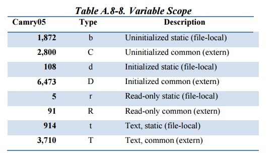
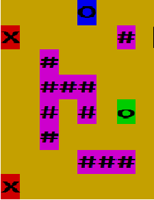
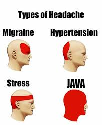
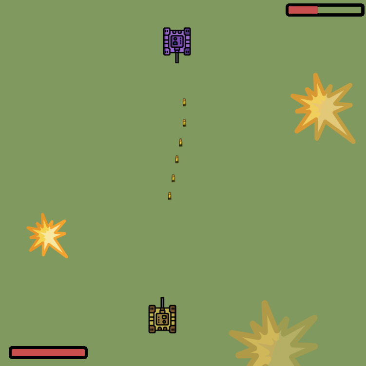

------ Day 00 – Java bootcamp ------
### Management structures and arrays

*Takeaways: Today, you will learn the basics of solving both trivial and more challenging business tasks using basic Java language constructs.*

# Contents
1. [Chapter I](#chapter-i) 
    
	1.1. [Preamble](#preamble)
2. [Chapter II](#chapter-ii) 
    
	2.1. [General Rules](#general-rules)
3. [Chapter III](#chapter-iii) 
    
	3.1. [Rules of the Day](#rules-of-the-day)
4. [Chapter IV](#chapter-iv) 
    
	4.1. [Exercise 00 – Sum of Digits](#exercise-00-sum-of-digits)
5. [Chapter V](#chapter-v) 
    
	5.1. [Exercise 01 – Really Prime Number](#exercise-01-really-prime-number)
6. [Chapter VI](#chapter-vi) 
    
	6.1. [Exercise 02 – Endless Sequence (or not?)](#exercise-02-endless-sequence-or-not)
7. [Chapter VII](#chapter-vii) 
    
	7.1. [Exercise 03 – A Little Bit of Statistics](#exercise-03-a-little-bit-of-statistics)
8. [Chapter VIII](#chapter-viii) 
    
	8.1. [Exercise 04 – A Bit More of Statistics](#exercise-04-a-bit-more-of-statistics)
9. [Chapter IX](#chapter-ix) 
    
	9.1. [Exercise 05 – Schedule](#exercise-05-schedule)


# Chapter I 
### Preamble

<br>
Java Man, or *Homo erectus erectus*

# Chapter II
### General Rules
- Use this page as the only reference. Do not listen to any rumors and speculations about how to prepare your solution.
- Now there is only one Java version for you, 1.8. Make sure that compiler and interpreter of this version are installed on your machine.
- You can use IDE to write and debug the source code.
- The code is read more often than written. Read carefully the [document](https://www.oracle.com/technetwork/java/codeconventions-150003.pdf) where code formatting rules are given. When performing each task, make sure you follow the generally accepted [Oracle standards](https://www.oracle.com/java/technologies/javase/codeconventions-namingconventions.html).

- Comments are not allowed in the source code of your solution. They make it difficult to read the code.
- Pay attention to the permissions of your files and directories.
- To be assessed, your solution must be in your GIT repository.
- Your solutions will be evaluated by your bootcamp mates.
- You should not leave in your \"src\" directory any other file than those explicitly specified by the exercise instructions. It is recommended that you modify your .gitignore to avoid accidents.
- When you need to get precise output in your programs, it is forbidden to display a precalculated output instead of performing the exercise correctly.
- Have a question? Ask your neighbor on the right. Otherwise, try with your neighbor on the left.
- Your reference manual: mates / Internet / Google. And one more thing. There's an answer to any question you may have on Stackoverflow. Learn how to ask questions correctly.
- Read the examples carefully. They may require things that are not otherwise specified in the subject.
- Use \"System.out\" for output.
- And may the Force be with you!
- Never leave that till tomorrow which you can do today ;)

# Chapter III
###  Rules of the Day
- User-defined methods and classes are prohibited for all tasks of the day, except for user-defined static functions and procedures in the main class file of the solution.
- All tasks contain a list of ALLOWED language constructs for the specific task.
- System::exit may be used for all tasks.

- All tasks contain an example of how the application operates. The implemented solution must be identical to the specified output example for current input data.
- For illustration purposes, the data entered by the user in task examples are preceded by an arrow (->). Do not take account of these arrows when implementing a solution!

P.S. Some tasks require a non-trivial approach because of the above-mentioned limitations. These limitations will teach you how to find solutions for automating actual business processes.

# Chapter IV
### Exercise 00 – Sum of Digits

|Exercise 00: Sum of Digits||
|------|------|
| Turn-in directory | ex00 |
| Files to turn-in |	Program.java |
| **Allowed** | |
| Input/Output | System.out|
| Types |	Primitive types |
| Operators |	Standard operations of primitive types|

Java is a strictly typed programming language. Fundamental data types (boolean, character, integer, floating point number) are represented in Java by eight primitive types: boolean, char, byte, short, int, long, float, double.

Work with integer type.

Calculate the sum of digits of a six-digit int number (the number value is set directly in the code by explicitly initializating the number variable). 

Example of the program operation for number 479598:
```
$ java Program
  42
```

# Chapter V
### Exercise 01 – Really Prime Number

|Exercise 01: Really Prime Number||
|------|------|
| Turn-in directory |	ex01 |
| Files to turn-in |	Program.java |
| **Allowed** | |
|Input/Output	| System.out, System.err, Scanner(System.in) |
| Types |	Primitive types |
| Operators |	Standard operations of primitive types, conditions, loops |

According to Böhm-Jacopini theorem, any algorithm can be written using three statements: sequence, selection, and iteration.

Using these statements in Java, you need to determine if the input number is a prime. A prime is a number which has no dividers other than the number itself and 1.

The program accepts the number entered from the keyboard as input and displays the result of checking whether that number is a prime.  In addition, the program shall output the number of steps (iterations) required to perform the check. In this task, an iteration is a single comparison operation. 

For negative numbers, 0 and 1, display theIllegalArgument message and shut down the program with the -1 code.

Example of program operation:

```
$ java Program
-> 169
   false 12

$ java Program
-> 113
   true 10

$ java Program
-> 42
   false 1

$ java Program
-> -100 
   Illegal Argument
```

# Chapter VI
### Exercise 02 – Endless Sequence (or not?)

|Exercise 02: Endless Sequence (or not?)||
|------|------|
Turn-in directory |	ex02
Files to turn-in |	Program.java
**Allowed**
Input/Output |	System.out, System.err, Scanner(System.in)
Types |	Primitive types
Operators |	Standard operations of primitive types, conditions, loops

Today, you are Google. 
You need to count queries related to coffee preparation which our search system users make at a certain moment. It is clear that the sequence of search queries is infinite. It is impossible to store these queries and count them later. 

But there is a solution—process the flow of queries. Why should we waste our resources for all queries if we are only interested in a specific feature of this query sequence?  Let's assume that each query is any natural number other than 0 and 1. A query is related to coffee preparation only if the sum of digits of the number (query) is a prime number.

So, we need to implement a program that will count the number of elements for a specified set of numbers whose sum of digits is a prime number.
To keep it simple, let's assume that this potentially infinite sequence of queries is still limited, and the last sequence element is number 42.

This task guarantees that input data is absolutely correct.

Example of program operation:

```
$ java Program
-> 198131
-> 12901212
-> 11122
-> 42
   Count of coffee-request – 2
```

# Chapter VII
### Exercise 03 – A Little Bit of Statistics
Exercise 03: A Little Bit of Statistics ||
---|---
Turn-in directory |	ex03
Files to turn-in |	Program.java
**Allowed**
Input/Output | System.out, System.err, Scanner(System.in)
Types |	Primitive types, String
Operators	| Standard operations of primitive types, conditions, loops
Methods |	String::equals

When developing corporate systems, you often need to collect different kinds of statistics. And the customer always wants such analytics to be illustrative. Who needs cold, dry figures? 

Educational organizations and online schools often belong to this type of customers. Now, you need to implement functionality to visualize students' progress. Customer wants to see a chart showing student's progress changes over several weeks. 

Customer evaluates this progress as a minimal grade for five tests within each week. Each test can be graded between 1 and 9.

The maximum number of weeks for the analysis is 18. Once the program has obtained information for each week, it displays the graph on the console to show minimum grades for a specific week.

And we keep assuming that 42 is the input data limit. 

The exact guaranteed number of tests in a week is 5.

However, the order of weekly data input is not guaranteed, so Week 1's data can be entered after Week 2's data. If data input order is wrong, IllegalArgument message shall be displayed, and the program shall be shut down with -1 code.


**Note**:

1.	There are many options for storing information, and arrays are just one of them. Apply another method for storing data about student tests without the use of arrays.
2.	String concatenation often results in unexpected program behavior. If there are many iterations of a concatenation operation in a cycle for a single variable, an application may slow down significantly. That is why we should not use string concatenation inside a loop to generate a result.

Example of program operation:

```
$ java Program
-> Week 1
-> 4 5 2 4 2
-> Week 2
-> 7 7 7 7 6
-> Week 3
-> 4 3 4 9 8
-> Week 4
-> 9 9 4 6 7
-> 42
Week 1 ==>
Week 2 ======>
Week 3 ===>
Week 4 ====>
```

# Chapter VIII
### Exercise 04 – A Bit More of Statistics
Exercise 04: A Bit More of Statistics ||
---|---
Turn-in directory	| ex04
Files to turn-in |	Program.java
**Allowed**
Input/Output |	System.out, System.err, Scanner(System.in)
Types | Primitive types, String, arrays
Operators	| Standard operations of primitive types, conditions, loops
Methods	| String::equals, String::toCharArray, String::length

Did you know that you can use frequency analysis to decipher poorly encrypted texts?

 See https://en.wikipedia.org/wiki/Frequency_analysis

Feel like a hacker and implement a program for counting a character occurrences in a text. 

We like visual clarity. This is why the program will display the results in a histogram. This chart will show 10 most frequently occurring characters in descending order. 

If letters are encountered the same number of times, they should be sorted in a lexicographic order.

Each character may occur in text a great number of times. For that reason, the chart should be scalable. The maximum height of the displayed chart is 10, and the minimum is 0. 

Input data for the program is a string with a single \"\
\" character at the end (thus, a single long string can be used as input).

It is assumed that each input character can be contained in a char variable (Unicode BMP; for example, the code of letter \"S\" is 0053, maximum code value is 65535).

The maximum number of character occurrences is 999.

**Note**: this problem must be solved without multiple iterations over the source text (sorting and removing repetitions), because these methods will significantly slow down the application. Use other information processing methods.

Example of program operation:

```
$ java Program

-> AAAAAAAAAAAAAAAAAAAAAAAAAAAAAAAAASSSSSSSSSSSSSSSSSSSSSSSSDDDDDDDDDDDDDDDDDDDDDDDDDDDDDDDDDWEWWKFKKDKKDSKAKLSLDKSKALLLLLLLLLLRTRTETWTWWWWWWWWWWOOOOOOO42

 36
  #  35
  #   #
  #   #  27
  #   #   #
  #   #   #
  #   #   #
  #   #   #  14  12
  #   #   #   #   #   9
  #   #   #   #   #   #   7   4
  #   #   #   #   #   #   #   #   2   2
  D   A   S   W   L   K   O   T   E   R
```

# Chapter IX
### Exercise 05 – Schedule

Exercise 05: Schedule ||
---|---
Turn-in directory	| ex05
Files to turn-in |Program.java
**Allowed**
Input/Output | System.out, System.err, Scanner(System.in)
Types |	Primitive types, String, arrays
Operators	| Standard operations of primitive types, conditions, loops
Methods |	String::equals, String::toCharArray, String::length

You've just become a great hacker, but your customer comes back to you with another task. This time, they need to be able to maintain a class timetable in their educational institution. Customer opens a school in September 2020. So, you need to implement the MVP version of the project for this month only. 

You need to be able to create a list of students and specify time and weekdays for classes. Classes can be held on any day of week between 1 pm and 6 pm. Multiple classes can be held on a single day. However, total classes per week cannot exceed 10.

Maximum number of students in the timetable is also 10. Maximum length of a student's name is 10 (no spaces).

You should also provide an ability to record student's attendance. To do so, time and date of classes shall be specified next to each student's name along with attendance status (HERE, NOT_HERE). You do not need to record attendance for all classes in a month.

Therefore, application's life cycle is as follows:
1. Creating a list of students
2. Populating a timetable—each class (time, day of week) is entered in a separate row
3. Attendance recording
4. Displaying the timetable in tabular form with attendance statuses.

Each application operation stage is divided by \".\" (period). Absolute correctness of data is guaranteed, except for sequential ordering of classes when populating the timetable.

Example of program operation:


 ------ Team 00 – Java bootcamp ------
### Console Game & Maven

*Takeaways: Today you will implement quite a complicated game business process using Maven build tool*

# Contents
1. [Chapter I](#chapter-i) 
    
	1.1. [Preamble](#preamble)
2. [Chapter II](#chapter-ii) 
    
	2.1. [General Rules](#general-rules)
3. [Chapter III](#chapter-iii) 
    
	3.1. [Exercise 00 – Surrender, You're Surrounded](#exercise-00-surrender-youre-surrounded)


# Chapter I 
### Preamble
Between 2000 and 2010, there were numerous issues in throttle controller software of a well-known automotive manufacturing company which resulted in 89 serious accidents.

The problem was not in the vehicle design but in low-quality software. It was a spaghetti code uncoverable by any testing methods. 

Even NASA was engaged in the problem investigation. 

Below is the number of defects found in the controller software:



And this content is not safe to view:


# Chapter II
### General Rules
- Use this page as the only reference. Do not listen to any rumors and speculations about how to prepare your solution.

- Now there is only one Java version for you, 1.8. Make sure that compiler and interpreter of this version are installed on your machine.

- You can use IDE to write and debug the source code.

- The code is read more often than written. Read carefully the [document](https://www.oracle.com/technetwork/java/codeconventions-150003.pdf) where code formatting rules are given. When performing each task, make sure you follow the generally accepted [Oracle standards](https://www.oracle.com/java/technologies/javase/codeconventions-namingconventions.html).

- Comments are not allowed in the source code of your solution. They make it difficult to read the code. The only format of comments allowed is Javadoc.

- Pay attention to the permissions of your files and directories.

- To be assessed, your solution must be in your GIT repository.

- Your solutions will be evaluated by your bootcamp mates.

- You should not leave in your \"src\" directory any other file than those explicitly specified by the exercise instructions. It is recommended that you modify your .gitignore to avoid accidents.

- When you need to get precise output in your programs, it is forbidden to display a precalculated output instead of performing the exercise correctly.

- Have a question? Ask your neighbor on the right. Otherwise, try with your neighbor on the left.

- Your reference manual: mates / Internet / Google. And one more thing. There's an answer to any question you may have on Stackoverflow. Learn how to ask questions correctly.

- Read the examples carefully. They may require things that are not otherwise specified in the subject.

- Use System.out for output.

- And may the Force be with you!

- Never leave that till tomorrow which you can do today ;)


# Chapter III
### Exercise 00 – Surrender, You're Surrounded

| Exercise 00: Surrender, You're Surrounded | |
| ------ | ------ |
| Turn-in directory | ex00 |
| Files to turn-in | Game-folder, ChaseLogic-folder |

Do you remember good old Java games? In the early 2000s, they were in each phone. Now Java developers design scalable enterprise systems, but at that time... 

Your objective today is to get a bit nostalgic and implement a game where you run from artificial intelligence entities across a square field. 

The program shall generate a random map with obstacles. Both player and its enemies are located on the map in a random manner. Each map element shall have a certain color.

Example of a generated map:



**Designations**: <br>
`o` - position of a player (program user) on the map.<br>
`#` - obstacle<br>
`x` - enemy (artificial intelligence)<br>
`O` - target point the player must get to before the enemies reach the player. The player is considered to have reached the target cell if they stepped on its position.

**Game rules**:
1. Each participant (player and enemies) may make one move. Then, it's another participant's turn. The enemy is considered to have reached the player if it can step on the player's position by making the current move.
2. Available movement directions are left, right, downward, and upward.
3. If an enemy is unable to move forward (there are obstacles or other enemies around them, or a map edge has been reached), the enemy skips a move.
4. The target point is an obstacle for an enemy.
5. If the player is unable to move forward (surrounded by obstacles, enemies, or has reached an edge of the map), the player loses the game.
6. The player loses if an enemy finds them before they reach the target point.
7. The player starts the game first.

**Implementation requirements**:
1. Field size, number of obstacles, and number of enemies are entered into the program using command-line parameters (their availability is guaranteed):<br>
`$ java -jar game.jar --enemiesCount=10 --wallsCount=10 --size=30 --profile=production`
2. A check shall be made whether it is possible to put the specified number of enemies and obstacles on the map of given size. If input data is incorrect, the program shall throw an unchecked IllegalParametersException and shut down.
3. Enemies, obstacles, the player, and the target point are positioned on the field randomly. 
4. When generating the map, enemies, the player, obstacles, and the target point shall not overlap.
5. In the beginning of the game, the map must be generated so that the player can reach the target point (the player must not be blocked by walls and map edge in starting position).
6. To make a move, the player shall enter a number in the console that corresponds to the movement direction A, W, D, S (left, upward, right, downward).
7. If the player is unable to make a move in the specified direction, another number (direction) shall be entered.
8. If the player understands in the beginning or middle of the game that the target point is unreachable, they shall end the game by entering 9 (player loses).
9. Once the player has made a move, it is its enemy's turn to make a move towards the player. 
10. In the development mode, each enemy's step shall be confirmed by the player by entering 8.
11. Upon each a step of any participant, map must be redrawn in the console. In development mode, the map shall be displayed without updating the screen.
12. Pursuing algorithm shall take account of the target object location in each step.

**Architecture requirements**:
1. Two projects shall be implemented: Game (contains game logic, application entry point, output functionality, etc.) and ChaseLogic (contains pursuing algorithm implementation).
2. Both are mavenprojects, and ChaseLogic shall be added as a dependency to pom.xml inside Game.
3. Game.jar archive shall be portable:  JCommander and JCDP must be directly included in the archive. At the same time, all libraries connected to the project shall be declared as maven-dependency. To build such archive, the following plugins shall be used.

It is also necessary to create a configuration file called application-production.properties. In this file, you will specify your application settings. The example of this file is shown below:

enemy.char = X <br>
player.char = o <br>
wall.char = 
    # <br>
goal.char = O <br>
empty.char= <br>
enemy.color = RED <br>
player.color = GREEN <br>
wall.color = MAGENTA <br>
goal.color = BLUE <br>
empty.color = YELLOW

This configuration file will be located in resources folder of the launched jar archive.

In addition to that, application-dev.properties file should be implemented. Structure of this file is similar to that of application.properties. Here, you can specify parameters for distinguishing application startup in development mode (for example, different colors/characters for map components).

It is necessary to keep in mind that the program may also be started in other modes. For this purpose, the respective properties file can be added to the source project, and the mode itself is passed via --profile parameter.


------ Day 04 – Java Bootcamp ------
### JAR

*Takeaways: Today you will learn to create library archives and use external libraries*

# Contents
1. [Chapter I](#chapter-i) 
    
  1.1. [Preamble](#preamble)
2. [Chapter II](#chapter-ii) 
    
  2.1. [General Rules](#general-rules)
3. [Chapter III](#chapter-iii) 
    
  3.1. [Exercise 00 – Packages](#exercise-00-packages)
4. [Chapter IV](#chapter-iv) 
    
  4.1. [Exercise 01 – First JAR](#exercise-01-first-jar)
5. [Chapter V](#chapter-v) 
    
  5.1. [Exercise 02 – JCommander & JCDP](#exercise-02-jcommander-jcdp)

# Chapter I 
### Preamble
Any Java library or framework is a set of JAR files—archives of compiled classes and other resources.
 
Thus, the goal of any Java developer is to correctly organize the source code and then transfer the compiled JAR archive with implemented functionality to another programmer.

There is a range of tools to organize the project building life cycle and its structure. Nevertheless, certain skills of using standard Java infrastructure tools guarantee the correct understanding of how out-of-the-box and popular solutions work.

Today, you will manually build an application with external libraries. This is your first step in learning Maven—the most popular building system.

# Chapter II
### General Rules
- Use this page as the only reference. Do not listen to any rumors and speculations about how to prepare your solution.
- Now there is only one Java version for you, 1.8. Make sure that compiler and interpreter of this version are installed on your machine.
- You can use IDE to write and debug the source code.
- The code is read more often than written. Read carefully the [document](https://www.oracle.com/technetwork/java/codeconventions-150003.pdf) where code formatting rules are given. When performing each task, make sure you follow the generally accepted [Oracle standards](https://www.oracle.com/java/technologies/javase/codeconventions-namingconventions.html).

- Comments are not allowed in the source code of your solution. They make it difficult to read the code. The only format of comments allowed is Javadoc.
- Pay attention to the permissions of your files and directories.
- To be assessed, your solution must be in your GIT repository.
- Your solutions will be evaluated by your bootcamp mates.
- You should not leave in \"src\" your directory any other file than those explicitly specified by the exercise instructions. It is recommended that you modify your .gitignore to avoid accidents.
- When you need to get precise output in your programs, it is forbidden to display a precalculated output instead of performing the exercise correctly.
- Have a question? Ask your neighbor on the right. Otherwise, try with your neighbor on the left.
- Your reference manual: mates / Internet / Google. And one more thing. There's an answer to any question you may have on Stackoverflow. Learn how to ask questions correctly.
- Read the examples carefully. They may require things that are not otherwise specified in the subject.
- Use System.out for output.
- And may the Force be with you!
- Never leave that till tomorrow which you can do today :))


# Chapter III
### Exercise 00 – Packages

Exercise 00: Packages ||
---|---
Turn-in directory	| ex00
Files to turn-in	| ImagesToChar-folder (exclude target)

Code can be organized on different levels. Packages are one of the code organization methods where classes are located in individual folders. 

Now your task is to implement functionality that prints a two-colored image in the console. 

An example of a black-and-white BMP image (this format is mandatory for the solution). Image size is 16*16 pixels.


You can download this image [here](https://yadi.sk/i/nt-C_kZKWrlyNQ ).

Your application shall accept input parameters corresponding to characters that should be displayed in place of white and black pixels. Another main function startup parameter is the full path to the image on your disk.

If \".\" character is used for white color and \"0\" for black, the image in the console may look as follows:


Application logic must be distributed between different packages and have the following structure:

- ImagesToChar - project folder
  - src - source files
    -	java - files of Java source code
        - edu.school21.printer - a series of main packages
          -	app - a package that contains classes for startup 
          -	logic - a package that contains the logic for converting an image into an array of characters
  -	target - compiled .class files
    -	edu.school21.printer ...
  -	README.txt
  
README.txt file must contain instructions for compiling and starting your source code from the console (non-IDE). Instruction is written for the state where the console is opened in the project's root folder.

# Chapter IV
### Exercise 01 – First JAR

Exercise 01: First JAR ||
---|---
Turn-in directory	| ex01
Files to turn-in	| ImagesToChar-folder (exclude target)

Now you need to create a distribution package of the application—a JAR archive. It is important that the image be contained in that archive (a command-line parameter for the full path to the file is not required in this task).

The following project structure shall be adhered to:

- ImagesToChar - project folder
  - src - source files
    - java - files of Java source code
      - ...
    -	resources - a folder with resource files
         - image.bmp - the displayed image
    - manifest.txt - a file containing the description of the initial point for archive startup  
  - target - compiled .class files and archive
    - edu.school21.printer ...
    - resources
    - images-to-chars-printer.jar
  - README.txt

Archive and all compiled files shall be put in target folder during assembly (without a manual file transfer; you may apply cp command to the resource folder).

README.txt file should also contain information on the archive assembly and startup.

# Chapter V
### Exercise 02 – JCommander & JCDP
Exercise 02: JCommander & JCDP ||
---|---
Turn-in directory	| ex02
Files to turn-in |	ImagesToChar (exclude lib and target)

Now you should use external libraries:
- JCommander for the command line. 
- JCDP or JColor for using colored output

Archives with these libraries shall be downloaded and included in the previous task's project. 

Now application startup parameters shall be processed with JCommander tools. The image should be displayed using the \"colored\" output option of JCDP library.

Required project structure:
- ImagesToChar - project folder
  -	lib - external library folder
    -	jcommander-*.**.jar
    -	JCDP-*.*.*.jar/JCOLOR-*.*.*.jar
  -	src - source files
  -	target - compiled .class files and archive
    -	edu.school21.printer
    -	com/beust ... - .class files of JCommander library
    -	com/diogonunes ... - .class files of JCDP library
    -	resources
    -	images-to-chars-printer.jar
  -	README.txt

README.txt file shall also contain the information about including external libraries in the final assembly.

Example of program operation:

`$ java -jar images-to-chars-printer.jar --white=RED --black=GREEN`


 ------ Day 03 – Java bootcamp ------
### Threads

*Takeaways: Today you will learn how to use basic multithreading mechanisms in Java*

# Contents
1. [Chapter I](#chapter-i) 
    
  1.1. [Preamble](#preamble)
2. [Chapter II](#chapter-ii) 
    
  2.1 [General Rules](#general-rules)
3. [Chapter III](#chapter-iii) 
    
  3.1 [Exercise 00 – Egg, Hen... or Human?](#exercise-00-egg-hen-or-human)
4. [Chapter IV](#chapter-iv) 
    
  4.1 [Exercise 01 – Egg, Hen, Egg, Hen...](#exercise-01-egg-hen-egg-hen)
5. [Chapter V](#chapter-v) 
    
  5.1. [Exercise 02 – Real Multithreading](#exercise-02-real-multithreading)
6. [Chapter VI](#chapter-vi) 
    
  6.1. [Exercise 03 – Too Many Threads...](#exercise-03-too-many-threads)


# Chapter I
### Preamble
- Any up-to-date client/server application is based on threads.
- Threads implement the asynchronous operation concept, where several loosely-coupled tasks are performed \"in parallel.\"
- Multithreading in client/server applications enables to put some tasks into background execution mode so that client does not have to wait for server's response. For example, once you have specified your email on the website, a page is displayed immediately to inform that the confirmation message has been sent to your email address regardless of how long it will take to send the message to your email in a parallel thread.

- Each of your requests on a website is performed in an individual, independent thread on the server.
- Behavior of threads is managed by the operating system and the processor.
- Behavior of threads is non-deterministic. You never know which thread will run at a specific moment, even if you restart the same multithreaded code.
- Tips on handling threads can be found in Object class.
- Threads are the favorite topic in junior interviews.

# Chapter II
### General Rules
- Use this page as the only reference. Do not listen to any rumors and speculations about how to prepare your solution.
- Now there is only one Java version for you, 1.8. Make sure that compiler and interpreter of this version are installed on your machine.
- You can use IDE to write and debug the source code.
- The code is read more often than written. Read carefully the [document](https://www.oracle.com/technetwork/java/codeconventions-150003.pdf) where code formatting rules are given. When performing each task, make sure you follow the generally accepted [Oracle standards](https://www.oracle.com/java/technologies/javase/codeconventions-namingconventions.html).

- Comments are not allowed in the source code of your solution. They make it difficult to read the code.
- Pay attention to the permissions of your files and directories.
- To be assessed, your solution must be in your GIT repository.
- Your solutions will be evaluated by your bootcamp mates.
- You should not leave in your \"src\" directory any other file than those explicitly specified by the exercise instructions. It is recommended that you modify your .gitignore to avoid accidents.
- When you need to get precise output in your programs, it is forbidden to display a precalculated output instead of performing the exercise correctly.
- Have a question? Ask your neighbor on the right. Otherwise, try with your neighbor on the left.
- Your reference manual: mates / Internet / Google. And one more thing. There's an answer to any question you may have on Stackoverflow. Learn how to ask questions correctly.
- Read the examples carefully. They may require things that are not otherwise specified in the subject.
- Use System.out for output.
- And may the Force be with you!
- Never leave that till tomorrow which you can do today ;)

# Chapter III
### Exercise 00 – Egg, Hen... or Human?

Exercise 00: Egg, Hen... or Human? ||
---|---
Turn-in directory |	ex00
Files to turn-in |	*.java
**Allowed:** |
Types and their methods: |	Object, Thread, Runnable

Chicken or egg

The truth is born in a dispute—let's assume that each thread provides its own answer. The thread that has the last word is right.

You need to implement the operation of two threads. Each of them must display its answer a few times, for example, 50:
```
$ java Program --count=50
Egg
Hen
Hen
Hen
...
Egg
```
In this case, the egg thread wins. However, the program also contains main thread. Inside the thread,  public static void main(String args[]) method is executed. We need this thread to display all its responses at the end of program execution. Thus, the ultimate variant is as follows:
```
$ java Program --count=50
Egg
Hen
Hen
...
Egg
Hen
...
Human
...
...
Human
```
It means that the program outputs Human message 50 times, which main thread prints.

# Chapter IV
### Exercise 01 – Egg, Hen, Egg, Hen...

Exercise 00: Egg, Hen, Egg, Hen... ||
---|---
Turn-in directory |	ex01
Files to turn-in | *.java
**Allowed:** |
Types and their methods: | Object, Thread, Runnable
Keywords: |	Synchronized

Let's orchestrate the argument. Now, each thread can provide its answer only after another thread has done so. Let's assume that the egg thread always answers first.

```
$ java Program --count=50
Egg
Hen
Egg
Hen
Egg
Hen
...
```

**Note**:<br>
To solve this task, we recommend to explore Producer-Consumer model operation principle

# Chapter V
### Exercise 02 – Real Multithreading

Exercise 02: Real Multithreading ||
---|---
Turn-in directory |	ex02
Files to turn-in | *.java
**Allowed:** |
Types and their methods: | Object, Thread, Runnable
Keywords: | Synchronized

Try to use multithreading for its intended purpose: distribute computations across the program.

Let's assume there is an array of integer values. Your goal is to calculate the sum of array elements using several \"summing\" threads. Each thread computes a certain section inside the array. The number of elements in each section is constant, except for the last one (its size can differ upward or downward).

The array shall be randomly generated each time. Array length and the number of threads are passed as command-line arguments.

To make sure the program operates correctly, we should start by calculating the sum of array elements using a standard method.

Maximum number of array elements is 2,000,000. Maximum number of threads is no greater than current number of array elements. Maximum modulo value of each array element is 1,000. All data is guaranteed to be valid.

Example of the program operation (each array element equals 1):
```
$ java Program --arraySize=13 --threadsCount=3
Sum: 13
Thread 1: from 0 to 4 sum is 5
Thread 2: from 5 to 9 sum is 5
Thread 3: from 10 to 12 sum is 3
Sum by threads: 13
```

**Notes**:
- In the above example, the size of the last summing-up section used by the third thread is less than others.
- Threads can output the results of operation inconsistently

# Chapter VI
### Exercise 03 – Too Many Threads...

Exercise 02: Too Many Threads... ||
---|---
Turn-in directory	| ex03
Files to turn-in	| *.java
**Allowed:** |
Types and their methods: |	Object, Thread, Runnable
Keywords: |	Synchronized

Let's assume that we need to download a list of files from a network. Some files are downloaded faster, while others are slower.

To implement this functionality, we can obviously use multithreaded downloading where each thread loads a specific file. But what should we do if there are too many files? A large number of threads cannot be run at the same time. Therefore, many of them will be waiting.

In addition, we should bear in mind that continuously creating and completing threads is a very costly operation we should avoid. It makes more sense to start N threads at once and, when either of them finishes downloading the file, it can take on the next file in the queue.

We need to create files_urls.txt file (file name shall be explicitly specified in program code) where you specify a list of URLs of files to be downloaded, for instance:
```
1 https://i.pinimg.com/originals/11/19/2e/11192eba63f6f3aa591d3263fdb66bd5.jpg
2 https://pluspng.com/img-png/balloon-hd-png-balloons-png-hd-2750.png
3 https://i.pinimg.com/originals/db/a1/62/dba162603c71cac00d3548420c52bac6.png
4 https://pngimg.com/uploads/balloon/balloon_PNG4969.png
5 http://tldp.org/LDP/intro-linux/intro-linux.pdf
```
Example of the program operation:
```
$ java Program.java --threadsCount=3
Thread-1 start download file number 1
Thread-2 start download file number 2
Thread-1 finish download file number 1
Thread-1 start download file number 3
Thread-3 start download file number 4
Thread-1 finish download file number 3
Thread-2 finish download file number 2
Thread-1 start download file number 5
Thread-3 finish download file number 4
Thread-1 finish download file number 5
```
**Notes**:
- Output created by the implemented program may differ from the illustration.
- Each file is downloaded only once by a single thread.
- The program may contain an \"infinite loop\" without the exit condition (in this case, the program can be shut down by interrupting the process).


 ------ Day 02 – Java bootcamp ------
### IO, Files

*Takeways: Today you will learn how to use input/output in Java and implement programs to manipulate a file system*

# Contents
1. [Chapter I](#chapter-i) 
    
  1.1. [Preamble](#preamble)
2. [Chapter II](#chapter-ii) 
    
  2.1. [General Rules](#general-rules)
3. [Chapter III](#chapter-iii) 
    
  3.1. [Exercise 00 – File Signatures](#exercise-00-file-signatures)
4. [Chapter IV](#chapter-iv) 
    
  4.1. [Exercise 01 – Words](#exercise-01-words)
5. [Chapter V](#chapter-v) 
    
  5.1. [Exercise 02 – File Manager](#exercise-02-file-manager)

# Chapter I
### Preamble
Input/output operations play an important role in corporate system development. It is often necessary to implement functionality for loading and processing user files, sending various documents by mail, etc.

Apparently, input/output never boils down to working with a file system. Any client/server interaction between applications implies input/output operations. For example, Java Servlets technology used in web development enables to format HTML pages using PrintWriter class.

It is important to remember that the input/output functionality is not limited to Java IO stack. There are many libraries that greatly simplify interaction with data flows. Apache Commons IO is one of them.

# Chapter II
### General Rules
- Use this page as the only reference. Do not listen to any rumors and speculations about how to prepare your solution.
- Now there is only one Java version for you, 1.8. Make sure that compiler and interpreter of this version are installed on your machine.
- You can use IDE to write and debug the source code.
- The code is read more often than written. Read carefully the [document](https://www.oracle.com/technetwork/java/codeconventions-150003.pdf) where code formatting rules are given. When performing each task, make sure you follow the generally accepted [Oracle standards](https://www.oracle.com/java/technologies/javase/codeconventions-namingconventions.html).

- Comments are not allowed in the source code of your solution. They make it difficult to read the code. The only format of comments allowed is Javadoc.
- Pay attention to the permissions of your files and directories.
- To be assessed, your solution must be in your GIT repository.
- Your solutions will be evaluated by your bootcamp mates.
- You should not leave in your \"src\" directory any other file than those explicitly specified by the exercise instructions. It is recommended that you modify your .gitignore to avoid accidents.
- When you need to get precise output in your programs, it is forbidden to display a precalculated output instead of performing the exercise correctly.
- Have a question? Ask your neighbor on the right. Otherwise, try with your neighbor on the left.
- Your reference manual: mates / Internet / Google. And one more thing. There's an answer to any question you may have on Stackoverflow. Learn how to ask questions correctly.
- Read the examples carefully. They may require things that are not otherwise specified in the subject.
- Use System.out for output
- And may the Force be with you!
- Never leave that till tomorrow which you can do today ;)

# Chapter III
### Exercise 00 – File Signatures

Exercise 00: File Signatures||
---|---
Turn-in | directory	ex00
Files to turn-in |	*.java, signatures.txt
**Permissions**
Recommended types |	Java Collections API (`List<T>`, `Map<K`, `V>`, etc.), InputStream, OutputStream, FileInputStream, FileOutputStream

Input/output classes in Java are represented by a broad hierarchy. The key classes describing byte input/output behavior are abstract classes InputStream and OutputStream. They do not implement specific mechanisms for byte flows processing, rather delegate them to their subclasses, such as FileInputStream/FileOutputStream.

To understand the use of this functionality, you should implement an application for analyzing signatures of arbitrary files. This signature allows to define file content type and consists of a set of \"magic numbers.\" These numbers are usually located in the beginning of the file. For example, a signature for PNG file type is represented by first eight bytes of a file that are equal for all PNG images:
```
89 50 4E 47 0D 0A 1A 0A
```

You need to implement an application that accepts the signatures.txt as an input (you should describe it on your own; the file name is explicitly stated in the program code). It contains a list of file types and their respective signatures in the HEX format. Example (specified format of this file must be adhered to):
```
PNG, 89 50 4E 47 0D 0A 1A 0A
GIF, 47 49 46 38 37 61
```
During execution, your program shall accept full paths to files on hard disk and keep the type which file signature corresponds to. The result of program execution should be written to result.txt file. If a signature cannot be defined, the execution result is UNDEFINED (no information should be written into the file).

Example of program operation:
```
$java Program
-> C:/Users/Admin/images.png
PROCESSED
-> C:/Users/Admin/Games/WoW.iso
PROCESSED
-> 42
```
Contents of result.txt file (there is no need to load this file as a result):
```
PNG
GIF
```

**Notes**:
- We can accurately determine the content type by analyzing the file signature, since the file extension contained in the name (e. g. image.jpg) can be changed by simply renaming the file.

- The signatures file shall contain at least 10 different formats for analysis.

# Chapter IV
### Exercise 01 – Words

Exercise 01: Words ||
---|---
Turn-in directory	| ex01
Files to turn-in |	*.java
**Permissions**
Recommended types |	Java Collections API, Java IO

In addition to classes designed to handle byte flows, Java has classes to simplify handling of character flows (char). These include abstract classes Reader/Writer, as well as their implementations (FileReader/FileWriter, etc.). Of special interest are BufferedReader/BufferedWriter classes which accelerate flow handling via buffering mechanisms.

Now you need to implement an application that will determine the level of similarity between texts. The simplest and most obvious method to do this is to analyze the frequency of occurrence of the same words.

Let's assume that we have two following texts:
```
1. aaa bba bba a ссс
2. bba a a a bb xxx
```
Let's create a dictionary that contains all words in these texts:
```
a, aaa, bb, bba, ccc, xxx
```
Now let's create two vectors with length equal to that of the dictionary. In i-th position of each vector, we shall reflect the frequency of occurrence of the i-th word in our dictionary in the former and latter texts:
```
A = (1, 1, 0, 2, 1, 0)
B = (3, 0, 1, 1, 0, 1)
```

Thus, each of these vectors characterizes the text in terms of frequency of occurrence of words from our dictionary. Let's determine the similarity between vectors using the following formula:


Thus, similarity value for these vectors is:
```
Numerator A. B = (1 * 3 + 1 * 0 + 0 * 1 + 2 * 1 + 1 * 0 + 0 * 1) = 5
Denominator ||A|| * ||B|| = sqrt(1 * 1 + 1 * 1 + 0 * 0 + 2  * 2 + 1 * 1 + 0 * 0) * sqrt(3 * 3 + 0 * 0 + 1 * 1 + 1 * 1  + 0 * 0 + 1 * 1) = sqrt(7) * sqrt(12) = 2.64 * 3.46 = 9.1
similarity = 5 / 9.1 = 0.54
```
Your goal is to implement an application that accepts two files as an input (both files are passed as command-line arguments) and displays their similarity comparison outcome (cosine measure).

The program shall also create dictionary.txt file containing a dictionary based on these files.

Example of program operation:
```
$ java Program inputA.txt inputB.txt
Similarity = 0.54
```

**Notes**:
1. Maximum size of these files is 10 MB.
2. Files may contain non-letter characters.

# Chapter V
### Exercise 02 – File Manager

Exercise 02: File Manager ||
---|---
Turn-in directory |	ex02
Files to turn-in |	*.java
**Permissions**
Recommended types	| Java Collections API, Java IO, Files, Paths, etc.

Let's implement a utility handling the files. The application shall display information about the files, folder content and size, and provide moving/renaming functionality. In essence, the application emulates a command line of Unix-like systems.

The program shall accept as an argument the absolute path to the folder where we start to work, and support the following commands:

`mv` WHAT WHERE – enables to transfer or rename a file if WHERE contains a file name without a path.
`ls` – displays the current folder contents (file and subfolder names and sizes in KB)
`cd FOLDER_NAME` – changes the current directory

Let's assume there is MAIN folder on disk C:/ (or in the root directory, depending on OS) with the following hierarchy:
- MAIN
  + folder1
    * image.jpg
    *	animation.gif
  +	folder2
    * text.txt
    *	Program.java

Example of the program operation for MAIN directory:
```
$ java Program --current-folder=C:/MAIN
C:/MAIN
-> ls
folder1 60 KB
folder2 90 KB
-> cd folder1
C:/MAIN/folder1
-> ls
image.jpg 10 KB
animation.gif 50 KB
-> mv image.jpg image2.jpg
-> ls
image2.jpg 10 KB
animation.gif 50 KB
-> mv animation.gif ../folder2
-> ls
image2.jpg 10 KB
-> cd ../folder2
C:/MAIN/folder2
-> ls
text.txt 10 KB
Program.java 80 KB
animation.gif 50 KB
-> exit
```

**Note**:<br>
You should test the program functionality using your own set of files/folders.


 ------ Day 01 – Java bootcamp ------
### OOP/Collections

*Takeaways: Today you will learn how to model the operation of various collections correctly, and create a full-scale money transfer application*

# Contents
1. [Chapter I](#chapter-i) 
    
	1.1. [Preamble](#preamble)
2. [Chapter II](#chapter-ii) 
    
	2.1. [General Rules](#general-rules)
3. [Chapter III](#chapter-iii) 
    
	3.1. [Introduction to exercises](#introduction-to-exercises)
4. [Chapter IV](#chapter-iv) 
    
	4.1. [Exercise 00 – Models](#exercise-00-models)
5. [Chapter V](#chapter-v) 
    
	5.1. [Exercise 01 – ID Generator](#exercise-01-id-generator)
6. [Chapter VI](#chapter-vi) 
    
	6.1. [Exercise 02 – List of Users](#exercise-02-list-of-users)
7. [Chapter VII](#chapter-vii) 
    
	7.1. [Exercise 03 – List of Transactions](#exercise-03-list-of-transactions)
8. [Chapter VIII](#chapter-viii) 
    
	8.1. [Exercise 04 – Business Logic](#exercise-04-business-logic)
9. [Chapter IX](#chapter-ix) 
    
	9.1. [Exercise 05 – Menu](#exercise-05-menu)

# Chapter I 
### Preamble
Domain modeling is the most challenging task in software development. Solving this task correctly ensures flexibility of the implemented system.
Programming languages supporting the object-oriented programming (OOP) concept enable to effectively divide business processes into logical components called classes.
Each class must comply with SOLID principles:
1.	Single responsibility principle: a class contains a single logically associated functionality (a coffee machine cannot clean and monitor changes in the call stack; its purpose is to make coffee).
2.	Open–closed principle: each class can offer an option to extend its functionality. However, such extension should not provide for modifying source class code.
3.	Liskov substitution principle: derived classes only ADD to the functionality of a source class without modifying it.
4.	Interface segregation principle: there are many points (interfaces) that describe a logically associated behavior. There is no general-purpose interface.
5.	Dependency inversion principle: a system must not depend on specific entities; all dependencies are based on abstractions (interfaces).

Today, you should focus on the first SOLID principle.


# Chapter II
### General Rules
- Use this page as the only reference. Do not listen to any rumors and speculations about how to prepare your solution.
- Now there is only one Java version for you, 1.8. Make sure that compiler and interpreter of this version are installed on your machine.
- You can use IDE to write and debug the source code.
- The code is read more often than written. Read carefully the [document](https://www.oracle.com/technetwork/java/codeconventions-150003.pdf) where code formatting rules are given. When performing each task, make sure you follow the generally accepted [Oracle standards](https://www.oracle.com/java/technologies/javase/codeconventions-namingconventions.html).

- Comments are not allowed in the source code of your solution. They make it difficult to read the code.
- Pay attention to the permissions of your files and directories.
- To be assessed, your solution must be in your GIT repository.
- Your solutions will be evaluated by your bootcamp mates.
- You should not leave in your \"src\" directory any other file than those explicitly specified by the exercise instructions. It is recommended that you modify your .gitignore to avoid accidents.
- When you need to get precise output in your programs, it is forbidden to display a precalculated output instead of performing the exercise correctly.
- Have a question? Ask your neighbor on the right. Otherwise, try with your neighbor on the left.
- Your reference manual: mates / Internet / Google. And one more thing. There's an answer to any question you may have on Stackoverflow. Learn how to ask questions correctly.
- Read the examples carefully. They may require things that are not otherwise specified in the subject.
- Use System.out for output.
- And may the Force be with you!
- Never leave that till tomorrow which you can do today ;)

# Chapter III
### Introduction to exercises
An internal money transfer system is an integral part of many corporate applications. 

Your today's task is to automate a business process associated with transfers of certain amounts between participants of our system.

Each system user can transfer a certain amount to another user. We need to make sure that even if we lose the history of incoming and outgoing transfers for a specific user, we shall still be able to recover this information.

Inside the system, all money transactions are stored in the form of debit/credit pairs. For example, John has transferred $500 to Mike. System saves the transaction for both users:
```java
John -> Mike, -500, OUTCOME, transaction ID
Mike -> John, +500, INCOME, transaction ID
```
To recover the connection within such pairs, identifiers of each transaction should be used.

A transfer entry may obviously be lost in such a complex system—it may not be recorded for one of the users (to emulate and debug such a situation, a developer needs to be able to remove the transfer data from one of users individually). Since such situations are realistic, functionality is required for displaying all \"unacknowledged transfers\" (transactions recorded for one user only) and resolving such issues.

Below is a set of exercises you can do one by one to solve the task.

# Chapter IV
### Exercise 00 – Models

Exercise 00: Models ||
---|---
Turn-in directory |	ex00
Files to turn-in |	User.java, Transaction.java, Program.java
**User classes can be employed, along with:**
Types (+ all methods of these types) |	Integer, String, UUID, enumerations

Your first task is to develop basic domain models—namely, User and Transaction classes.

It is quite likely for different users to have the same name in the system. This problem should be solved by adding a special field for a user's unique ID. This ID can be any integer number. Specific ID creation logic is described in the next exercise.

Thus, the following set of states (fields) is typical for User class:

-	Identifier
-	Name
-	Balance

Transaction class describes a money transfer between two users. Here, a unique identifier should also be defined. Since the number of such transactions can be very large, let us define the identifier as an UUID string. Thus, the following set of states (fields) is typical for Transaction class:
-	Identifier
-	Recipient (User type)
-	Sender (User type)
-	Transfer category (debits, credits)
-	Transfer amount

It is necessary to check the initial user balance (it cannot be negative), as well as the balance for the outgoing (negative amounts only) and incoming (positive amounts only) transactions (use of get/set methods).

An example of use of such classes shall be contained in Program file (creation, initialization, printing object content on a console). All data for class fields must be hardcoded in Program.

# Chapter V
### Exercise 01 – ID Generator

Exercise 01: ID Generator||
---|---
Turn-in directory |	ex01
Files to turn-in |	UserIdsGenerator.java, User.java, Program.java
**All permissions from the previous exercise can be used**

Make sure that each user ID is unique. To do so, create UserIdsGenerator class. Behavior of the object of this class defines the functionality for generating user IDs.

State-of-the-art database management systems support autoincrement principle where each new ID is the value of the previously generated ID +1.
So, UserIdsGenerator class contains the last generated ID as its state. UserIdsGenerator behavior is defined by int generateId() method that returns a newly generated ID each time it is called.

An example of use of such classes shall be contained in Program file (creation, initialization, printing object content on a console).

**Notes**:

- Make sure only one UserIdsGenerator object exists (see the Singleton pattern). It is required because existence of several objects of this class cannot guarantee that all user identifiers are unique.

- User identifier must be read-only since it is initialized only once (when the object is created) and cannot be modified later during the program execution.

- Temporary logic for identifier initialization should be added to User class constructor:
```java
public User(...) {
	this.id = UserIdsGenerator.getInstance().generateId();
}
```

# Chapter VI
### Exercise 02 – List of Users

Exercise 02: List of Users||
---|---
Turn-in directory	| ex02
Files to turn-in |	UsersList.java, UsersArrayList.java, User.java,Program.java, etc.
**All permissions from the previous exercise  + throw can be used.**

Now we need to implement a functionality for storing users while the program runs. 

At the moment, your application has no persistent storage (such as a file system or a database). However, we want to avoid the dependence of your logic on user storage implementation method. To ensure more flexibility, let us define UsersList interface that describes the following behavior:

-	Add a user
-	Retrieve a user by ID
-	Retrieve a user by index
-	Retrieve the number of users

This interface will enable to develop the business logic of your application so that a specific storage implementation does not affect other system components.

We shall also implement UsersArrayList class that implements UsersList interface.

This class shall use an array to store user data. The default array size is 10. If the array is full, its size is increased by half. The user-adding method puts an object of User type in the first empty (vacant) cell of the array.

In case of an attempt to retrieve a user with a non-existent ID, an unchecked UserNotFoundException must be thrown.

An example of use of such classes shall be contained in Program file (creation, initialization, printing object content on a console).

**Note**:<br>
Nested `ArrayList<T>` Java class has the same structure. By modeling behavior of this class on your own, you will learn how to use mechanisms of this standard library class. 

# Chapter VII
### Exercise 03 – List of Transactions

Exercise 03: List of Transactions||
---|---
Turn-in directory |	ex03
Files to turn-in | TransactionsList.java, TransactionsLinkedList.java, User.java, Program.java, etc.
**All permissions from the previous exercise can be used**

Unlike users, a list of transactions requires a special implementation approach. Since the number of transaction creation operations can be very large, we need a storage method to avoid a costly array size extension. 

In this task, we offer you to create TransactionsList interface describing the following behavior:
- Add a transaction
- Remove a transaction by ID (in this case, UUID string identifier is used)
- Transform into array (ex. Transaction[] toArray())

A list of transactions shall be implemented as a linked list (LinkedList) in TransactionsLinkedList class. Therefore, each transaction shall contain a field with a link to the next transaction object.
If an attempt is made to remove a transaction with non-existent ID, TransactionNotFoundException runtime exception must be thrown.
An example of use of such classes shall be contained in Program file (creation, initialization, printing object content on a console).

**Note**:<br>
- We need to add transactions field of TransactionsList type to User class so that each user can store the list of their transactions.
- A transaction must be added with a SINGLE operation (O(1))
- `LinkedList<T>` nested Java class has the same structure, a bidirectional linked list.

# Chapter VIII
### Exercise 04 – Business Logic

Exercise 04: Business Logic||
---|---
Turn-in directory |	ex04
Files to turn-in |	TransactionsService.java, Program.java, etc.
**All permissions from the previous exercise can be used**

The business logic level of the application is located in service classes. Such classes contain basic algorithms of the system, automated processes, etc. These classes are usually designed based on the Facade pattern that can encapsulate behavior of several classes.

In this case, TransactionsService class must contain a field of UserList type for user interactions and provide the following functionality:
-	Adding a user
-	Retrieving a user's balance

-	Performing a transfer transaction (user IDs and transfer amount are specified). In this case, two transactions of DEBIT/CREDIT types are created and added to recipient and sender. IDs of both transactions must be equal
-	Retrieving transfers of a specific user (an ARRAY of transfers is returned). Removing a transaction by ID for a specific user (transaction ID and user ID are specified)
-	Check validity of transactions (returns an ARRAY of unpaired transactions).

In case of an attempt to make a transfer of the amount exceeding user's residual balance, IllegalTransactionException runtime exception must be thrown.

An example of use of such classes shall be contained in Program file (creation, initialization, printing object content on a console).

# Chapter IX
### Exercise 05 – Menu

Exercise 05: Menu||
---|---
Turn-in directory |	ex05
Files to turn-in |	Menu.java, Program.java, etc.
**All permissions from the previous exercise can be used, as well as try/catch**

As a result, you should create a functioning application with a console
menu. Menu functionality must be implemented in the respective class with a link field to TransactionsService.

Each menu item must be accompanied by the number of the command entered by a user to call an action.

The application shall support two launch modes—production (standard mode) and dev (where transfer information for a specific user can be removed by user ID, and a function that checks the validity of all transfers can be run). 

If an exception is thrown, a message containing information about the error shall appear, and user shall be provided an ability to enter valid data.

The application operation scenario is as follows (the program must carefully follow this output example):

```
$ java Program --profile=dev

1. Add a user
2. View user balances
3. Perform a transfer
4. View all transactions for a specific user
5. DEV – remove a transfer by ID
6. DEV – check transfer validity
7. Finish execution
-> 1
Enter a user name and a balance
-> Jonh 777
User with id = 1 is added
---------------------------------------------------------
1. Add a user
2. View user balances
3. Perform a transfer
4. View all transactions for a specific user
5. DEV – remove a transfer by ID
6. DEV – check transfer validity
7. Finish execution
-> 1
Enter a user name and a balance
-> Mike 100
User with id = 2 is added
---------------------------------------------------------
1. Add a user
2. View user balances
3. Perform a transfer
4. View all transactions for a specific user
5. DEV – remove a transfer by ID
6. DEV – check transfer validity
7. Finish execution
-> 3
Enter a sender ID, a recipient ID, and a transfer amount
-> 1 2 100
The transfer is completed
---------------------------------------------------------
1. Add a user
2. View user balances
3. Perform a transfer
4. View all transactions for a specific user
5. DEV – remove a transfer by ID
6. DEV – check transfer validity
7. Finish execution
-> 3
Enter a sender ID, a recipient ID, and a transfer amount
-> 1 2 150
The transfer is completed
---------------------------------------------------------
1. Add a user
2. View user balances
3. Perform a transfer
4. View all transactions for a specific user
5. DEV – remove a transfer by ID
6. DEV – check transfer validity
7. Finish execution
-> 3
Enter a sender ID, a recipient ID, and a transfer amount
-> 1 2 50
The transfer is completed
---------------------------------------------------------
1. Add a user
2. View user balances
3. Perform a transfer
4. View all transactions for a specific user
5. DEV – remove a transfer by ID
6. DEV – check transfer validity
7. Finish execution
-> 2
Enter a user ID
-> 2
Mike - 400
---------------------------------------------------------
1. Add a user
2. View user balances
3. Perform a transfer
4. View all transactions for a specific user
5. DEV – remove a transfer by ID
6. DEV – check transfer validity
7. Finish execution
-> 4
Enter a user ID
-> 1
To Mike(id = 2) -100 with id = cc128842-2e5c-4cca-a44c-7829f53fc31f
To Mike(id = 2) -150 with id = 1fc852e7-914f-4bfd-913d-0313aab1ed99
TO Mike(id = 2) -50 with id = ce183f49-5be9-4513-bd05-8bd82214eaba
---------------------------------------------------------
1. Add a user
2. View user balances
3. Perform a transfer
4. View all transactions for a specific user
5. DEV – remove a transfer by ID
6. DEV – check transfer validity
7. Finish execution
-> 5
Enter a user ID and a transfer ID
-> 1 1fc852e7-914f-4bfd-913d-0313aab1ed99
Transfer To Mike(id = 2) 150 removed
---------------------------------------------------------
1. Add a user
2. View user balances
3. Perform a transfer
4. View all transactions for a specific user
5. DEV – remove a transfer by ID
6. DEV – check transfer validity
7. Finish execution
-> 6
Check results:
Mike(id = 2) has an unacknowledged transfer id = 1fc852e7-914f-4bfd-913d-0313aab1ed99 from John(id = 1) for 150
```


 ------ Day 07 – Java bootcamp ------
### Reflection

*Takeaways: Today you will develop your own frameworks that use the reflection mechanism*

# Contents
1. [Chapter I](#chapter-i) 
    
  1.1. [Preamble](#preamble)
2. [Chapter II](#chapter-ii) 
    
  2.1. [General Rules](#general-rules)
3. [Chapter III](#chapter-iii) 
    
  3.1. [Exercise 00 – Work with Classes](#exercise-00-work-with-classes)
4. [Chapter IV](#chapter-iv) 
    
  4.1. [Exercise 01 – Annotations – SOURCE](#exercise-01-annotations-source)
5. [Chapter V](#chapter-v) 
    
  5.1. [Exercise 02 – ORM](#exercise-02-orm)

# Chapter I
### Preamble
Reflection is a powerful mechanism that ensures the operation of frameworks (such as Spring or Hibernate). Knowledge of Java Reflection API operation principles guarantees the correct use of various technologies for implementing corporate systems.

Reflection tool enables to flexibly use class information during runtime, as well as dynamically change the state of objects without using this information in writing the source code.

One of reflection capabilities is modifying private field values from outside. We may ask then whether this contradicts the encapsulation principle, and <br>
the answer is no :)


# Chapter II
### General Rules
- Use this page as the only reference. Do not listen to any rumors and speculations about how to prepare your solution.
- Now there is only one Java version for you, 1.8. Make sure that compiler and interpreter of this version are installed on your machine.
- You can use IDE to write and debug the source code.
- The code is read more often than written. Read carefully the [document](https://www.oracle.com/technetwork/java/codeconventions-150003.pdf) where code formatting rules are given. When performing each task, make sure you follow the generally accepted [Oracle standards](https://www.oracle.com/java/technologies/javase/codeconventions-namingconventions.html).

- Comments are not allowed in the source code of your solution. They make it difficult to read the code.
- Pay attention to the permissions of your files and directories.
- To be assessed, your solution must be in your GIT repository.
- Your solutions will be evaluated by your bootcamp mates.
- You should not leave in your \"src\" directory any other file than those explicitly specified by the exercise instructions. It is recommended that you modify your .gitignore to avoid accidents.
- When you need to get precise output in your programs, it is forbidden to display a precalculated output instead of performing the exercise correctly.
- Have a question? Ask your neighbor on the right. Otherwise, try with your neighbor on the left.
- Your reference manual: mates / Internet / Google. And one more thing. There's an answer to any question you may have on Stackoverflow. Learn how to ask questions correctly.
- Read the examples carefully. They may require things that are not otherwise specified in the subject.
- Use System.out for output.
- And may the Force be with you!
- Never leave that till tomorrow which you can do today ;)

# Chapter III
### Exercise 00 – Work with Classes

Exercise 00: Work with Classes ||
---|---
Turn-in directory	| ex00
Files to turn-in |	Reflection-folder


Now you need to implement a Maven project that interacts with classes of your application. We need to create at least two classes, each having:
- private fields (supported types are String, Integer, Double, Boolean, Long)
- public methods
- an empty constructor
- a constructor with a parameter
- toString() method

In this task, you do not need to implement get/set methods. Newly created classes must be located in a separate **classes** package (this package may be located in other packages). Let's assume that the application has User and Car classes. User class is described below:
```java
public class User {
   private String firstName;
   private String lastName;
   private int height;

   public User() {
       this.firstName = \"Default first name\";
       this.lastName = \"Default last name\";
       this.height = 0;
   }

   public User(String firstName, String lastName, int height) {
       this.firstName = firstName;
       this.lastName = lastName;
       this.height = height;
   }

   public int grow(int value) {
       this.height += value;
       return height;
   }

   @Override
   public String toString() {
       return new StringJoiner(\", \", User.class.getSimpleName() + \"[\", \"]\")
               .add(\"firstName='\" + firstName + \"'\")
               .add(\"lastName='\" + lastName + \"'\")
               .add(\"height=\" + height)
               .toString();
   }
}
```

The implemented application shall operate as follows:
- Provide information about a class in classes package.
- Enable a user to create objects of a specified class with specific field values.
- Display information about the created class object.
- Call class methods.

Example of program operation:

```
Classes:
  - User
  - Car
---------------------
Enter class name:
-> User
---------------------
fields:
	String firstName
	String lastName
	int height
methods:
	int grow(int)
---------------------
Let’s create an object.
firstName:
-> UserName
lastName:
-> UserSurname
height:
-> 185
Object created: User[firstName='UserName', lastName='UserSurname', height=185]
---------------------
Enter name of the field for changing:
-> firstName
Enter String value:
-> Name
Object updated: User[firstName='Name', lastName='UserSurname', height=185]
---------------------
Enter name of the method for call:
-> grow(int)
Enter int value:
-> 10
Method returned:
195
```

- If a method contains more than one parameter, you need to set values for each one
- If the method has void type, a line with returned value information is not displayed
- In a program session, interaction only with a single class is possible; a single field of its object can be modified, and a single method can be called
- You may use throws operator.

# Chapter IV
### Exercise 01 – Annotations – SOURCE

Exercise 01: Annotations – SOURCE ||
---|---
Turn-in directory |	ex01
Files to turn-in |	Annotations-folder

Annotations allow to store metadata directly in the program code. Now your objective it to implement HtmlProcessor class (derived fromAbstractProcessor) that processes classes with special @HtmlForm and @Htmlnput annotations and generates HTML form code inside the target/classes folder after executing mvn clean compile command. Let's assume we have UserForm class:

```java
@HtmlForm(fileName = “user_form.html”, action = “/users”, method = “post”)
public class UserForm {
	@HtmlInput(type = “text”, name = “first_name”, placeholder = “Enter First Name”)
	private String firstName;

	@HtmlInput(type = “text”, name = “last_name”, placeholder = “Enter Last Name”)
	private String lastName;
	
	@HtmlInput(type = “password”, name = “password”, placeholder = “Enter Password”)
	private String password;
}
```
Then, it shall be used as a base to generate \"user_form.html\" file with the following contents:

```HTML
<form action = \"/users\" method = \"post\">
	<input type = \"text\" name = \"first_name\" placeholder = \"Enter First Name\">
	<input type = \"text\" name = \"last_name\" placeholder = \"Enter Last Name\">
	<input type = \"password\" name = \"password\" placeholder = \"Enter Password\">
	<input type = \"submit\" value = \"Send\">
</form>
```

- @HtmlForm and @HtmlInput annotations shall only be available during compilation.
- Project structure is at the developer's discretion.
- To handle annotations correctly, we recommend to use special settings of maven-compiler-plugin and auto-service dependency on com.google.auto.service.

# Chapter V
### Exercise 02 – ORM

Exercise 02: ORM ||
---|---
Turn-in directory	| ex02
Files to turn-in	| ORM-folder

We mentioned before that Hibernate ORM framework for databases is based on reflection. ORM concept allows to map relational links to object-oriented links automatically. This approach makes the application fully independent from DBMS. You need to implement a trivial version of such ORM framework.

Let's assume we have a set of model classes. Each class contains no dependencies on other classes, and its fields may only accept the following value types: String, Integer, Double, Boolean, Long. Let's specify a certain set of annotations for the class and its members, for example, User class:

```java
@OrmEntity(table = “simple_user”)
public class User {
  @OrmColumnId
  private Long id;
  @OrmColumn(name = “first_name”, length = 10)
  private String firstName;
  @OrmColumn(name = “first_name”, length = 10)
  private String lastName;
  @OrmColumn(name “age”)
  private Integer age;
  
  // setters/getters
}
```

OrmManager class developed by you shall generate and execute respective SQL code during initialization of all classes marked with @OrmEntity annotation. That code will contain CREATE TABLE command for creating a table with the name specified in the annotation. Each field of the class marked with @OrmColumn annotation becomes a column in this table. The field marked with @OrmColumnId annotation indicates that an auto increment identifier must be created. OrmManager shall also support the following set of operations (the respective SQL code in Runtime is also generated for each of them):

```java
public void save(Object entity)

public void update(Object entity)

public <T> T findById(Long id, Class<T> aClass)
```

- OrmManager shall ensure the output of generated SQL onto the console during execution.
- In initialization, OrmManager shall remove created tables.
- Update method shall replace values in columns specified in the entity, even if object field value is null.


 ------ Day 06 – Java bootcamp ------
### JUnit/Mockito

*Takeaways: Today you will learn the basics of module and integration testing*

# Contents
1. [Chapter I](#chapter-i) 
    
  1.1. [Preamble](#preamble)
2. [Chapter II](#chapter-ii) 
    
  2.1. [General Rules](#general-rules)
3. [Chapter III](#chapter-iii) 
    
  3.1. [Rules of the Day](#rules-of-the-day)
4. [Chapter IV](#chapter-iv) 
    
  4.1. [Exercise 00 – First Tests](#exercise-00-first-tests)
5. [Chapter V](#chapter-v) 
    
  5.1. [Exercise 01 – Embedded DataBase](#exercise-01-embedded-database)
6. [Chapter VI](#chapter-vi) 
    
  6.1. [Exercise 02 – Test for JDBC Repository](#exercise-02-test-for-jdbc-repository)
7. [Chapter VII](#chapter-vii) 
    
  7.1. [Exercise 03 – Test for Service](#exercise-03-test-for-service)

# Chapter I
### Preamble
Module and integration tests allow a programmer to ensure correct operation of programs they create. Those testing methods are performed automatically.

Thus, your goal is not just to write a correct code, but also create code to check the validity of your implementation.

Module tests in Java are classes that contain several testing methods for public methods of classes under test. Each module test class shall check the functionality of a single class only. Such tests allow to pinpoint errors accurately. To perform tests without specific dependencies, stub objects with temporary implementation are used.

Unlike module tests, integration tests enable checking bundles of various components.

Below are several best practices for module and integration testing:
1. Use adequate names for testing methods.
2. Consider different situations.
3. Ensure that tests cover at least 80% of code.
4. Each test method should contain a small portion of code and be executed quickly.
5. Test methods must be isolated from one another and have no side effects.

# Chapter II
### General Rules
- Use this page as the only reference. Do not listen to any rumors and speculations about how to prepare your solution.
- Now there is only one Java version for you, 1.8. Make sure that compiler and interpreter of this version are installed on your machine.
- You can use IDE to write and debug the source code.
- The code is read more often than written. Read carefully the [document](https://www.oracle.com/technetwork/java/codeconventions-150003.pdf) where code formatting rules are given. When performing each task, make sure you follow the generally accepted [Oracle standards](https://www.oracle.com/java/technologies/javase/codeconventions-namingconventions.html).

- Comments are not allowed in the source code of your solution. They make it difficult to read the code.
- Pay attention to the permissions of your files and directories.
- To be assessed, your solution must be in your GIT repository.
- Your solutions will be evaluated by your bootcamp mates.
- You should not leave in your \"src\" directory any other file than those explicitly specified by the exercise instructions. It is recommended that you modify your .gitignore to avoid accidents.
- When you need to get precise output in your programs, it is forbidden to display a precalculated output instead of performing the exercise correctly.
- Have a question? Ask your neighbor on the right. Otherwise, try with your neighbor on the left.
- Your reference manual: mates / Internet / Google. And one more thing. There's an answer to any question you may have on Stackoverflow. Learn how to ask questions correctly.
- Read the examples carefully. They may require things that are not otherwise specified in the subject.
- Use System.out for output.
- And may the Force be with you!
- Never leave that till tomorrow which you can do today ;)

# Chapter III
### Rules of the Day
- Use JUnit 5 framework in all tasks
- Use the following dependencies and plugins to ensure correct operation:
    -	maven-surefire-plugin
     -	junit-jupiter-engine
    -	junit-jupiter-params
     -	junit-jupiter-api
- All tests must be launchable by running mvn clean compile test command
- Source code of the tested class must be fully covered in all implemented tests. Below is an example of a full coverage demonstration with IntelliJ IDEA for Exercise 00:


# Chapter IV
### Exercise 00 – First Tests

Exercise 00: First Tests ||
---|---
Turn-in directory |	ex00
Files to turn-in |	Tests-folder

Now you need to implement NumberWorker class that contains the following functionality:

```java
public boolean isPrime(int number) {
  ...
}

```
This method determines if a number is prime and returns true/false for all natural (positive integer) numbers. For negative numbers, as well as 0 and 1, the program shall throw an unchecked exception. IllegalNumberException.
```java
public int digitsSum(int number) {
  ...
}
```

This method returns the sum of digits of a source number.

We also need to create NumberWorkerTest class that implements the module testing logic. Methods of NumberWorkerTest class shall check the correct operation of NumberWorker methods for various input data:
1. isPrimeForPrimes method to check isPrime using prime numbers (at least three)
2. isPrimeForNotPrimes method to check isPrime using composite numbers (at least three)
3. isPrimeForIncorrectNumbers method to check isPrime using incorrect numbers (at least three)
4. a method to check digitsSum using a set of at least 10 numbers

**Requirements**:
- NumberWorkerTest class must contain at least 4 methods to test NumberWorker functionality
- Use of @ParameterizedTest and @ValueSource is mandatory for methods 1–3.
- Use of @ParameterizedTest and @CsvFileSource is mandatory for method 4.
- You need to prepare data.csv file for method 4 where you shall specify at least 10 numbers and their correct sum of digits. A file content example:
1234, 10

**Project structure**:

- Tests
    - src
        - main
            - java
                 - edu.school21.numbers
                    - NumberWorker
            - resources
        - test
            - java
                - edu.school21.numbers
                    - NumberWorkerTest
            - resources
                -	data.csv
    - pom.xml

# Chapter V
### Exercise 01 – Embedded DataBase

Exercise 01: Embedded DataBase ||
---|---
Turn-in directory |	ex01
Files to turn-in |	Tests

Do not use a heavy DBMS (like PostgreSQL) to implement integration testing of components that interact with the database. It is best to create a lightweight in-memory database with prearranged data.  

Implement DataSource creation mechanism for HSQL DBMS. To do so, connect spring-jdbc and hsqldb dependencies to the project. Prepare schema.sql and data.sql files where you will describe product table structure and test data (at least five).

Product table structure:
- identifier
- name
- price

Also create EmbeddedDataSourceTest class. In this class, implement init() method marked with @BeforeEach annotation. In this class, implement functionality to create DataSource using EmbeddedDataBaseBuilder (a class in spring-jdbc library). Implement a simple test method to check the return value of getConnection() method created by DataSource (this value must not be null).

**Project structure**:

- Tests
    - src
        - main
            - java
                - edu.school21.numbers
                    - NumberWorker
            - resources
        - test
            - java
                - edu.school21
                    - numbers
                        - NumberWorkerTest
                    - repositories
                        - EmbeddedDataSourceTest
            - resources
                -	data.csv
                -	schema.sql
                -	data.sql
    - pom.xml

# Chapter VI
### Exercise 02 – Test for JDBC Repository

Exercise 02: Test for JDBC Repository ||
---|---
Turn-in directory |	ex02
Files to turn-in |	Tests

Implement ProductsRepository/ProductsRepositoryJdbcImpl interface/class pair with the following methods:

```java
List<Product> findAll()

Optional<Product> findById(Long id)

void update(Product product)

void save(Product product)

void delete(Long id)
```
You shall implement ProductsRepositoryJdbcImplTest class containing methods checking repository functionality using the in-memory database mentioned in the previous exercise. In this class, you should prepare in advance model objects that will be used for comparison in all tests.

Example of declaring test data is given below:
```java
class ProductsRepositoryJdbcImplTest {
  final List<Product> EXPECTED_FIND_ALL_PRODUCTS = ...;
  final Product EXPECTED_FIND_BY_ID_PRODUCT = ...;
  final Product EXPECTED_UPDATED_PRODUCT = ...;
}
```
**Notes**:
1.	Each test shall be isolated from behavior of other tests. Thus, the database must be in its initial state before each test is run.
2.	Test methods may call other methods that are not under the current test. For instance, when testing update() method, findById() method may be called to check the entity update validity in the database.

**Project structure**:

- Tests
    - src
        - main
            - java
                - edu.school21
                    - numbers
                        - NumberWorker
                    - models
                        - Product
                    - repositories
                        - ProductsRepository
                        - ProductsRepositoryJdbcImpl
            - resources
        - test
            - java
                - edu.school21
                    - numbers
                        - NumberWorkerTest
                    - repositories
                        - EmbeddedDataSourceTest
                        - ProductsRepositoryJdbcImplTest
            - resources
                -	data.csv
                -	schema.sql
                -	data.sql
    - pom.xml

# Chapter VII
### Exercise 03 – Test for Service

Exercise 03: Test for Service ||
---|---
Turn-in directory |	ex03
Files to turn-in |	Tests

An important rule for module tests:  an individual system component shall be tested without calling its dependencies' functionality. This approach allows developers to create and test components independently, as well as postpone the implementation of specific application parts.

Now you need to implement the business logic layer represented by UsersServiceImpl class. This class contains a user authentication logic. It also has a dependency on UsersRepository interface (in this task, you do not need to implement this interface).

UsersRepository interface (that you have described) shall contain the following methods:
```java
User findByLogin(String login);
void update(User user);
```
It is assumed that findByLogin method returns a Userobject found via login, or throws EntityNotFoundException if no user is found with the login specified. Update method throws a similar exception when updating a user that does not exist in the database.

User entity shall contain the following fields:
- Identifier
- Login
- Password
- Authentication success status (true - authenticated, false - not authenticated)

In turn, UsersServiceImpl class calls these methods inside the authentication function:
```java
boolean authenticate(String login, String password)
```

This method:
1.	Checks if a user has been authenticated in the system using this login. If authentication was performed, AlreadyAuthenticatedException must be thrown.
2.	The user with this login is retrieved from UsersRepository.
3.	If the retrieved user password matches the specified password, the method sets the status of the authentication success for the user, updates its information in the database and returns true. If passwords mismatch, the method returns false.

Your goal is to:
1.	Create UsersRepository interface
2.	Create UsersServiceImpl class and authenticate method
3.	Create a module test for UsersServiceImpl class

Since your objective is to check correct operation of authenticate method independently of UsersRepository component, you should use mock object and stubs of findByLogin and update methods (see Mockito library).

Authenticate method shall be checked for three cases:
1.	Correct login/password (check calling update method using verify instruction of Mockito library)
2.	Incorrect login
3.	Incorrect password

**Project structure**:

- Tests
    - src
        - main
            - java
                - edu.school21
                    - exceptions
                        - AlreadyAuthenticatedException
                    - numbers
                        - NumberWorker
                    - models
                        - Product
                        - User
                    - services
                        - UsersServiceImpl
                    - repositories
                        - ProductsRepository
                        - ProductsRepositoryJdbcImpl
                        - UsersRepository
            - resources
        - test
            - java
                - edu.school21
                    - services
                        - UsersServiceImplTest
                    - numbers
                        - NumberWorkerTest
                    - repositories
                        - EmbeddedDataSourceTest
                        - ProductsRepositoryJdbcImplTest
            - resources
                -	data.csv
                -	schema.sql
                -	data.sql
    - pom.xml


 ------ Team 01 – Java bootcamp ------
### Java FX & Sockets
*Takeaways: Today you will implement an actual client/server game with a full-scale interface*

# Contents
1. [Chapter I](#chapter-i) 
    
	1.1. [Preamble](#preamble)
2. [Chapter II](#chapter-ii) 
    
	2.1. [General Rules](#general-rules)
3. [Chapter IV](#chapter-iv) 
    
	3.1. [Exercise 00 - Tanks!](#exercise-00-tanks)


# Chapter I
### Preamble

Minimum requirements for Java junior developers:
1. Java Core (type system, OOP, Collections, IO/NIO, Reflection, Generics, Exceptions)
2. Maven
3. JUnit
4. Mockito
5. SQL
6. JDBC
7. Spring Framework (Context, JDBC, MVC, AOP, Security, Data Jpa)
8. HTML/CSS/JS (JQuery)
9. Tomcat
10. Servlets/JSP
11. Freemarker
12. REST API
13. Postman, curl, Swagger
14. English
      ...



# Chapter II
### General Rules
- Use this page as the only reference. Do not listen to any rumors and speculations about how to prepare your solution.

- Now there is only one Java version for you, 1.8. Make sure that compiler and interpreter of this version are installed on your machine.

- You can use IDE to write and debug the source code.

- The code is read more often than written. Read carefully the [document](https://www.oracle.com/technetwork/java/codeconventions-150003.pdf) where code formatting rules are given. When performing each task, make sure you follow the generally accepted [Oracle standards](https://www.oracle.com/java/technologies/javase/codeconventions-namingconventions.html).

- Comments are not allowed in the source code of your solution. They make it difficult to read the code.

- Pay attention to the permissions of your files and directories.

- To be assessed, your solution must be in your GIT repository.

- Your solutions will be evaluated by your bootcamp mates.

- You should not leave in your \"src\" directory any other file than those explicitly specified by the exercise instructions. It is recommended that you modify your .gitignore to avoid accidents.

- When you need to get precise output in your programs, it is forbidden to display a precalculated output instead of performing the exercise correctly.

- Have a question? Ask your neighbor on the right. Otherwise, try with your neighbor on the left.

- Your reference manual: mates / Internet / Google. And one more thing. There's an answer to any question you may have on Stackoverflow. Learn how to ask questions correctly.

- Read the examples carefully. They may require things that are not otherwise specified in the subject.

- Use System.out for output.

- And may the Force be with you!

- Never leave that till tomorrow which you can do today ;)

# Chapter IV
### Exercise 00 - Tanks!
| Exercise 00: Tanks! | |
| ------ | ------ |
| Turn-in directory | ex00 |
| Files to turn-in | TanksClient-folder, TanksServer-folder |

JavaFX allows to create high-quality Desktop applications. Despite the fact that JavaFX is not very popular in corporate development, this technology is applied in a wide range of \"private\" solutions. JavaFX is also a good tool for exploring mechanisms of Java programming language.

Your objective is to implement the client/server game where the Socket server will allow two Java FX clients to play a tank game with each other. An example of the client-side appearance is provided below:



Thus, the game should enable two users to \"drive\" their tank and decrease the enemy's HP by shooting.

**Game mechanics** :
1. A tank is only able to move horizontally by pressing left and right arrow keys. Holding down the respective key results in a continuous movement in the respective direction.
2. A tank cannot move beyond the field edge.
3. A single space key press results in one shot. Makin a series of shots by holding down the key is impossible.
4. Hitting the target deducts 5 HPs from the enemy.
5. In the beginning, both players have 100 HPs.
6. The player is always at the bottom of the screen, whereas the enemy is at the top.
7. Tanks can only move if both players are connected to the server.

**Additional requirements**:
- Interface shall allow to connect to a specific server.

- When either player wins, a modal box shall appear with the statistics of shots, hits, and misses.

- These stats shall be stored in DBMS on the server.

- JavaFX client shall have an executable jar archive that can be launched like a normal application (by clicking on the file).

- README.md file shall be prepared with a set of instructions for application assembly and startup.

Files you can use to implement the game: [Materials](/materials)


 ------ Day 08 – Java bootcamp ------
### Spring

*Takeaways: Today you will learn about enterprise-level Java development and the basics of the Spring framework*

# Contents
1. [Chapter I](#chapter-i) 
    
    1.1. [Preamble](#preamble)
2. [Chapter II](#chapter-ii) 
    
    2.1. [General Rules](#general-rules)
3. [Chapter III](#chapter-iii) 
    
    3.1. [Exercise 00 – Spring Context](#exercise-00-spring-context)
4. [Chapter IV](#chapter-iv) 
    
    4.1. [Exercise 01 – JdbcTemplate](#exercise-01-jdbctemplate)
5. [Chapter V](#chapter-v) 
    
    5.1. [Exercise 02 – AnnotationConfig](#exercise-02-annotationconfig)

# Chapter I
### Preamble
Spring Framework is an integral part of the most Java-based corporate systems. This framework makes it much easier to configure applications and relate components to each other. Due to this, a developer can fully focus on business logic implementation.

Spring operation principle is fully based on DI/IoC patterns which you should learn about before using this technology.

The central concept in Spring framework is a bean (component) that represents an object inside an ApplicationContext container. The container also creates links between beans.

There are several ways to configure beans:
1. Using an xml.file.
2. Using a Java configuration (configuring with annotations).
3. Combined configuration.

XML configuration allows to change application's behavior without a reassembly. In turn, Java configuration makes code more developer-friendly.


# Chapter II
### General Rules
- Use this page as the only reference. Do not listen to any rumors and speculations about how to prepare your solution.
- Now there is only one Java version for you, 1.8. Make sure that compiler and interpreter of this version are installed on your machine.
- You can use IDE to write and debug the source code.
- The code is read more often than written. Read carefully the [document](https://www.oracle.com/technetwork/java/codeconventions-150003.pdf) where code formatting rules are given. When performing each task, make sure you follow the generally accepted [Oracle standards](https://www.oracle.com/java/technologies/javase/codeconventions-namingconventions.html).

- Comments are not allowed in the source code of your solution. They make it difficult to read the code.
- Pay attention to the permissions of your files and directories.
- To be assessed, your solution must be in your GIT repository.
- Your solutions will be evaluated by your bootcamp mates.
- You should not leave in your \"src\" directory any other file than those explicitly specified by the exercise instructions. It is recommended that you modify your .gitignore to avoid accidents.
- When you need to get precise output in your programs, it is forbidden to display a precalculated output instead of performing the exercise correctly.
- Have a question? Ask your neighbor on the right. Otherwise, try with your neighbor on the left.
- Your reference manual: mates / Internet / Google. And one more thing. There's an answer to any question you may have on Stackoverflow. Learn how to ask questions correctly.
- Read the examples carefully. They may require things that are not otherwise specified in the subject.
- Use System.out for output.
- And may the Force be with you!
- Never leave that till tomorrow which you can do today ;)

# Chapter III
### Exercise 00 – Spring Context

Exercise 00: Spring Context ||
---|---
Turn-in directory |	ex00
Files to turn-in |	Spring-folder

Let's implement a loosely-coupled system comprised of a set of components (beans) and compliant with IoC/DI principles.

Let's assume there is Printer interface designed to display a specific message.

This class has two implementations: PrinterWithDateTimeImpl and PrinterWithPrefixImpl. The first class outputs messages by specifying output date/time using LocalDateTime, while the second class can be used to set a text prefix for a message.

In turn, both Printer implementations have a dependency on Renderer interface that sends messages onto the console. Renderer also has two implementations: RendererStandardImpl (outputs a message via standard System.out) and RendererErrImpl (outputs messages via System.err).

Renderer also has a dependency on PreProcessor interface that pre-processes messages. Implementation of PreProcessorToUpperImpl translates all letters into upper case, while implementation of PreProcessorToLower translates all letters into lower case.

UML diagram of classes is shown below:


An example of code using these classes in a standard way:
```java
public class Main {
   public static void main(String[] args) {
       PreProcessor preProcessor = new PreProcessorToUpperImpl();
       Renderer renderer = new RendererErrImpl(preProcessor);
       PrinterWithPrefixImpl printer = new PrinterWithPrefixImpl(renderer);
       printer.setPrefix(\"Prefix\");
       printer.print(\"Hello!\");
   }
}
```
Running this code will deliver the following result:

```
PREFIX HELLO!
```
You need to describe context.xml file for Spring, where all settings for each component and links between them will be specified.

Using these components with Spring looks as follows:
```java
public class Main {
   public static void main(String[] args) {
       ApplicationContext context = new ClassPathXmlApplicationContext(\"context.xml\");
       Printer printer = context.getBean(“printerWithPrefix”, Printer.class);
       printer.print(\"Hello!\");
   }
}
```

# Chapter IV
### Exercise 01 – JdbcTemplate

Exercise 01: JdbcTemplate ||
---|---
Turn-in directory |	ex01
Files to turn-in |	Service-folder

JdbcTemplate and its extension NamedParameterJdbcTemplate are convenient mechanisms for working with databases. These classes allow to eliminate writing template code for query execution and processing, as well as the need to intercept exceptions under check.

In addition, they provide a convenient RowMapper concept for ResultSet processing and converting resulting tables into objects.

Now, you need to implement the User model with the following fields:
- Identifier
- Email

You also need to implement `CrudRepository<T>` interface with the following methods:
- `Optional<T>` findById(Long id)
- `List<T>` findAll()
- void save(T entity)
- void update(T entity)
- void delete(Long id)

UsersRepository interface declared as UsersRepository extends CrudRepository<User> shall contain the following method:
- `Optional<T>` findByEmail(String email)

In addition, two implementations of UsersRepository are required:<br> UsersRepositoryJdbcImpl (uses standard Statements meachanisms) and UsersRepositoryJdbcTemplateImpl (is based on JdbcTemaplte/NamedParameterJdbcTemaple). Both classes shall accept DataSource object as a constructor argument.

In context.xml file, beans shall be declared for both repository types with different identifiers, as well as two beans of DataSource type: DriverManagerDataSource and HikariDataSource.

In addition, data for connecting to DB shall be specified in db.properties file and included in context.xml using `${db.url}`  placeholders.

Example of db.properties:
```
db.url=jdbc:postgresql://localhost:5432/database
db.user=postgres
db.password=qwerty007
db.driver.name=org.postgresql.Driver
```

In Main class, operation of findAll method shall be demonstrated using both repositories:
```
ApplicationContext context = new ClassPathXmlApplicationContext(\"context.xml\");
UsersRepository usersRepository = context.getBean(\"usersRepositoryJdbc\", UsersRepository.class);
System.out.println(usersRepository.findAll());
usersRepository = context.getBean(\"usersRepositoryJdbcTemplate\", UsersRepository.class);
System.out.println(usersRepository.findAll());
```

**Project structure**:
- Service
    - src
        - main
            - java
                - school21.spring.service
                    - models
                        - User
                    - repositories
                        - CrudRepository
                        - UsersRepository
                        - UsersRepositoryJdbcImpl
                        - UsersRepositoryJdbcTemplateImpl
                    - application
                        - Main
            - resources
                -	db.properties
                -	context.xml
    -	pom.xml

# Chapter V
### Exercise 02 – AnnotationConfig

Exercise 02: AnnotationConfig ||
---|---
Turn-in directory |	ex02
Files to turn-in |	Service-folder

Now, you need to configure Spring-application configuration mechanisms using annotations. To do so, use the configuration class marked as @Configuration. Inside this class, you need to describe beans for connecting to DataSource DB using @Bean annotation. As in the previous task, connection data shall be located inside db.properties file. You also need to make sure context.xml is not present.

Also implement UsersService/UsersServiceImpl interface/class pair with a dependency on UsersRepository declared in it. Insertion of correct repository bean shall be implemented using @Autowired annotation (similarly, you need to bind DataSource inside repositories). Collisions in automatic binding shall be resolved with @Qualifier annotation.

Beans for UsersService and UsersRepository shall be defined using @Component annotation.

In UsersServiceImpl, implement String signUp(String email)method that registers a new user and saves its details in DB. This method returns a temporary password assigned to the user by the system (this information should also be saved in the database).

To check if your service works correctly, implement an integration test for UsersServiceImp using an in-memory database (H2 or HSQLDB). The context configuration for test environment (DataSource for in-memory database) shall be described in a separate TestApplicatoinConfig class. This test shall check if a temporary password has been returned in signUp method.

**Project structure**:
- Service
    - src
        - main
            - java
                - school21.spring.service
                    - config
                        - ApplicationConfig
                    - models
                        - User
                    - repositories
                        - CrudRepository
                        - UsersRepository
                        - UsersRepositoryJdbcImpl
                        - UsersRepositoryJdbcTemplateImpl
                    - services
                        - UsersService
                        - UsersServiceImpl
                    - application
                        - Main
            - resources
                -	db.properties
        - test
            - java
                - school21.spring.service
                    - config
                        - TestApplicationConfig
                    - services
                        - UsersServiceImplTest
    -	pom.xml


 ------ Day 09 – Java bootcamp ------
### Sockets

*Takeaways: Today you will implement the basic mechanism of a client/server application based on Java—Sockets API*


# Contents
1. [Chapter I](#chapter-i) 
    
    1.1. [Preamble](#preamble)
2. [Chapter II](#chapter-ii) 
    
    2.1. [General Rules](#general-rules)
3. [Chapter III](#chapter-iii) 
    
    3.1. [Exercise 00 – Registration](#exercise-00-registration)
4. [Chapter IV](#chapter-iv) 
    
    4.1. [Exercise 01 – Messaging](#exercise-01-messaging)
5. [Chapter V](#chapter-v) 
    
    5.1. [Exercise 02 – Rooms](#exercise-02-rooms)

# Chapter I
### Preamble
The client/server interaction is the backbone of up-to-date systems. Server performs a large volume of business logic and information storage. As a result, the client application load is significantly reduced.

Dividing the logic into server and client components enables to flexibly build a general system architecture if server and client implementations are maximally independent.

Client and server communicate via numerous protocols described in OSI network model as different layers:

Layer |	Example
---|---
7.<font> Application |	HTTP
6.<font> Representation |	ASCII
5.<font> Session |	RPC
4.<font> Transport |	TCP, UDP
3.<font> Network |	IPv4
2.<font> Channel |	Ethernet, DSL
1.<font> Physical |	USB, \"twisted pair\"


# Chapter II
### General Rules
- Use this page as the only reference. Do not listen to any rumors and speculations about how to prepare your solution.
- Now there is only one Java version for you, 1.8. Make sure that compiler and interpreter of this version are installed on your machine.
- You can use IDE to write and debug the source code.
- The code is read more often than written. Read carefully the [document](https://www.oracle.com/technetwork/java/codeconventions-150003.pdf) where code formatting rules are given. When performing each task, make sure you follow the generally accepted [Oracle standards](https://www.oracle.com/java/technologies/javase/codeconventions-namingconventions.html).

- Comments are not allowed in the source code of your solution. They make it difficult to read the code.
- Pay attention to the permissions of your files and directories.
- To be assessed, your solution must be in your GIT repository.
- Your solutions will be evaluated by your bootcamp mates.
- You should not leave in your \"src\" directory any other file than those explicitly specified by the exercise instructions. It is recommended that you modify your .gitignore to avoid accidents.
- When you need to get precise output in your programs, it is forbidden to display a precalculated output instead of performing the exercise correctly.
- Have a question? Ask your neighbor on the right. Otherwise, try with your neighbor on the left.
- Your reference manual: mates / Internet / Google. And one more thing. There's an answer to any question you may have on Stackoverflow. Learn how to ask questions correctly.
- Read the examples carefully. They may require things that are not otherwise specified in the subject.
- Use System.out for output.
- And may the Force be with you!
- Never leave that till tomorrow which you can do today ;)

# Chapter III
### Exercise 00 – Registration

Exercise 00: Registration ||
---|---
Turn-in directory	| ex00
Files to turn-in |	Chat-folder

Before you start creating a full-scale, multi-user chat, you need to implement core functionality and build the foundational architecture of the system.

Now you need to create two applications: socket-server and socket-client. Server shall support connecting a single client and be made as a separate Maven project. Server JAR file is launched as follows:
```
$ java -jar target/socket-server.jar --port=8081
```

Client is also a separate project:
```
$ java -jar target/socket-client.jar --server-port=8081
```

In this task, you need to implement the registration functionality. Example of the client operation:
```
Hello from Server!
> signUp
Enter username:
> Marsel
Enter password:
> qwerty007
Successful!
```

Connection must be closed after Successful! message appears.

To ensure secure storage of passwords, use a hashing mechanism with PasswordEncoder and BCryptPasswordEncoder (see Spring Security components). Bin for this component shall be described in a class of SocketsApplicationConfig configuration and used in UsersService.

Key client/server interaction logic and the use of UsersService via Spring Context shall be implemented in Server class.

**Additional requirements**:
- Use a single DataSource—HikariCP
- Repository operation shall be implemented via JdbcTemplate
- Services, repositories, utility classes shall be context bins.

Server application architecture (client application is at the developer's discretion):

- Char
    - SocketServer
        - src
            - main
                - java
                    - edu.school21.sockets
                        - server
                            -	Server
                        - models
                            -	User
                        - services
                            - UsersService
                            - UsersServiceImpl
                        - repositories
                            - CrudRepository
                            - UsersRepository
                            - UsersRepositoryImpl
                        - app
                            - Main
                        - config
                            - SocketsApplicationConfig
                - resources
                    - db.properties
        - pom.xml

# Chapter IV
### Exercise 01 – Messaging

Exercise 01: Messaging ||
---|---
Turn-in directory |	ex01
Files to turn-in |	Chat-folder

Once you have implemented the application backbone, you should provide multi-user message exchange.

You need to modify the application so that it supports the following chat user life cycle:
1. Registration
2. Sign in (if no user is detected, close a connection)
3. Sending messages (each user connected to the server must receive a message)
4. Logout

Example of the application operation on the client side:
```
Hello from Server!
> signIn
Enter username:
> Marsel
Enter password:
> qwerty007
Start messaging
> Hello!
Marsel: Hello!
NotMarsel: Bye!
> Exit
You have left the chat.
```
Each message shall be saved in the database and contain the following information:
- Sender
- Message text
- Sending time

**Note**:
- For comprehensive testing, several jar files of the client application shall be run.

# Chapter V
### Exercise 02 – Rooms

Exercise 02: Rooms ||
---|---
Turn-in directory |	ex02
Files to turn-in |	Chat-folder

To make our application fully-featured, let's add the concept of \"chatrooms\" to it. Each chatroom can have a certain set of users. The chatroom contains a set of messages from participating users.

Each user can:
1.	Create a chatroom
2.	Choose a chatroom
3.	Send a message to a chatroom
4.	Leave a chatroom

When the user re-enters the application, 30 last messages shall be displayed in the room the user visited previously.

Example of the application operation on the client side:
```
Hello from Server!
1. signIn
2. SignUp
3. Exit
> 1
Enter username:
> Marsel
Enter password:
> qwerty007
1.	Create room
2.	Choose room
3.	Exit
> 2
Rooms:
1. First Room
2. SimpleRoom
3. JavaRoom
4. Exit
> 3
Java Room ---
JavaMan: Hello!
> Hello!
Marsel: Hello!
> Exit
You have left the chat.
```

Using JSON format for message exchange will be a special task for you. In this way, each user command or message must be transferred to the server (and received from the server) in the form of a JSON line.

For example, a command for sending a message may look as follows (specific contents of messages are at the discretion of a developer):
```JSON
{
  \"message\" : \"Hello!\",
  \"fromId\" : 4,
  \"roomId\": 10
}
```
